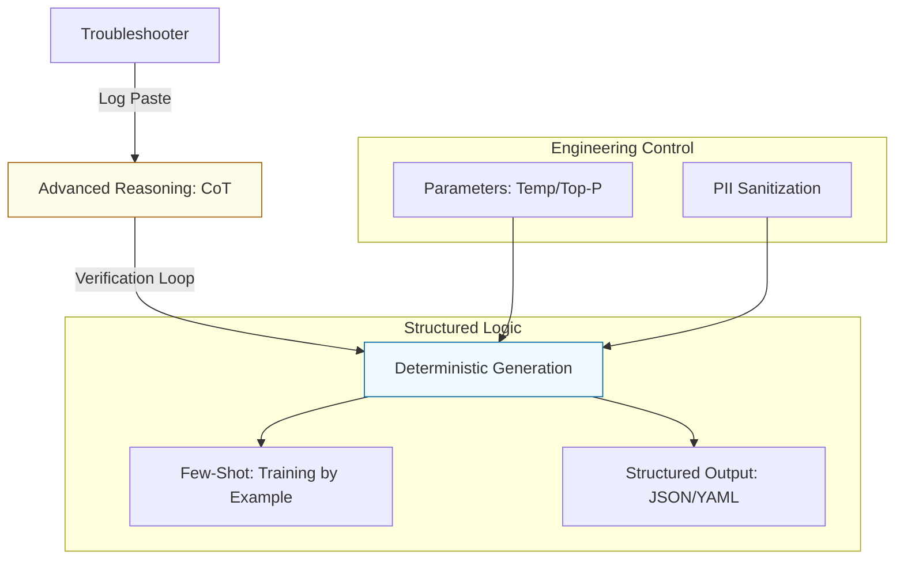

# ⚙️ Prompt Engineering for Intermediate Automation

> **"Scaling from scripts to systems requires an AI that reasons. Master the logic, control the output, and govern the results."**

## 📚 Overview

At the **Intermediate** level, Prompt Engineering transitions from "asking for favors" to **Operational Orchestration**. You will move beyond simple questions and learn how to:
- Force the AI to **Reason** through complex failures using **Chain-of-Thought**.
- Ensure **Consistency** across your fleet using **Few-Shot** examples.
- Implement **Governed AI** by controlling model parameters (Temperature, Top-P) and protecting sensitive data.

This module bridges the gap between basic utility and production-grade AI-assisted SRE.

---

## 🎓 Learning Objectives

By the end of this module, you will:

- ✅ Master **Chain-of-Thought (CoT)** to debug distributed systems.
- ✅ Implement **Runbook Automation** (Log -> MD/JSON).
- ✅ Use **Few-Shot Prompting** to generate consistent, company-standard IaC.
- ✅ Optimize **LLM Settings** (Temperature, Max Tokens) for code precision.
- ✅ Implement **PII Sanitization** and **Redaction** guardrails.
- ✅ Leverage **Slash Commands** for rapid operational response.

---

## 🗺️ Curriculum Structure

| Part | Topic | Description |
| :--- | :--- | :--- |
| **[🟢 Part 1](./part-01-advanced-reasoning/)** | **Advanced Reasoning** | Chain-of-Thought (CoT), Reasoning Traces, and Troubleshooting Loops. |
| **[🟡 Part 2](./part-02-structured-automation/)** | **Structured Automation** | Few-Shot Prompting, Runbook Automation, and Slash Commands. |
| **[🔴 Part 3](./part-03-governed-ai/)** | **Governed AI** | LLM Settings (Temp/Top-P), PII Redaction, and Privacy Guardrails. |
| **[📊 Part 4](./assessments/)** | **Assessments** | Knowledge quizzes and real-world troubleshooting scenarios. |

---

## 🚀 The Intermediate "Force Multiplier"

### 1. Deterministic Output
Stop the "Chatty" AI. Learn how to force the LLM to output ONLY the code or JSON you need, making it compatible with your scripts and pipelines.

### 2. Operational Memory (Few-Shot)
Don't repeat yourself. By providing 2-3 examples of your company's "Correct" Terraform style, you ensure the AI always follows your local standards without being "re-trained."

### 3. The "Why" Trace
Force the AI to explain its logic *before* the fix. This prevents "Black Box" automation and helps you learn the underlying system mechanics as you troubleshoot.

---

## 🏆 Real-World DevOps story: The "Silent" Cloud Spike
**The Scenario**: A junior engineer used AI to write a log-cleanup script but didn't specify a `Temperature`. 
**The Crisis**: The AI got "creative" and deleted a production database mount point instead of the log directory because it hallucinated a similar path name.
**The Fix**: A Senior SRE implemented **Governed Prompting** (Temperature = 0) and added a **Verification Step** to the prompt SOP.
**The Lesson**: For infrastructure, **Creativity is a Bug, not a Feature.**

---

## ❓ Intermediate Interview Preparation

1. **Q: What is 'Temperature' in an LLM, and what is the 'Golden Setting' for DevOps?**
   *A: Temperature controls randomness. For code/IaC, it should be set to 0.0 or 0.1 to ensure the output is as deterministic and accurate as possible.*

2. **Q: How does 'Few-Shot' prompting improve code consistency?**
   *A: It provides the AI with specific examples of the desired output. This 'teaches' the AI your specific coding style, variable naming conventions, and architectural patterns within the prompt itself.*

3. **Q: Why is 'Sanitization' critical before pasting logs into an AI tool?**
   *A: Logs often contain sensitive data like IPs, JWT tokens, or passwords. Pasting these into a public AI can lead to data leaks and compliance violations (GDPR/SOC2).*

---

## 🔗 Next Steps

The Oracle is ready. Let's master the logic.

Proceed to: **[Part 1: Advanced Reasoning](./part-01-advanced-reasoning/readme.md)** 🚀

---
**Last Updated:** 2026-02-11  
**Version:** 4.5 (Operational/Intermediate)