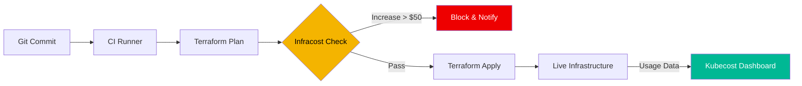

# 💰 FinOps: Cost Optimization as Code (Intermediate)

> **"Infrastructure is only as good as its efficiency. If you don't track cost, you don't scale—you just bleed."**

## 📚 Overview

FinOps is an evolving cloud financial management discipline and cultural practice that enables organizations to get maximum business value by helping engineering, finance, technology and business teams to collaborate on data-driven spending decisions.

## Core Concept: The FinOps Lifecycle
**[REFERENCE: FinOps Architecture](./reference/finops-architecture-ref.md)**

Managing cost is a continuous technical and cultural discipline:
- **Inform**: Gaining total visibility into spending through granular tagging and Kubecost allocation.
- **Optimize**: Identifying "Zombie" resources and right-sizing underutilized instances to eliminate waste.
- **Operate**: Transitioning from reactive "Bill shock" to proactive "Cost-Aware CI/CD."
- **Unit Economics**: Measuring "Cost per Transaction" rather than just the total cloud bill.

## Enterprise Governance: Cost as Code
**[REFERENCE: FinOps Architecture](./reference/finops-architecture-ref.md)**

Enforcing financial rigor within the automation lifecycle:
- **Infracost PR Comments**: Automatically adding cost projections to every Pull Request to empower developer decisions.
- **Budget Guardrails**: Implementing automated "Policy as Code" to block deployments that exceed a defined cost threshold.
- **Automated Waste Elimination**: Scripts that terminate untagged resources or shut down Dev environments over weekends.
- **Reservation Management**: Balancing on-demand scaling with long-term Savings Plans for stable base-load traffic.

## 🎯 Learning Objectives

- ✅ Understand the **Inform, Optimize, Operate** lifecycle.
- ✅ Implement **Infracost** in CI/CD to prevent budget overruns.
- ✅ Deploy **Kubecost** to track internal Kubernetes spending.
- ✅ Automate the identification of "Zombies" (Unused resources).

## 🗺️ Module Structure

1. **[🟢 01-Infracost-CI-CD](readme.md)**
   - Analyzing plan JSONs.
   - Setting up PR comments for cost changes.
2. **[🟢 02-Kubecost-Basics](readme.md)**
   - Deploying Kubecost via Helm.
   - Mapping costs to Namespaces and Labels.

---

## 🏗️ Visual: Cost-Aware CI/CD Pipeline



## 📋 Professional Pattern: The "Zombie Hunter"
Always automate the detection of unused resources. Idle Load Balancers and unattached EBS volumes account for up to 15% of wasted cloud spend in unmanaged environments.

---

## 🛠️ Automation: Zombie Resource Identification (Python)

```python
import boto3

def hunt_zombies():
    ec2 = boto3.client('ec2')
    
    # 1. Unattached EBS Volumes
    volumes = ec2.describe_volumes(Filters=[{'Name': 'status', 'Values': ['available']}])
    for vol in volumes['Volumes']:
        print(f"[ZOMBIE] Unused Volume Found: {vol['VolumeId']} ({vol['Size']}GB)")

    # 2. Idle Load Balancers (Classic Example)
    elb = boto3.client('elbv2')
    lbs = elb.describe_load_balancers()
    for lb in lbs['LoadBalancers']:
        # Logic to check request count metrics would go here
        print(f"[AUDIT] LB Active: {lb['LoadBalancerName']}")

if __name__ == "__main__":
    hunt_zombies()
```

---
**Next Step**: [Infracost in CI/CD](readme.md) 🚀
