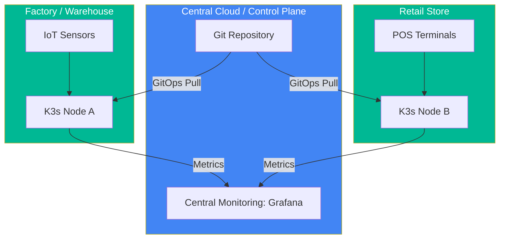

# 📡 Edge Computing with K3s (Intermediate)

> **"Kubernetes is heavy. K3s is the lightweight distribution for the frontier."**

## 📚 Overview

Edge computing brings computation and data storage closer to the location where it is needed, to improve response times and save bandwidth. K3s is a highly available, certified Kubernetes distribution designed for production workloads in unattended, resource-constrained, remote locations or inside IoT appliances.

## Core Concept: Lightweight Orchestration
**[REFERENCE: Edge Computing Architecture](./reference/edge-computing-architecture-ref.md)**

K3s optimizes Kubernetes for the "Frontier":
- **Single Binary**: All components combined into a < 50MB binary for deployment on small-footprint devices.
- **SQLite Substitution**: Using SQLite instead of etcd to reduce memory consumption by ~60% in small clusters.
- **Addon Tuning**: Disabling default features (Traefik, Storage) to fit within 512MB RAM constraints.

## Enterprise Governance: Remote Reliability
**[REFERENCE: Edge Computing Architecture](./reference/edge-computing-architecture-ref.md)**

Managing thousands of disconnected locations requires unique standards:
- **GitOps Pull Model**: Allowing remote clusters to pull their own manifests, avoiding the need for inbound open ports or stable connections.
- **Unattended Recovery**: Configuring automated reboots and self-healing storage (Local-Path) for locations without on-site technical staff.
- **Device Identity**: Using TLS/TPM certificates to secure communication between "The Wild" and the central control plane.
- **Air-Gapped Execution**: Enabling local image registries and metrics buffering for sites with zero or intermittent internet.

## 🎯 Learning Objectives

- ✅ Understand the difference between **K8s (Heavy)** and **K3s (Light)**.
- ✅ Learn how to install K3s on a single node or small cluster.
- ✅ Manage resource constraints (RAM/CPU) for Edge workloads.
- ✅ Implement local-path provisioning for storage at the Edge.

## 🗺️ Module Structure

1. **[🟢 01-K3s-Installation](readme.md)**
   - Single-node setup with `curl -sfL https://get.k3s.io | sh -`.
   - Managing `kubeconfig` and node tokens.
2. **[🟢 02-Resource-Constraints](readme.md)**
   - Disabling unnecessary features (Traefik, ServiceLB).
   - Tuning the K3s server for low-memory environments (< 512MB RAM).

---

## 🏗️ Visual: Edge-to-Cloud Architecture

## 📋 Professional Pattern: "Kube-Light"
When deploying to Edge, always strip out default addons you don't use. Use `--disable traefik` during K3s installation if you plan to use an Nginx ingress or if you don't need a load balancer at the edge.

---
**Next Step**: Start with [K3s Installation](readme.md) 🚀
