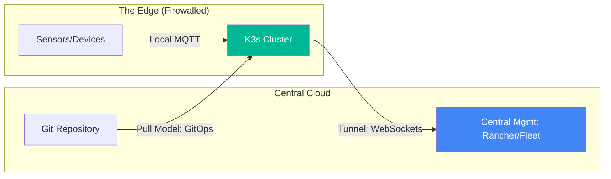

# Edge Computing & K3s Architecture Reference

**Doc Version:** 1.0.0
**Role:** Edge Systems Engineer / IoT Architect
**Scope:** K3s internals, resource constraints, and Edge-to-Cloud patterns

---

## 1. Why K3s for Edge?

K3s is a fully compliant, lightweight Kubernetes distribution created by Rancher. It is optimized for small footprints and unattended locations.

### Key Optimizations
- **Single Binary**: The entire Kubernetes distribution is packaged as a single < 50MB binary.
- **SQLite by Default**: Uses SQLite (instead of etcd) for the cluster datastore in single-node environments, drastically reducing RAM usage.
- **Stripped Addons**: Removes legacy cloud providers and unnecessary features to keep the footprint small.
- **Low Memory Requirement**: Can run on as little as 512MB of RAM (with tuning).

---

## 2. K3s Architecture Components

Internal components are combined into a single process for efficiency.

- **K3s Server**: Includes the Control Plane (API Server, Scheduler, Controller Manager) and the Datastore.
- **K3s Agent**: The worker node component (Kubelet, Proxy).
- **Embedded Components**: Containerd, Flannel (CNI), CoreDNS, and Traefik (Ingress).

---

## 3. Resource Constraint Governance

At the Edge, resource management is a survival skill.

### Tuning for Low-Memory
- **Disable Traefik**: `--disable traefik` (save ~100MB RAM).
- **Disable Local-Storage**: `--disable local-storage` if not needed.
- **Node-Local DNS**: Reduces DNS latency and bandwidth to central servers.

### Cgroup Management
Strictly enforce CPU and Memory limits (Requests/Limits) to ensure a single runaway pod doesn't crash the entire K3s node and disconnect the Edge location.

---

## 4. Visualizing Edge Connectivity Models

---

## 5. Deployment Patterns: Push vs. Pull

- **Push Model (Standard)**: Central CI/CD connects to Edge and pushes manifests. **Risk**: Edge locations are often behind strict firewalls or unstable networks.
- **Pull Model (GitOps)**: Every K3s node runs a GitOps agent (like ArgoCD or Flux) that polls the central Git repository and pulls changes. **Result**: Robust against network disconnects and requires no inbound open ports.

---

## 6. Enterprise Governance for Remote Sites

- **Air-Gapped Updates**: Support for offline image loading in locations with zero internet access.
- **Device Identity**: Using TLS certificates or TPM (Trusted Platform Module) for securing the handshake between Edge and Cloud.
- **Unattended Recovery**: Configuring the OS for automatic reboot and cluster re-join after power failure.
- **Centralized Metrics**: Using a pull-based monitoring system or local VictoriaMetrics to buffer data before sending it to the central Grafana dashboard.

> **Enterprise Pattern**: Use **Rancher Fleet**. It is designed specifically for "Million-Cluster" scenarios, allowing you to manage deployments across 10,000 retail stores or factories as easily as a single cluster.
