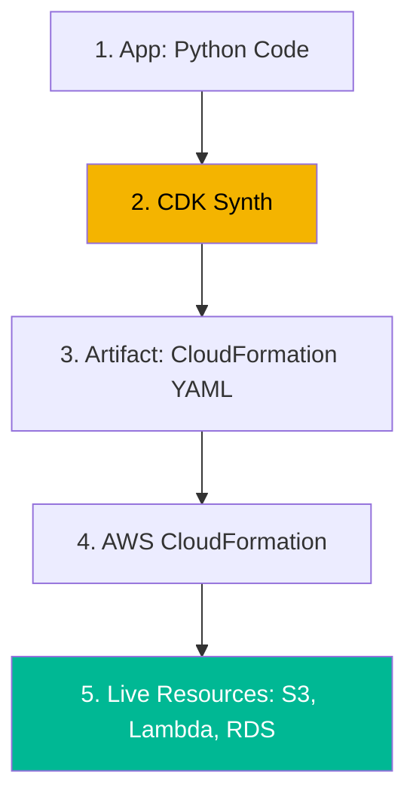

# Serverless IaC & CDK Architecture Reference

**Doc Version:** 1.0.0
**Role:** Cloud Engineer / Serverless Architect
**Scope:** CDK, Pulumi, Synthesis vs Deployment, and Testing IaC

---

## 1. The Pro-Code IaC Model

Pro-code IaC (Infrastructure as Code) uses general-purpose programming languages (Python, TypeScript, Go) instead of domain-specific languages like HCL (Terraform) or YAML.

### Why Pro-Code?
- **Abstraction**: Use object-oriented principles (Classes, Inheritance) to build complex infrastructure.
- **Tooling**: Leverage existing IDEs, linters, and unit testing frameworks (Pytest, Jest).
- **Logic**: Easily implement loops, conditionals, and complex string manipulations without the constraints of HCL.
- **Sharing**: Package your infrastructure as standard software libraries (NPM, PyPI).

---

## 2. AWS CDK: Synthesis vs. Deployment

The AWS CDK (Cloud Development Kit) works by translating your high-level code into low-level cloud provider templates.

1.  **Code**: You write high-level **Constructs** (e.g., `s3.Bucket`).
2.  **Synthesis (`cdk synth`)**: The CDK translates the code into a **CloudFormation Template** (JSON/YAML).
3.  **Bootstrap**: Prepares the AWS environment with an S3 bucket and IAM roles to hold the assets.
4.  **Deployment (`cdk deploy`)**: Pushes the synthesized template and any code assets (Lambda zips) to AWS CloudFormation.

---

## 3. Pulumi Architecture: State & Providers

Unlike CDK, Pulumi does not use an intermediate template like CloudFormation. It communicates directly with the cloud provider APIs.

- **State Management**: Pulumi tracks the status of your infrastructure in a "State File" (stored in Pulumi Cloud by default or locally).
- **Automation API**: Allows you to embed Pulumi deployments directly inside your application code (Self-Service Infrastructure).
- **Cross-Cloud**: Supports AWS, Azure, GCP, and Kubernetes within the same language and project.

---

## 4. Visualizing the CDK Lifecycle

---

## 5. Testing Infrastructure as Software

Since the IaC is real code, it must be tested like real code.

- **Fine-Grained Assertions**: Verifying that a specific resource exists in the synthesized template with specific properties (e.g., "Check if the S3 bucket is encrypted").
- **Snapshot Testing**: Comparing the synthesized template against a "Golden Snapshot" to detect unintended changes in the architecture.
- **Integration Testing**: Deploying the stack to a "Sandbox" account and running a test script to verify actual connectivity.

---

## 6. Enterprise Governance Standards

- **Construct Libraries**: Creating a centralized, private library of "Internal Standards" (e.g., a `CompanyVpc` construct that automatically includes VPN and Flow Logs).
- **Permissions**: Using **IAM Roles for Service Accounts** and ensuring Lambda functions have the minimum possible permissions.
- **Asset Security**: Automatically scanning Lambda ZIPs and Docker images for vulnerabilities during the `cdk synth` phase.
- **Tagging**: Implementing a global "Aspect" (in CDK) that automatically applies mandatory tags to every resource in the stack.

> **Enterprise Pattern**: Use **CDK Aspects**. Aspects allow you to apply a piece of logic to every resource in a given scope. For example, you can write an Aspect that finds every S3 Bucket in your entire application and ensures that `public_access_block` is enabled, regardless of how the developer originally defined the bucket.
