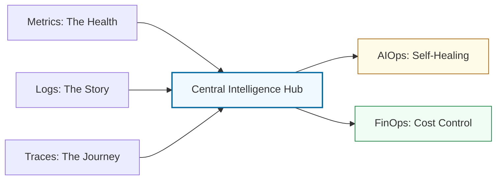

# 🧠 Modern Operations: The Systems Oracle

> **"Listen up, Junior. Monitoring tells you if a system is dead. Observability tells you why it's dying. In this module, you move from 'Reaction' to 'Intelligence'."**

---

## 🧠 The Mental Model: The Systems Oracle

**The Junior Struggle**: "I have a dashboard that shows CPU and RAM. Isn't that enough? Why do I need distributed tracing, LLM-insights, and FinOps reports?"

**The Senior Solution**: You realize that in a microservices world, dashboards are not enough. You need a **Systems Oracle** that can see through the noise.
- **Observability (Three Pillars)**: The eyes and ears that detect the "Silent Killer" bugs.
- **AIOps**: The artificial brain that can read 10 million logs in 1 second to find the root cause.
- **FinOps**: The financial auditor that ensures your "cool" architecture doesn't bankrupt the company.
- **Edge/Serverless**: The ability to run code everywhere without managing the "where."

---

## 🆚 Junior Way vs. Senior Way

| Feature | The Junior Way (Problematic) | The Senior Way (Architected) |
|:---|:---|:---|
| **Monitoring** | "Is the server Up?" (Binary) | **"What is the User Experience?"** (SLI/SLO) |
| **Failures** | Manual log searching (`grep`) | **Distributed Tracing** (Tracing the request) |
| **AI** | Asking ChatGPT to "Fix this error" | **Contextual Prompting** with System Logs |
| **Costs** | Checking the bill at the end of the month | **Infracost** (Cost-as-Code) in the PR |
| **Ops** | Running everything in one region | **Edge Computing** (K3s/Wasm) |

---

## 🏗️ Visual: The Observability Intelligence Mesh

---

## 🗺️ Curriculum Path

### 1. [Observability](./01-observability/readme.md)
*Junior, stop looking at Up/Down lights.* 
Master Prometheus, Grafana, and the OpenTelemetry standard. Learn to trace a single user request across 5 different services.

### 2. [Prompt Engineering](./02-prompt-engineering/readme.md)
*Treat the LLM as your Co-Pilot, not your replacement.* 
Prompt engineering for DevOps, automated root-cause analysis, and using AI to write complex security policies.

### 3. [FinOps & Cost Management](./03-finops-cost-management/readme.md)
*Every byte has a price.* 
Cloud cost visibility and "Unit Economics." Learn to block expensive infrastructure changes before they are even deployed.

### 4. [Edge & Serverless Controllers](./04-edge-computing/readme.md)
*The server is an implementation detail.* 
Lightweight Kubernetes (K3s) for the edge and modern event-driven serverless architectures.

---

## 🏆 Real-World DevOps Story: The $50,000 Typo

**The Scenario**: A Junior engineer accidentally deployed a "Debug" flag in a high-traffic service that logged every single database query to a cloud logging service.
**The Crisis**: The logs grew so fast that the cloud provider's bill spiked by $50,000 in one weekend. Standard monitoring didn't catch it because the server was "Healthy." 
**The Fix**: Implemented **FinOps Guardrails** that alerted the team when the "Daily Log Spend" exceeded $100.
**The Lesson**: **Junior, efficiency is a technical metric.** If you ignore the cost, you are ignoring the system's longevity.

---

## 🎤 Interview Preparation (Modern Ops)

1. **Q: Junior, what are the 'Three Pillars of Observability'?**
   - *A: **Metrics** (Aggregated data over time), **Logs** (Discrete events), and **Traces** (The journey of a request through the system).*

2. **Q: What is the difference between Monitoring and Observability?**
   - *A: Monitoring tells you **if** something is wrong (the 'known unknowns'); Observability allows you to ask **why** something is wrong (the 'unknown unknowns').*

3. **Q: What is 'AIOps'?**
   - *A: The application of machine learning and AI (like LLMs) to automate and enhance IT operations, such as anomaly detection and automated incident summaries.*

4. **Q: Explain 'Cloud Unit Economics' in FinOps.**
   - *A: It's the practice of measuring the cost of a single business unit (e.g., 'What is the cloud cost of one user login?'). This helps determine if a feature is actually profitable.*

5. **Q: What is 'OpenTelemetry' (OTel)?**
   - *A: An open-source standard and set of tools for collecting and exporting observability data in a vendor-neutral format.*

6. **Q: What is an 'SLO' vs. an 'SLA'?**
   - *A: **SLO** (Service Level Objective) is an internal goal for reliability. **SLA** (Service Level Agreement) is a legal contract with a customer that includes penalties if the SLO is missed.*

7. **Q: Why would you use K3s over K8s at the Edge?**
   - *A: K3s is highly optimized for low-resource environments (Edge/IoT), with a smaller footprint and fewer dependencies while remaining fully Kubernetes-compatible.*

8. **Q: Explain 'Serverless IaC'.**
   - *A: Defining serverless functions (like AWS Lambda) and their triggers (SQS, API Gateway) using code (Terraform/CloudFormation) so they scale automatically without managing servers.*

9. **Q: What is 'Cardinality' in metrics?**
   - *A: It's the number of unique combinations of label values. High cardinality (e.g., using 'User ID' as a label) can crash your metrics database.*

10. **Q: How does AI improve 'Incident Response'?**
    - *A: It can instantly correlate multiple alerts, summarize complex log events, and suggest the most likely 'Root Cause' based on previous system behavior.*

---

## 📝 Knowledge Check

1. **Which pillar of observability traces a request across microservices?**
   - [x] Traces.

2. **What does 'MTTR' stand for?**
   - [x] Mean Time To Repair.

3. **Which tool is the industry standard for visualizing metrics?**
   - [x] Grafana.

4. **True/False: FinOps is only the responsibility of the Finance department.**
   - [x] **False**. (It's a shared engineering responsibility).

5. **What is an 'Error Budget'?**
   - [x] The amount of downtime or errors a service is allowed to have before the team must stop feature work and focus on reliability.

6. **Which OTel component is responsible for receiving and exporting data?**
   - [x] Collector.

7. **What is 'Anomaly Detection'?**
   - [x] Using AI/ML to find patterns that differ from 'normal' system behavior.

8. **Where is 'Edge Computing' physically located?**
   - [x] Close to the user (e.g., on a leaf node or local server).

9. **Which metric measures the percentage of successful requests?**
   - [x] Availability.

10. **What is 'Infracost'?**
    - [x] A tool that shows the cloud cost impact of a Terraform change in a Pull Request.

---

## 🏁 Phase Complete
Junior, you have mastered the engine, the assembly line, and the central intelligence. You are now ready for the final ascent.

1. Proceed to: **[Phase 3: High Fidelity Orchestration](../../03-phase-3/readme.md)** →
2. Return to: **[Phase 2 Hub](../readme.md)** →

---
## 🧭 Additional Modules
- [05 Serverless Architecture](05-serverless-architecture/readme.md)
