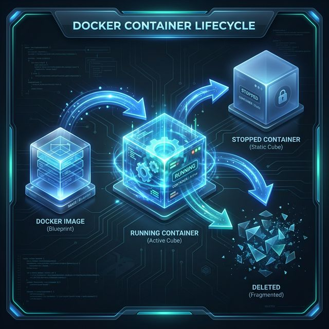

# 🐳 Junior Docker CLI Reference
> **The Essential Toolbox for Every Developer Starting Their Container Journey.**

This reference is designed to help you master the core Docker commands you'll use daily. Use this as your "pocket guide" until the commands become second nature.

---

## 🚦 The Container Lifecycle
Understanding how a container transitions between states is key to debugging.

---

## 🛠️ CLI Reference Tracker
- [ ] **Basic Essentials**
- [ ] **Image Management**
- [ ] **Container Operations**
- [ ] **Interaction & Debugging**
- [ ] **Cleanup**

---

## 🟢 1. Basic Essentials
*Checking the health and status of your Docker installation.*

| Command | Explanation | Real-World Example |
| :--- | :--- | :--- |
| `docker --version` | Checks which version of Docker you have installed. | `docker --version` |
| `docker info` | Shows high-level information about your Docker system (containers, images, storage driver). | `docker info` |
| `docker help` | The "Manual" - gives you a list of all commands or help for a specific one. | `docker help run` |

---

## 📦 2. Image Management
*Managing the "Templates" (Images) used to create containers.*

| Command | Explanation | Real-World Example |
| :--- | :--- | :--- |
| `docker pull` | Downloads an image from Docker Hub to your local machine. | `docker pull nginx:latest` |
| `docker images` | Lists all the images currently stored on your computer. | `docker images` |
| `docker rmi` | Removes (deletes) a local image. | `docker rmi nginx` |
| `docker build -t` | Builds a new image from a `Dockerfile` and gives it a "tag" (name). | `docker build -t my-app:v1 .` |

---

## 🚀 3. Container Operations
*The core commands for running and managing live containers.*

| Command | Explanation | Real-World Example |
| :--- | :--- | :--- |
| `docker run` | Creates AND starts a container. Common flags: `-d` (background), `-p` (ports), `-it` (interactive). | `docker run -d -p 8080:80 nginx` |
| `docker ps` | Lists all currently **running** containers. | `docker ps` |
| `docker ps -a` | Lists **all** containers, including those that have stopped. | `docker ps -a` |
| `docker stop` | Gracefully shuts down a running container. | `docker stop my-nginx` |
| `docker start` | Re-starts a container that was previously stopped. | `docker start my-nginx` |
| `docker rm` | Permanently deletes a stopped container. | `docker rm my-nginx` |

---

## 🔍 4. Interaction & Debugging
*Looking inside the box to see why things are (or aren't) working.*

| Command | Explanation | Real-World Example |
| :--- | :--- | :--- |
| `docker logs` | Shows the output (console logs) from inside the container. | `docker logs -f <id>` |
| `docker exec -it` | Runs a new command inside a running container (usually to get a shell). | `docker exec -it <id> /bin/bash` |
| `docker inspect` | Shows detailed JSON configuration for a container or image. | `docker inspect nginx` |
| `docker top` | Displays the processes currently running inside the container. | `docker top <id>` |

---

## 🧹 5. Cleanup
*Keeping your machine clean by removing unused resources.*

| Command | Explanation | Real-World Example |
| :--- | :--- | :--- |
| `docker system prune` | Removes all stopped containers, unused networks, and dangling images at once. | `docker system prune` |
| `docker container prune`| Specifically removes only the stopped containers. | `docker container prune` |

---
*Generated by the Lead DevOps Instructor - Intermediate Curriculum*
