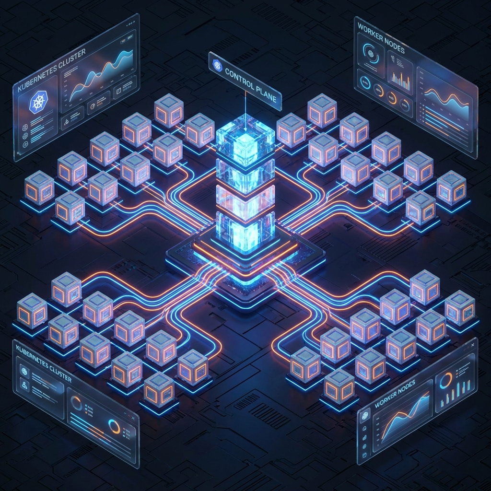
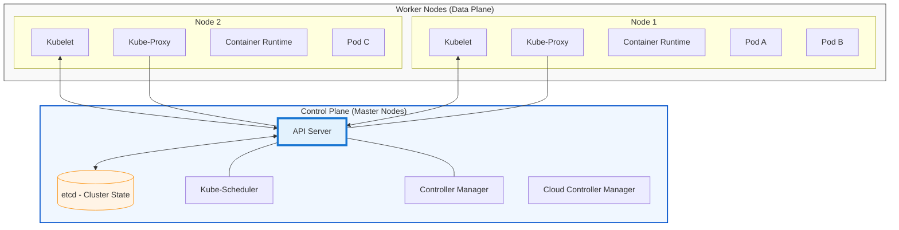
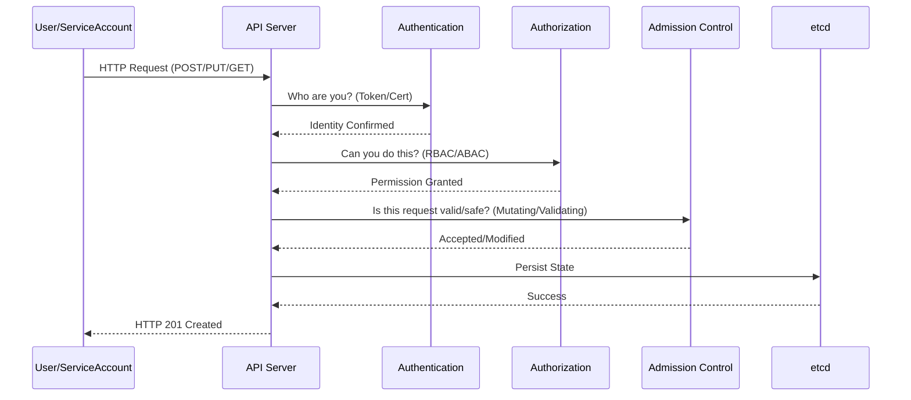
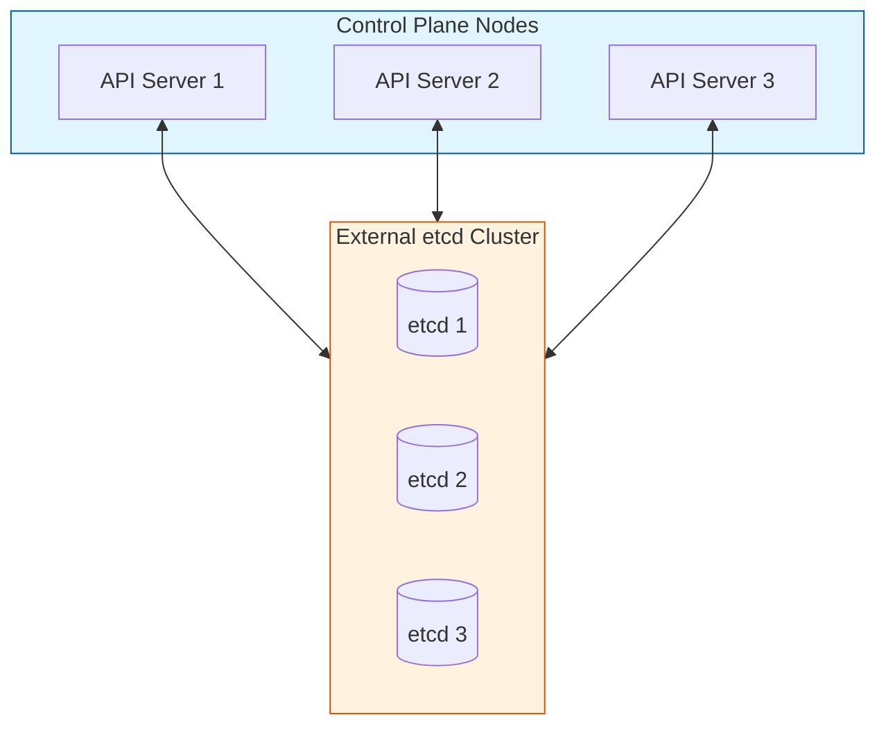

# ☸️ Kubernetes Cluster Architecture



## 📋 Overview

A **Kubernetes Cluster** is a distributed system consisting of a set of worker machines, called nodes, that run containerized applications. Every cluster has at least one worker node. The worker node(s) host the Pods that are the components of the application workload. The **Control Plane** manages the worker nodes and the Pods in the cluster.

### 🎯 Learning Objectives

By the end of this module, you will:

- Understand the internal mechanics of the Kubernetes **Control Plane**.
- Master the **Data Plane** components (Kubelet, Kube-proxy, Container Runtime).
- Design and implement **High Availability (HA)** cluster topologies.
- Troubleshoot complex cluster-level issues using professional methodology.
- Grasp the **etcd Raft Consensus** and request lifecycle.

---

## 🏗️ High-Level Architecture

The cluster is split into two main functional areas:

1. **The Control Plane (The Brain)**: Decision-making, scheduling, and monitoring.
2. **The Data Plane (The Muscle)**: Running the containers and handling networking.



---

## ⚡ The Kubernetes Nerve Center: Control Plane Deep Dive

### 1. The API Server Request Lifecycle

Every request to Kubernetes (e.g., `kubectl apply`) goes through a rigorous multi-stage pipeline.



### 2. etcd: The Source of Truth
`etcd` uses the **Raft Consensus Algorithm** to ensure all nodes agree on the cluster state.

**Key Rule:** $(N/2) + 1$ nodes must be healthy to maintain a quorum.

- 3 nodes: Can lose 1
- 5 nodes: Can lose 2

```mermaid
graph TD
    subgraph Quorum ["etcd Cluster (HA)"]
        L((Leader))
        F1((Follower))
        F2((Follower))
        
        L <-->|Heartbeat/Append| F1
        L <-->|Heartbeat/Append| F2
    end
    
    API[API Server] <-->|gRPC| L
    
    style L fill:#f96,stroke:#333,stroke-width:4px
    style Quorum fill:#f5f5f5,stroke:#333,border-dash:[5,5]
```

### 3. Controller Manager (The Watchman)

The Controller Manager runs various controller processes that watch the current state via the API Server and make changes to reach the desired state.

- **Node Controller**: Handles node failures.
- **Replication Controller**: Ensures correct number of pods.
- **Endpoints Controller**: Populates Service objects.

---

## 🌐 The Data Plane: Under the Hood

### Kubelet: The Node Shepherd

The Kubelet ensures that containers are running in a Pod. It doesn't manage containers created outside Kubernetes.

- **CRI (Container Runtime Interface)**: Kubelet uses CRI to talk to `containerd` or `CRI-O`.
- **Probes**: Kubelet executes Liveness, Readiness, and Startup probes.

### Kube-Proxy: The Traffic Cop

| Mode | Performance | Mechanism |
| :--- | :--- | :--- |
| **iptables** | Standard | Sequential rule evaluation. Default mode. |
| **IPVS** | High Performance | Hash-table based. Scales to thousands of services. |
| **eBPF (Cilium)** | Ultra Fast | Bypasses kernel networking stack for direct routing. |

---

## 🛡️ Professional Pattern: High Availability Topologies

### 1. Stacked etcd Topology

The `etcd` members run on the same nodes as the control plane. Simple to manage, but if a node fails, you lose both a control plane member and an etcd member.

### 2. External etcd Topology (Enterprise Standard)

The `etcd` cluster is separated from the control plane nodes. 



---

## 🏗️ 4. Cloud Controller Manager (CCM)

The **Cloud Controller Manager** allows you to link your cluster into your cloud provider's API. It decouples the cloud-specific logic from the core Kubernetes components.

- **Node Controller**: For checking the cloud provider to determine if a node has been deleted in the cloud after it stops responding.
- **Route Controller**: For setting up routes in the underlying cloud infrastructure.
- **Service Controller**: For creating, updating, and deleting cloud provider load balancers.

---

## 🛠️ Cluster Setup & Management

### Setup Methods

- **kubeadm**: The official tool for creating clusters. Great for learning and on-prem.
- **Managed Services**: AWS EKS, Google GKE, Azure AKS (Management of Control Plane handled by provider).
- **Lightweight**: K3s (Edge), Kind/Minikube (Local Dev).

### Essential Health Commands
```bash
# Check Health of Core components
kubectl get nodes
kubectl get componentstatuses (deprecated, use 'kubectl get configmap -n kube-system' for details)
kubectl cluster-info

# Check API Server Events
kubectl get events --all-namespaces --sort-by='.lastTimestamp'
```

---

## 📖 Real-World DevOps Story: "The Day the Quorum Died"

**The Scenario:** A DevOps team was running a 3-node HA control plane. During a routine maintenance window, they took Node 1 down for OS patching. Simultaneously, a network glitch partitioned Node 3 from the rest of the cluster.

**The Result:** Quorum requires $(3/2)+1 = 2$ nodes. With only Node 2 reachable, the API Server stopped accepting any write requests. The business was "frozen" for 4 hours.

**The Lesson:**

- In 3-node clusters, you have **ZERO** fault tolerance during maintenance.
- **Enterprise Rule:** Use 5 nodes for etcd in production to survive maintenance + 1 failure.

---

## 👨‍💻 Interview Preparation (Architect Level)

1. **Q: What happens if etcd is lost and you have no backup?**
   - *A: The control plane stops functioning. Existing pods stay running (thanks to Kubelet cache), but the cluster state is lost. You cannot scale, update, or schedule new pods.*

2. **Q: Why is etcd always an odd number of members?**
   - *A: To avoid "split-brain" scenarios. An odd number ensures that in any network partition, only one side can achieve a majority (quorum).*

3. **Q: Explain the difference between `kube-scheduler` Filtering and Scoring.**
   - *A: Filtering removes nodes that don't meet hard requirements (e.g., Taints). Scoring ranks the remaining nodes to find the best fit.*

---

## 🧠 Knowledge Check

1. Which component is the only one authorized to talk to `etcd`? (API Server)
2. What is the default networking mode for `kube-proxy`? (iptables)
3. If a Pod is stuck in `Pending` state, which component is likely at fault? (Kube-Scheduler)

---

## 🔗 Internal Navigation

- [Next: Kubectl Basics](../02-kubectl-basics/readme.md)
- [Back: Foundations Overview](../readme.md)
