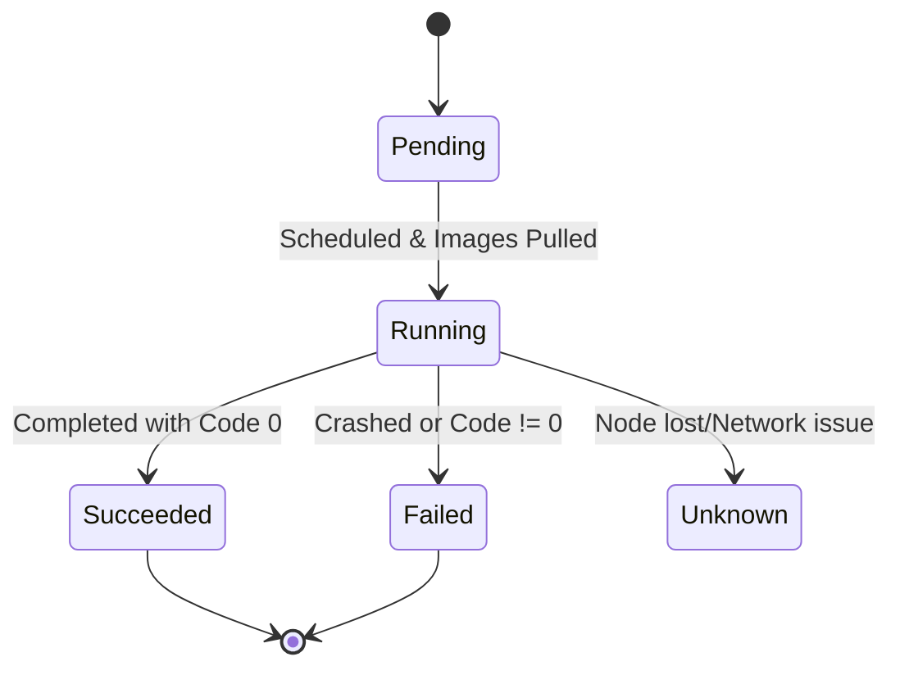

# Missing Sections for Pods and Nodes

This file contains the high-fidelity enhancements for the Pods and Nodes module.

---

## 📦 The Pod: The Atom of Kubernetes

### 1. The Pod Lifecycle
A Pod is not "just a container." It has a state machine that Kubernetes monitors.

### 2. The Multi-Container Design Patterns
Sometimes one container isn't enough. We use these patterns to augment the main application.

- **Sidecar**: Adds functionality (e.g., Log shipment, Proxy).
- **Init Container**: Runs *before* the main app (e.g., Database migration, Setup).
- **Ephemeral Container**: Temporary container for debugging (no shell in main image).

---

## 🧠 Smart Scheduling: Finding the Right Home

How does Kubernetes decide which Pod goes to which Node? It's a game of "Magnets and Repellents."

### 1. Node Affinity (The Magnet)
Allows Pods to prefer or require specific nodes.
- **Required**: "You MUST run on an SSD node."
- **Preferred**: "I'd like to run in `us-east-1` if possible."

### 2. Taints and Tolerations (The Repellent)
Nodes can "repel" Pods unless the Pod has a matching "key."
- **Taint**: "This node is for GPUs ONLY."
- **Toleration**: "I am a GPU application; I can handle your taint."

---

## 📖 Real-World DevOps Story: "The OOMKiller Mystery"

**The Scenario:** A high-traffic API started crashing every day at 3 PM. The logs showed nothing—the container just vanished. The team checked `kubectl get pods` and saw `OOMKilled`. 

**The Cause:** The application had a memory leak. During peak hours, it exceeded the memory **limit** set in the PodSpec. The Linux kernel's **Out-Of-Memory Killer** stepped in and terminated the process to protect the Node’s stability.

**The Lesson:** 
- **Requests** are for scheduling (guaranteed).
- **Limits** are for safety (hard cap).
- Always monitor memory metrics to distinguish between a crash and an eviction.

---

## 👨‍💻 Interview Preparation (Pod & Node Specialist)

1. **Q: Can two containers in the same Pod listen on the same port (e.g., 80)?**
   *   *A: No. Containers in a Pod share the same Network Namespace and IP. They must use unique ports.*

2. **Q: What is the difference between `Ready` and `Live`?**
   *   *A: `Liveness` checks if the app is alive (if not, restart it). `Readiness` checks if the app is ready to serve traffic (if not, remove it from the Service endpoint).*

3. **Q: What happens to a Pod if its Node goes `NotReady` for 5 minutes?**
   *   *A: The control plane waits for a timeout (`pod-eviction-timeout`). If the node doesn't recover, Kubernetes schedules copies of those pods onto other healthy nodes.*

---

## 🧠 Knowledge Check

1. What is the smallest deployable unit in Kubernetes? (Pod)
2. Which component on the node is responsible for reporting pod status? (Kubelet)
3. How do you prevent new pods from being scheduled on a specific node? (`kubectl cordon`)
