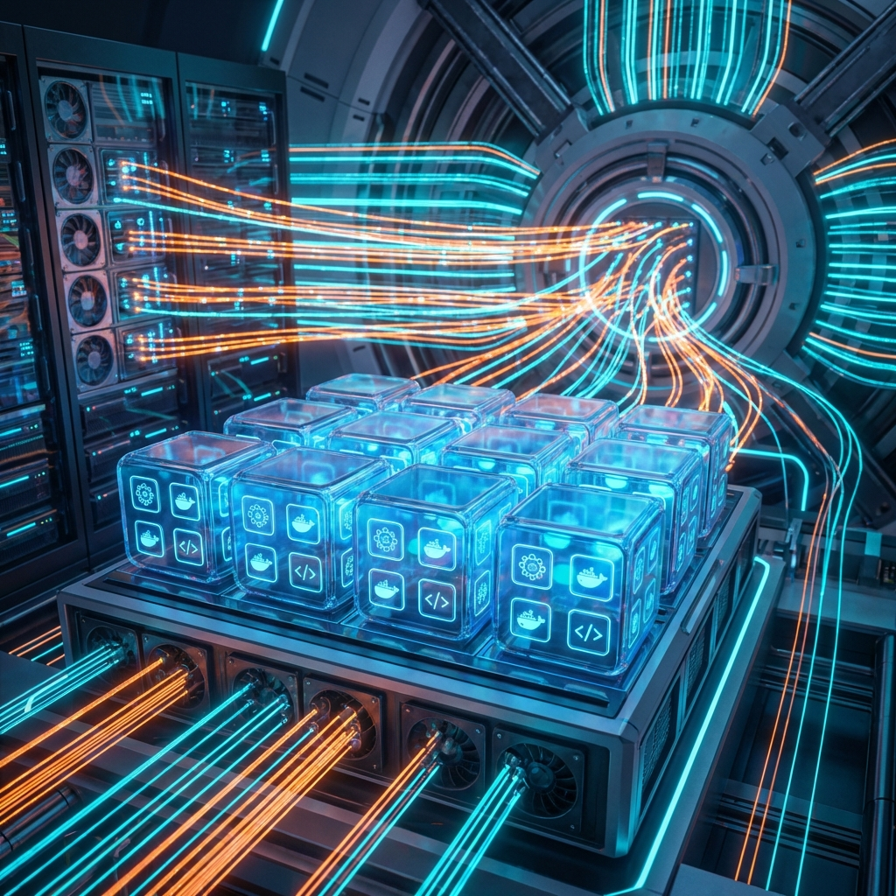
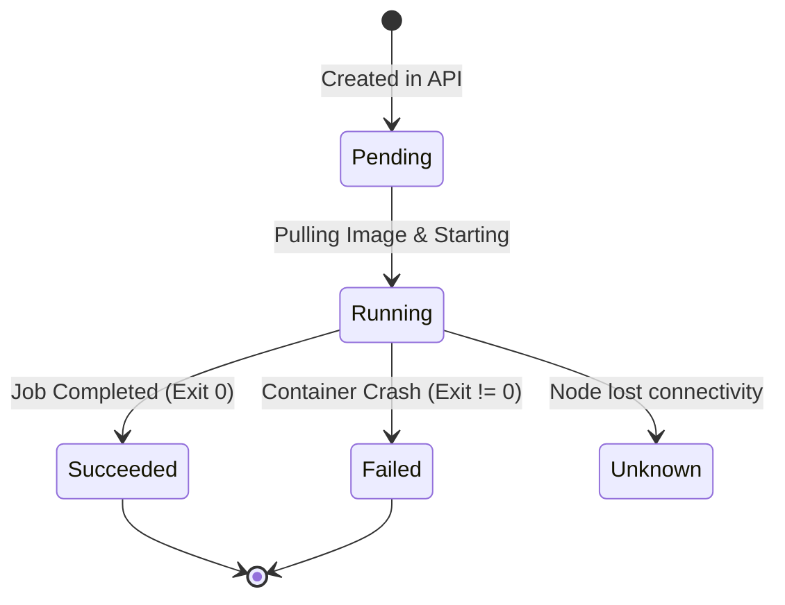

# 📦 Pods and Nodes: The Building Blocks



## 📋 Overview

In Kubernetes, **Nodes** provide the compute power, and **Pods** are the units of execution. Understanding the relationship between these two—and how the Scheduler connects them—is fundamental to cluster operations.

### 🎯 Learning Objectives

By the end of this module, you will:
- Master the **Pod Lifecycle** and its internal states.
- Design **Multi-container Pods** using industry patterns.
- Control workload placement using **Affinity** and **Tolerations**.
- Manage node maintenance (Cordon/Drain) with zero downtime.
- Troubleshoot **Evictions** and **Resource Constraints**.

---

## 🏗️ The Pod: The Atom of Kubernetes

A Pod is the smallest deployable unit you can create and manage in Kubernetes. It can contain one or more containers that share storage, network, and specifications on how to run them.

### 1. The Pod Lifecycle
A Pod is ephemeral. It's born, it runs, and it eventually dies.



### 2. Sidecar Pattern
A common practice where a helper container (Sidecar) supports the main application (e.g., a logging agent or a service mesh proxy).

---

## 🏠 The Node: The Worker Machine

A Node is a worker machine (VM or physical) managed by the control plane.

### Node Components Recap
- **Kubelet**: The agent that runs on each node.
- **Kube-proxy**: The network proxy.
- **Container Runtime**: Software that runs containers (e.g., CRI-O).

### Node Health Conditions
- **Ready**: True if the node is healthy and ready to accept pods.
- **MemoryPressure**: True if node memory is low.
- **DiskPressure**: True if disk capacity is low.

---

## 🧠 Smart Scheduling: Finding the Right Home

### 1. Node Affinity (The Magnet)
Allows Pods to be attracted to specific nodes based on labels.
```yaml
spec:
  affinity:
    nodeAffinity:
      requiredDuringSchedulingIgnoredDuringExecution:
        nodeSelectorTerms:
        - matchExpressions:
          - key: disktype
            operator: In
            values: ["ssd"]
```

### 2. Taints and Tolerations (The Repellent)
Nodes can "repel" Pods unless the Pod has a matching "key."
- **Taint**: `kubectl taint nodes node1 key=value:NoSchedule`
- **Toleration**: Defined in PodSpec to allow it to ignore the taint.

---

## 🔧 Node Maintenance Workflow

In production, you must safely move workloads before restarting a node.

1.  **Cordon**: Mark the node as unschedulable.
    ```bash
    kubectl cordon <node-name>
    ```
2.  **Drain**: Evict all pods from the node.
    ```bash
    kubectl drain <node-name> --ignore-daemonsets
    ```
3.  **Maintenance**: Perform OS updates/Hardware fixes.
4.  **Uncordon**: Bring the node back into the rotation.
    ```bash
    kubectl uncordon <node-name>
    ```

---

## 📖 Real-World DevOps Story: "The OOMKiller Mystery"

**The Scenario:** A high-traffic API started vanishing every day at 3 PM. Eventually, the team found that the pod status was `OOMKilled`. 

**The Cause:** The application had a memory leak triggered by high concurrency. It hit its memory **limit**, and the Linux kernel terminated it to save the node.

**The Lesson:** Always set realistic **Requests** (for scheduling) and **Limits** (for safety). Never let a pod run without memory limits in production!

---

## 👨‍💻 Interview Preparation

1. **Q: What is the difference between a Pod and a Container?**
   *   *A: A Pod is a wrapper around one or more containers. It provides a shared network/storage context for them.*

2. **Q: How does `kubectl drain` differ from `kubectl delete node`?**
   *   *A: `drain` gracefully evicts pods to other nodes. `delete node` simply removes the node object from the API; pods on that node will eventually time out and be rescheduled.*

3. **Q: What is a "Static Pod"?**
   *   *A: A pod managed directly by the Kubelet on a specific node, without the API Server's intervention (usually defined in `/etc/kubernetes/manifests`).*

---

## 🧠 Knowledge Check

1. Which component decides which node a pod should run on? (Scheduler)
2. What is the pod state when it is waiting for an image to be pulled? (Pending)
3. How do you see the "Events" associated with a node? (`kubectl describe node <name>`)

---

## 🔗 Internal Navigation
- [Next: Deployments and Scaling](../04-deployments-and-scaling/readme.md)
- [Back: Kubectl Basics](readme.md)