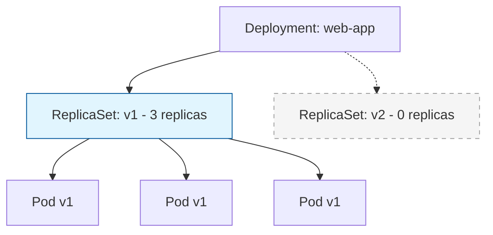
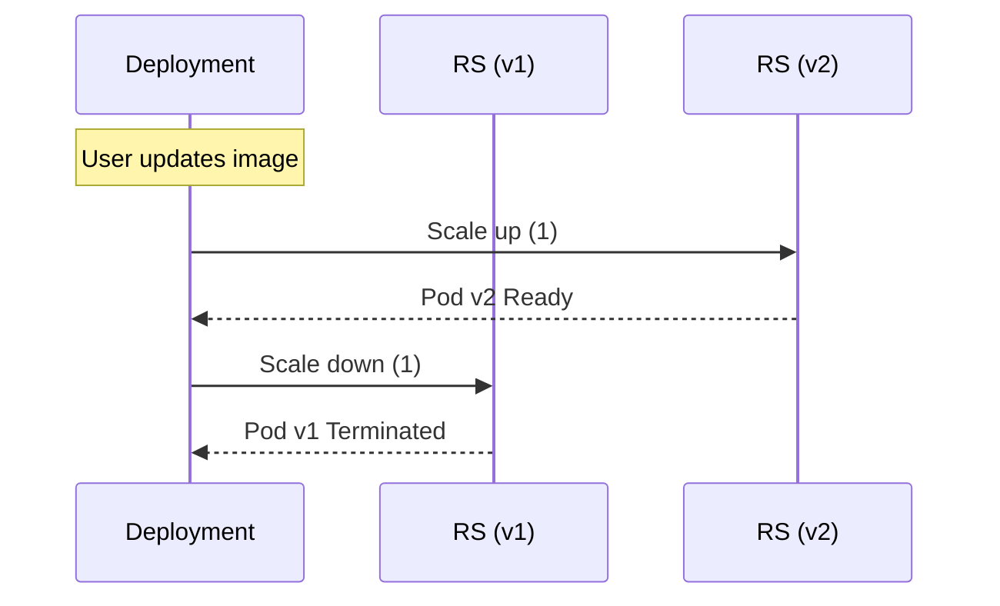

# Missing Sections for Deployments and Scaling

This file contains the high-fidelity enhancements for the Deployments and Scaling module.

---

## 🏗️ The Deployment Hierarchy

A Deployment doesn't manage Pods directly. It manages **ReplicaSets**, which in turn manage **Pods**. This layers-of-abstraction approach is what enables zero-downtime rollouts.



---

## 🔄 Rolling Update Mechanics: Surge vs. Unavailable

When you update an image, Kubernetes starts a "dance" between the old and new ReplicaSets.

| Parameter | Meaning | Example (Desired: 10) |
| :--- | :--- | :--- |
| **maxSurge** | How many extra pods can be created. | If 25%, you can have 13 pods total during rollout. |
| **maxUnavailable**| How many pods can be down. | If 25%, you must have at least 8 pods running. |



---

## 🕒 Rollbacks and History

Kubernetes keeps a history of your changes. If something goes wrong, you can travel back in time.

```bash
# View rollout history
kubectl rollout history deployment web-app

# Roll back to previous version
kubectl rollout undo deployment web-app

# Roll back to a specific revision
kubectl rollout undo deployment web-app --to-revision=2
```

---

## 📖 Real-World DevOps Story: "The 100% Unavailable Incident"

**The Scenario:** An engineer set `maxUnavailable: 100%` in their deployment strategy, thinking it would make the deployment faster. 

**The Result:** When they updated the image, Kubernetes killed **ALL** existing pods immediately before the new ones were even pulled. Because the new image had a typo in the tag, the new pods stayed in `ImagePullBackOff`. The site went dark for 10 minutes because there were no old pods left to serve traffic.

**The Lesson:** 
- In production, always use `maxUnavailable: 0` or a small percentage.
- The default is 25%, which is a safe middle ground.

---

## 👨‍💻 Interview Preparation (Scaling Expert)

1. **Q: What is the difference between Recreate and RollingUpdate strategies?**
   *   *A: `Recreate` kills all old pods before starting new ones (causes downtime). `RollingUpdate` replaces them one by one (zero downtime).*

2. **Q: How does the Deployment know which Pods to manage?**
   *   *A: It uses a **Label Selector**. If you manually create a pod with the same labels, the Deployment might try to manage it (and potentially kill it if the replica count is exceeded).*

3. **Q: Explain Horizontal Pod Autoscaling (HPA).**
   *   *A: HPA automatically scales the number of pods in a deployment based on observed CPU/Memory utilization or custom metrics.*

---

## 🧠 Knowledge Check

1. Which object does a Deployment directly manage? (ReplicaSet)
2. What happens if you run `kubectl rollout undo`? (Rolls back to the previous revision)
3. How do you see the status of an ongoing rollout? (`kubectl rollout status deployment <name>`)
