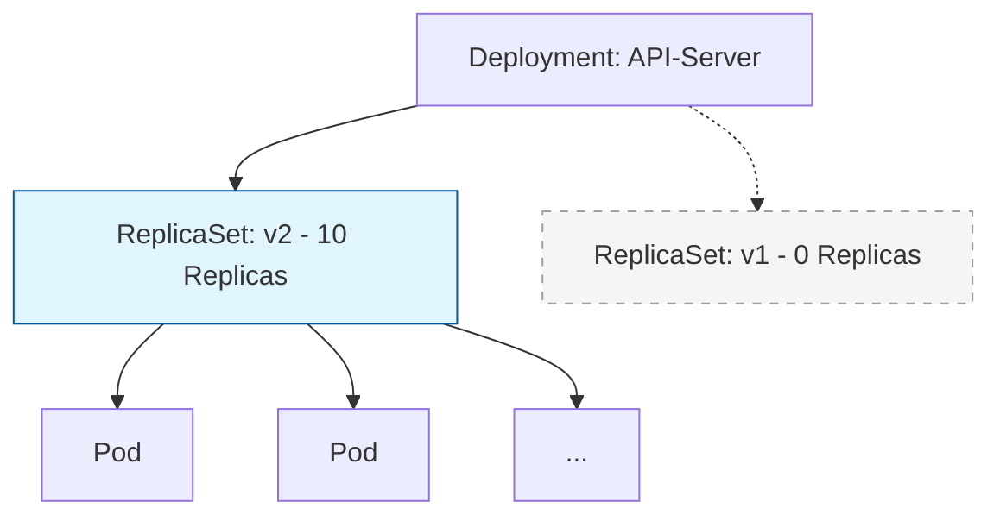

# 🚀 Deployments and Scaling: Managing State


## 📋 Overview

**Deployments** represent a set of multiple, identical Pods with no unique identities. A Deployment runs multiple replicas of your application and automatically replaces any instances that fail or become unresponsive. They are the standard way to deploy **stateless** applications in Kubernetes.

### 🎯 Learning Objectives

By the end of this module, you will:
- Understand the **Deployment -> ReplicaSet -> Pod** hierarchy.
- Master zero-downtime **Rolling Updates**.
- Handle **Rollbacks** and version history.
- Implement **Scaling** (Manual and Horizontal Autoscaling).
- Configure update strategies for high availability.

---

## 🏗️ The Deployment Hierarchy

A Deployment is a high-level object. It doesn't talk to Pods directly; it manages **ReplicaSets**.



---

## 🔄 Rolling Updates: The Zero-Downtime Dance

Kubernetes ensures your app stays online by replacing old pods with new ones gradually.

### Update Strategies
1.  **RollingUpdate (Default)**: Gradually replaces pods.
2.  **Recreate**: Kills all old pods first, then starts new ones (Causes Downtime!).

### ⚙️ Surgeon's Precision: MaxSurge & MaxUnavailable
```yaml
spec:
  strategy:
    type: RollingUpdate
    rollingUpdate:
      maxSurge: 25%       # How many extra pods allowed
      maxUnavailable: 25% # How many pods can be down
```

---

## 🕒 Rollbacks: Traveling in Time

If a new version is buggy, you can revert instantly.

```bash
# Check what happened
kubectl rollout history deployment/web-app

# Revert to the last working version
kubectl rollout undo deployment/web-app

# Revert to a specific point in time
kubectl rollout undo deployment/web-app --to-revision=3
```

---

## 📈 Scaling for Traffic

### 1. Manual Scaling
Quickly react to a sudden traffic spike.
```bash
kubectl scale deployment/web-app --replicas=20
```

### 2. Auto-scaling (HPA)
Let Kubernetes handle the load based on CPU metrics.
```bash
kubectl autoscale deployment/web-app --min=2 --max=10 --cpu-percent=80
```

---

## 📖 Real-World DevOps Story: "The 100% Unavailable Incident"

**The Scenario:** An engineer set `maxUnavailable: 100%` in their deployment strategy to "speed up" the update. 

**The Result:** Kubernetes killed **EVERY** healthy pod immediately. When the new image failed to pull due to a registry error, the cluster was left with 0 running pods. The service was down for 15 minutes.

**The Lesson:** Always use `maxUnavailable: 0` or a small percentage for production workloads to ensure there is always a "safety net" of old pods.

---

## 👨‍💻 Interview Preparation

1. **Q: Why does a Deployment use a ReplicaSet instead of managing pods directly?**
   *   *A: To support rolling updates. By keeping the old ReplicaSet around (at 0 replicas), Kubernetes can easily roll back to a previous state.*

2. **Q: How do you pause a rollout that is currently in progress?**
   *   *A: `kubectl rollout pause deployment/<name>`. This is useful for "Canary" testing.*

3. **Q: What happens if a Deployment has 3 replicas and you manually delete one pod?**
   *   *A: The ReplicaSet controller will notice the "Actual State" (2) doesn't match the "Desired State" (3) and will immediately start a new pod.*

---

## 🧠 Knowledge Check

1. Which command shows you the progress of an image update? (`kubectl rollout status`)
2. What is the default update strategy? (RollingUpdate)
3. If you want to ensure 100% capacity is maintained during an update, what should `maxUnavailable` be set to? (0)

---

## 🔗 Internal Navigation
- [Next: Services and Networking](readme.md)
- [Back: Pods and Nodes](../03-pods-and-nodes/readme.md)