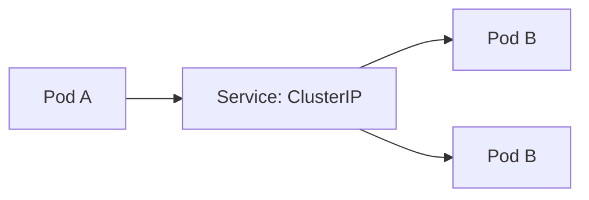

# Missing Sections for Services and Networking

This file contains the high-fidelity enhancements for the Services and Networking module.

---

## 🔌 Service Types: The Connectivity Matrix

Kubernetes Services abstract the underlying Pod IPs (which change frequently) and provide a stable endpoint.

### 1. ClusterIP (Internal Only)
The default type. Provides an IP reachable only from *inside* the cluster.


### 2. NodePort (External via Node IP)
Expose the service on a static port (30000-32767) on every Node's IP.


### 3. LoadBalancer (Cloud Standard)
Exposes the service externally using a cloud provider's load balancer (L4).
- AWS NLB/ELB
- Azure Load Balancer
- Google Cloud LB

---

## 🏷️ The Selector Mechanics: How Connections are Made

A Service is linked to Pods through **Labels**.

```yaml
# The Service
spec:
  selector:
    app: my-web-app
  ports:
    - protocol: TCP
      port: 80        # Service Port
      targetPort: 8080 # Pod Port
```

**The Internal Workflow:**
1.  Service looks for pods with `app: my-web-app`.
2.  It creates an **Endpoints** object containing the current IPs of those pods.
3.  **Kube-Proxy** updates the node's routing tables (iptables/IPVS) based on these endpoints.

---

## 📖 Real-World DevOps Story: "The Infinite Loop of Redirection"

**The Scenario:** A team deployed a new service and configured an Ingress. They noticed that internal calls to the service were failing with timeouts, while external calls via Ingress worked fine. 

**The Cause:** They had hardcoded the Ingress (external) URL inside their microservices code for inter-service communication. Instead of calling `http://order-service` (internal DNS), they were looping out to the internet and back in through the LoadBalancer.

**The Lesson:** 
- Always use **ClusterIP** and **Internal DNS** (`service.namespace.svc.cluster.local`) for service-to-service calls.
- It reduces latency, costs, and security risks.

---

## 👨‍💻 Interview Preparation (Network Engineer)

1. **Q: What is the difference between `port`, `targetPort`, and `nodePort`?**
   *   *A: `port` is the port on the Service itself. `targetPort` is the port the application is listening on inside the pod. `nodePort` is the external port on the cluster nodes (30000+).*

2. **Q: How does a Pod resolve `my-service` to an IP?**
   *   *A: Every pod is configured to use **CoreDNS** as its nameserver. CoreDNS watches the API Server and maintains A-records for every service.*

3. **Q: Why would you use a Service without a Selector (Headless Service)?**
   *   *A: For stateful applications (like databases) where you need to talk to a specific instance directly, rather than a load-balanced endpoint.*

---

## 🧠 Knowledge Check

1. What is the default range for `NodePort` Services? (30000-32767)
2. Which component manages the routing rules (iptables) on each node? (Kube-Proxy)
3. What is the FQDN format for a service? (`name.namespace.svc.cluster.local`)
