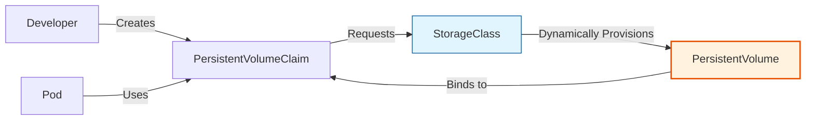

# 💾 Persistence and Storage: Handling Stateful Data

## 📋 Overview

By default, Kubernetes Pods are ephemeral. If a container crashes or is deleted, any data stored inside its root filesystem is lost. **Persistence and Storage** provides a way to decouple data from the container lifecycle, ensuring that databases, file shares, and user uploads survive restarts and rescheduling.

### 🎯 Learning Objectives

By the end of this module, you will:
- Master the **Storage Lifecycle**: StorageClass -> PVC -> PV.
- Understand **Dynamic Provisioning** vs. Static Provisioning.
- Select correct **Access Modes** (RWO, RWX) for different workloads.
- Implement **Topology-Aware** storage for multi-zone clusters.
- Manage **Reclaim Policies** to prevent accidental data loss.

---

## 🏗️ The Storage Hierarchy: Roles & Responsibilities

Kubernetes uses three main objects to manage storage:

1.  **StorageClass (SC)**: The "Menu" of available storage types (e.g., SSD, HDD, Encrypted).
2.  **PersistentVolumeClaim (PVC)**: The "Order" placed by a developer (e.g., "I need 10Gi of SSD").
3.  **PersistentVolume (PV)**: The "Actual Disk" created to fulfill the order.

---

## 🔌 Dynamic vs. Static Provisioning

| Type | How it Works | Use Case |
| :--- | :--- | :--- |
| **Static** | Admin manually creates PVs before they are used. | On-prem clusters with fixed hardware. |
| **Dynamic** | Kubernetes talks to the Cloud Provider (AWS/GCP) to create disks on-demand. | **Cloud Standard.** AWS EBS, Azure Disk, GCE PD. |

---

## 🛠️ Access Modes: Who can use the disk?

| Mode | Shortcut | Behavior | Example |
| :--- | :--- | :--- | :--- |
| **ReadWriteOnce** | RWO | Only one node can read/write at a time. | Databases (EBS, PD). |
| **ReadWriteMany** | RWX | Many nodes can read/write simultaneously. | File shares (EFS, NFS). |
| **ReadOnlyMany** | ROX | Many nodes can read, none can write. | Shared static assets. |

---

## 🛡️ The Reclaim Policy (Finality)

What happens to the physical disk when you delete the `PersistentVolumeClaim`?
- **Retain**: The disk is preserved. An admin must manually delete it or recover it.
- **Delete**: The physical disk in the cloud (e.g., AWS EBS) is deleted immediately. **Data is lost!**

---

## 📖 Real-World DevOps Story: "The Database that lost its home"

**The Scenario:** A team was running a database in a multi-zone AWS cluster. The DB pod was originally created in `us-east-1a` along with its EBS volume. During a maintenance window, the pod was rescheduled to `us-east-1b`.

**The Result:** The pod stayed in `Pending` state with the error `Volume not found in zone`. This is because **EBS volumes are zonal** and cannot travel across availability zones.

**The Lesson:** 
- In multi-zone clusters, use `volumeBindingMode: WaitForFirstConsumer` in your StorageClass. 
- This ensures the volume is created **only** after the pod is scheduled to a specific node, matching the zone perfectly.

---

## 👨‍💻 Interview Preparation

1. **Q: What is the benefit of using a StorageClass?**
   *   *A: It allows developers to request storage without needing to know the technical details of the underlying storage system (AWS, Azure, VMWare).*

2. **Q: Can you expand a PVC while it's attached to a pod?**
   *   *A: Most modern CSI drivers (like AWS EBS or GCE PD) support online expansion if `allowVolumeExpansion: true` is set in the StorageClass.*

3. **Q: What is CSI (Container Storage Interface)?**
   *   *A: It is a standard for exposing arbitrary block and file storage systems to containerized workloads (K8s).*

---

## 🧠 Knowledge Check

1. Which resource does a developer create to request 50GB of storage? (PVC)
2. What is the default reclaim policy for dynamic storage? (Delete)
3. Which access mode is needed for a shared web server folder used by multiple nodes? (ReadWriteMany)

---

## 🔗 Internal Navigation
- [Next: StatefulSets and Jobs](../09-statefulsets-and-jobs/readme.md)
- [Back: ConfigMaps and Secrets](readme.md)