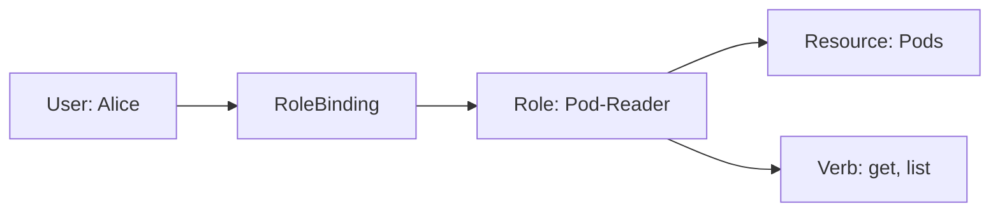

# Missing Sections for Cluster Administration (RBAC, Namespaces, Quotas)

This file contains the high-fidelity enhancements for the Cluster Administration module.

---

## 🏗️ Namespaces: The Virtual Sub-Clusters

Namespaces allow you to split a single physical cluster into multiple virtual ones. It is the foundation of **Soft Multi-tenancy**.

1.  **Default**: Where your pods go if you don't specify one.
2.  **Kube-System**: Where K8s infrastructure pods live (DNS, Proxy, Control Plane).
3.  **Custom**: (e.g., `dev`, `staging`, `prod`) to isolate teams or environments.

---

## 🔑 RBAC: Who Can Do What?

Kubernetes uses **Role-Based Access Control (RBAC)** to manage permissions.

| Component | Question | Example |
| :--- | :--- | :--- |
| **User/ServiceAccount**| **Who?** | `developer-john` or `jenkins-sa` |
| **Role / ClusterRole** | **What?** | `get`, `list`, `watch` on `Pods` |
| **Binding / ClusterBinding**| **Where?** | Link **Who** to **What** in a specific Namespace (Binding) or Cluster-wide (ClusterBinding) |

---

## 📊 Resource Hygiene: Quotas and LimitRanges

To prevent one team from hogging all the cluster's RAM/CPU, we use:

1.  **ResourceQuotas**: Sets a hard limit on the *total* resources a Namespace can use (e.g., "The `dev` namespace can only use 10 CPUs total").
2.  **LimitRanges**: Sets defaults and constraints for *individual* pods in a Namespace (e.g., "Every pod in `dev` must have a CPU limit of at least 100m").

---

## 📖 Real-World DevOps Story: "The Admin who deleted the wrong Namespace"

**The Scenario:** A junior admin wanted to clean up an old testing environment using `kubectl delete namespace test`. Unfortunately, they were in the wrong context and didn't realize that in this cluster, `test` was the prefix for `test-production-api`. 

**The Result:** Kubernetes immediately started terminating every production pod, service, and persistent volume claim in that namespace. Because Namespaces are the "Parent" object, everything inside them is deleted cascadingly.

**The Lesson:** 
- Always check your context using `kubectl config current-context`.
- Use **RBAC** to restrict `delete namespace` permissions to only a few "Super Admins."
- Implement **Resource Quotas** even in dev to catch runaway scripts before they consume the whole cluster.

---

## 👨‍💻 Interview Preparation (Cluster Admin)

1. **Q: What is the difference between a Role and a ClusterRole?**
   *   *A: A **Role** is namespaced (e.g., only gives access to Pods in 'dev'). A **ClusterRole** is cluster-wide (e.g., gives access to Nodes or PersistentVolumes across the whole cluster).*

2. **Q: How do you verify what permissions a specific user has?**
   *   *A: Use the `auth can-i` command. Example: `kubectl auth can-i create deployments --as=system:serviceaccount:dev:my-sa`.*

3. **Q: Why should you avoid using the 'default' ServiceAccount for your applications?**
   *   *A: The default SA usually has very few permissions, but if you accidentally grant it broad permissions, **every** pod in that namespace will inherit them. It's safer to create a dedicated SA for each application.*

---

## 🧠 Knowledge Check

1. Which resource is used to limit the total amount of memory a Namespace can consume? (ResourceQuota)
2. What is the difference between a RoleBinding and a ClusterRoleBinding? (RoleBinding is scoped to a single namespace; ClusterRoleBinding is cluster-wide)
3. How do you see all namespaces in a cluster? (`kubectl get ns`)
