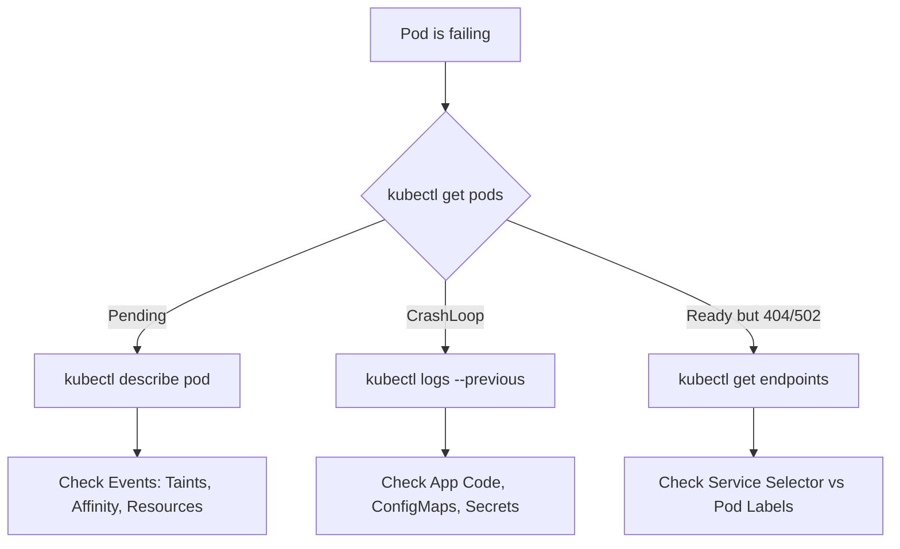

# 🚑 Kubernetes Real-Life Scenarios & Troubleshooting

## 📋 Overview

In production, Kubernetes rarely fails because of "The Cluster." It fails because of **Configurations**, **Resource Contention**, or **Network Misunderstandings**. This module collects high-pressure scenarios to help you build the diagnostic muscles of a Senior DevOps Engineer.

### 🎯 Learning Objectives

By the end of this module, you will:
- Identify and fix **Container Crash Patterns** (OOMKilled, Restarts).
- Resolve **Networking Deadlocks** (Services vs. Network Policies).
- Manage **Storage Attachment Locks** during pod migrations.
- Troubleshoot **Scaling Death Spirals** in HPA configurations.
- Use the **Diagnostic Toolkit** (`describe`, `logs`, `get events`, `debug`).

---

## 🛠️ The "Panic Button" Diagnostic Flow

When an incident occurs, follow this standard hierarchy to find the root cause:

---

## 🏗️ Scenario 1: The "OOMKilled" Mystery

**The Problem:** Your high-traffic API starts vanishing and restarting every few hours.
**The Investigation:** `kubectl get pods` shows `RESTARTS: 45`. `kubectl describe pod` shows `Reason: OOMKilled`.
**The Fix:** Increase the `memory: limit` in the deployment. If it keeps happening, you likely have a memory leak in your code.

---

## 🌩️ Scenario 2: The "Zombie Volume Attachment"

**The Problem:** You move a database pod to a new node, but it's stuck in `Pending` for 20 minutes.
**The Reason:** The cloud provider's storage controller (AWS EBS) still thinks the disk is attached to the *old* node.
**The Fix:** Manually verify and potentially force-detach the volume in the cloud console or delete the `VolumeAttachment` resource in K8s.

---

## 🚦 Scenario 3: The "Silent Timeout"

**The Problem:** Pod A and Pod B are in the same namespace. Pod A can't reach Pod B via internal DNS.
**The Reason:** A **NetworkPolicy** was applied with an `Ingress` rule that doesn't include Pod A's labels.
**The Fix:** Update the Network Policy to allow ingress from pods matching Pod A's labels.

---

## 📖 Real-World DevOps Story: "The Night the HPA went Crazy"

**The Scenario:** A team configured an HPA to scale based on **CPU usage**. During a flash sale, the app used 100% CPU purely for its startup initialization (loading cache). 

**The Result:** HPA saw 100% CPU and launched 10 more pods. Those pods *also* used 100% CPU to start. This triggered *more* pods. The cluster hit its cloud node limit and crashed the control plane with a storm of API requests.

**The Lesson:** Always use **Readiness Probes** to ensure the app is actually serving traffic before the HPA considers it "Healthy" for its scaling math.

---

## 👨‍💻 Interview Preparation

1. **Q: How do you see events for the whole namespace at once?**
   *   *A: `kubectl get events --sort-by='.lastTimestamp'`. This is the single best command for seeing a timeline of cluster failures.*

2. **Q: What is the difference between `kubectl logs` and `kubectl logs --previous`?**
   *   *A: `logs` shows the current container. `--previous` shows the logs from the container that just crashed, which is vital for finding why it died.*

3. **Q: If a pod is stuck in `Pending`, where do you look?**
   *   *A: `kubectl describe pod`. Go straight to the **Events** at the bottom. It will tell you if it's due to Insufficient CPU, Node Taints, or Volume issues.*

---

## 🧠 Knowledge Check

1. What status code indicates a memory-related crash? (OOMKilled)
2. Which command lets you investigate a pod without any debugging tools installed in its image? (`kubectl debug`)
3. Why might a Service exist but have no "Endpoints"? (The selector doesn't match any running pod labels)

---

## 🔗 Internal Navigation
- [Next: Final Assessment](../12-interview-questions-and-quizzes/readme.md)
- [Back: Part 6 Overview](../readme.md)
- [Mastery: Deep Dives](../deep-dives/readme.md)
