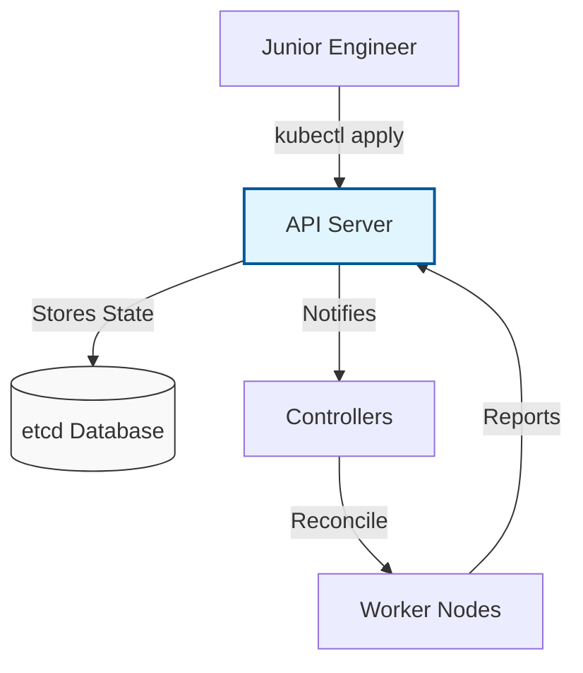

# ☸️ Kubernetes (K8s): The Command Center

> **"Listen up, Junior. In the Beginner phase, you learned how to run a container. In Phase 3, you learn how to run a fleet. Kubernetes isn't just a tool; it's the Operating System of the Cloud."**

---

## 🧠 The Mental Model: The Command Center

**The Junior Struggle**: "I can just run `docker run`. Why do I need 5 different components just to start one container? Why is YAML so complicated?"

**The Architect Solution**: You realize that in production, containers die, traffic spikes, and nodes fail. You don't want to be the one manually restarting things at 3 AM. You need a **Command Center**:
- **API Server**: The communication desk. Everything goes through here.
- **etcd**: The brain's memory. If it's not in etcd, it doesn't exist.
- **Scheduler**: The logistics officer who decides which room (Node) has space for a new guest (Pod).
- **Controller Manager**: The enforcer who ensures that if you asked for 3 pods, you *always* have 3 pods.
- **Kubelet**: The manager on the ground who makes sure the containers are actually running.

---

## 🆚 Junior Way vs. Architect Way

| Feature | The Junior Way (Problematic) | The Architect Way (Strategic) |
|:---|:---|:---|
| **Deployments** | `docker run` on a single VM | **Replicas & Rolling Updates** |
| **Recovery** | Manual `docker restart` | **Self-Healing** (Liveness Probes) |
| **Scaling** | "I'll create another VM" | **Horizontal Pod Autoscaler** (HPA) |
| **Storage** | Local volume mounts | **Persistent Volumes (PV/PVC)** |
| **Networking** | Hardcoded IP addresses | **Service Discovery & Ingress** |

---

## 🏗️ Visual: The Reconciliation Loop

---

## 🗺️ Curriculum Path

### 🏗️ [Part 1: Foundations & Architecture](readme.md)
*Junior, learn the anatomy before you perform surgery.* 
Master the Control Plane, `kubectl` productivity, and the Request Lifecycle.

### 🔄 [Part 2: Workload Management](readme.md)
*Treat your containers like cattle, not pets.* 
Deployments, Replicasets, and managing the application lifecycle at scale.

### 🚦 [Part 3: Networking and Config](readme.md)
*Traffic control for the cloud.* 
Services, Ingress Controllers, and decoupling config through ConfigMaps and Secrets.

### 💾 [Part 4: State and Persistence](readme.md)
*Data that survives the storm.* 
PVs, PVCs, and StatefulSets. Learn how to run databases in a world where containers are ephemeral.

### 🛡️ [Part 5: Cloud Ops and Administration](readme.md)
*Governance and Identity.* 
RBAC, Namespaces, EKS management, and multi-tenant security hardening.

---

## 🏆 Real-World DevOps Story: The 3 AM Node Failure

**The Scenario**: A cloud provider had a hardware failure that nuked 10 virtual machines instantly. 
**The Crisis**: In the old manual world, the site would be down for hours. 
**The Kubernetes Solution**: Within **30 seconds**, the Kubernetes Scheduler noticed the nodes were gone and automatically moved the affected Pods to healthy nodes. The users didn't even notice.
**The Lesson**: **Junior, automation isn't about laziness; it's about survival.**

---

## 🎤 Interview Preparation (Kubernetes)

1. **Q: Junior, what is the 'Control Plane' in Kubernetes?**
   - *A: It's the 'Brain' of the cluster, consisting of the API Server, etcd, Scheduler, and Controller Manager. It manages the state and health of all objects.*

2. **Q: Explain 'etcd' and why it's critical.**
   - *A: etcd is a distributed key-value store that holds the entire state of the cluster. If etcd is lost and you have no backup, your cluster is gone.*

3. **Q: What is a 'Pod'?**
   - *A: The smallest deployable unit in K8s. It contains one or more containers that share the same network namespace and storage.*

4. **Q: Explain 'Liveness' vs. 'Readiness' probes.**
   - *A: **Liveness** checks if the container is alive (restarts it if it fails). **Readiness** checks if the container is ready to accept traffic (stops sending traffic if it fails).*

5. **Q: What is a 'Service' in K8s?**
   - *A: An abstraction that defines a logical set of Pods and a policy by which to access them (providing a stable IP or DNS name).*

6. **Q: What is the difference between a Deployment and a StatefulSet?**
   - *A: **Deployments** are for stateless apps (any pod is identical). **StatefulSets** are for apps that need unique identities and persistent storage (like databases).*

7. **Q: What is an 'Ingress Controller'?**
   - *A: An API object that manages external access to services, typically HTTP. It acts as a Layer 7 Load Balancer.*

8. **Q: Explain 'RBAC' (Role-Based Access Control).**
   - *A: A method of regulating access to the K8s API based on the roles of individual users or service accounts.*

9. **Q: What is 'HPA' (Horizontal Pod Autoscaler)?**
   - *A: It automatically scales the number of Pods in a deployment based on observed CPU utilization or other metrics.*

10. **Q: Junior, how do you fix a 'CrashLoopBackOff' error?**
    - *A: Check the logs (`kubectl logs`), check the events (`kubectl describe pod`), and verify if resources (like ConfigMaps or Secrets) are missing or if the app is crashing on startup.*

---

## 📝 Knowledge Check

1. **Which component decides which Node a Pod should run on?**
   - [x] Scheduler.

2. **Where is the cluster's state stored?**
   - [x] etcd.

3. **Which object is used to expose an application to the internet?**
   - [x] Ingress (or LoadBalancer Service).

4. **What is the command to view the logs of a pod named 'myapp'?**
   - [x] `kubectl logs myapp`.

5. **Which probe tells K8s when to stop sending traffic to a Pod?**
   - [x] Readiness Probe.

6. **True/False: A Pod can have multiple containers.**
   - [x] **True**. (Sidecar pattern).

7. **What does 'Replicas: 3' in a YAML file mean?**
   - [x] K8s will ensure exactly 3 instances of the pod are running at all times.

8. **Which object provides a stable DNS name for a group of Pods?**
   - [x] Service.

9. **What is the default port for the Kubernetes API Server?**
   - [x] 6443.

10. **Which command is used to apply a configuration from a file?**
    - [x] `kubectl apply -f <filename>`.

---

## 🔗 Next Steps
Junior, the command center is active. Let's see how to monitor its health.
1. Proceed to: **[02. Observability Foundations](readme.md)** →
2. Return to: **[Phase 3 Hub](../readme.md)** →

---
## 🧭 Additional Modules
- [01 Foundations](01-foundations/readme.md)
- [02 Workload Management](02-workload-management/readme.md)
- [03 Networking and Config](03-networking-and-config/readme.md)
- [04 State and Persistence](04-state-and-persistence/readme.md)
- [05 Cloud Ops and Admin](05-cloud-ops-and-admin/readme.md)
- [06 Mastery and Resources](06-mastery-and-resources/readme.md)
