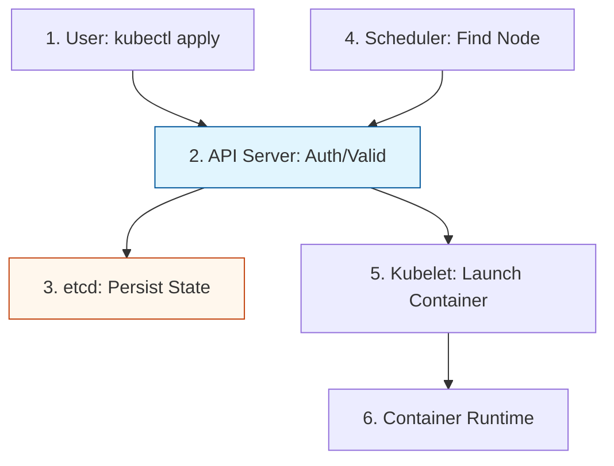

# Kubernetes Cluster Architecture Reference

**Doc Version:** 1.0.0
**Role:** Cluster Architect / Kubernetes Admin
**Scope:** Control Plane, Worker Nodes, and the Request Lifecycle

---

## 1. The Kubernetes "Brain" (Control Plane)

The Control Plane makes global decisions about the cluster (e.g., scheduling) and detects/responds to cluster events.

### Components:
- **kube-apiserver**: The "Front Door." Every request (from kubectl, users, or internal components) must go through the API server. It is the only component that talks directly to etcd.
- **etcd**: The "Source of Truth." A highly-available, distributed key-value store that holds all cluster data (manifests, status, secrets).
- **kube-scheduler**: The "Matcher." Watches for newly created Pods with no assigned node and selects the best node for them to run on based on resource requirements, policy constraints, and affinity/anti-affinity rules.
- **kube-controller-manager**: The "Manager of Managers." Runs controller processes that regulate the state of the cluster (e.g., Node Controller, Job Controller, EndpointSlice Controller).
- **cloud-controller-manager**: The "Cloud Bridge." Links your cluster to your cloud provider's API (AWS, GCP, Azure) to manage LoadBalancers, Nodes (as instances), and Storage (as volumes).

---

## 2. The "Hands" (Worker Nodes)

Worker nodes maintain running pods and provide the Kubernetes runtime environment.

### Components:
- **kubelet**: The "Captain of the Ship." An agent that runs on each node. It ensures that containers described in PodSpecs are running and healthy. It does not manage containers it didn't create via Kubernetes.
- **kube-proxy**: The "Networking traffic cop." Maintains network rules on nodes, allowing network communication to your Pods from inside or outside the cluster.
- **Container Runtime**: The "Workhorse." Software responsible for running containers (e.g., containerd, CRI-O).

---

## 3. The Reconcilliation Loop (Desired vs. Actual)

Kubernetes is built on the philosophy of **Declarative Management**.

1.  **Desired State**: Desired configuration submitted as YAML to the API Server.
2.  **Actual State**: The current reality of what is running on the nodes.
3.  **The Loop**: Controllers continuously compare the Actual State against the Desired State. If a deviation is found, the Controller initiates actions to bring the Actual State back in line with the Desired State.

**Example**: If you define a Deployment with 3 replicas, and a node crashes (killing one pod), the Deployment Controller notices the count is 2 and tells the API server to create a 3rd pod.

---

## 4. Visualizing the Request Lifecycle

---

## 5. Persistence and State management

- **Stateless Workloads**: Use **Deployments**. Containers can be killed and restarted on any node without data loss (because data is stored elsewhere).
- **Stateful Workloads**: Use **StatefulSets**. Provides stable network identities and stable persistent storage (pinned to the pod index).

---

## 6. Enterprise Best Practices

- **High Availability (HA)**: Run at least 3 Control Plane nodes (to ensure etcd quorum) across multiple Availability Zones.
- **Resource Limits**: Always define `requests` (minimum needed) and `limits` (maximum allowed) for CPU and Memory to prevent "Noisy Neighbor" issues and OOM (Out of Memory) kills.
- **Node Affinity**: Use `nodeAffinity` and `taints/tolerations` to ensure specialized workloads (e.g., GPU jobs) land on the correct hardware.

> **Enterprise Pattern**: Use **Infrastructure as Code** (Terraform/CloudFormation) to build the Cluster, and **GitOps** (ArgoCD/Flux) to manage the Workloads. This ensures that even if the entire cluster is deleted, it can be recreated and populated with all applications in minutes.
