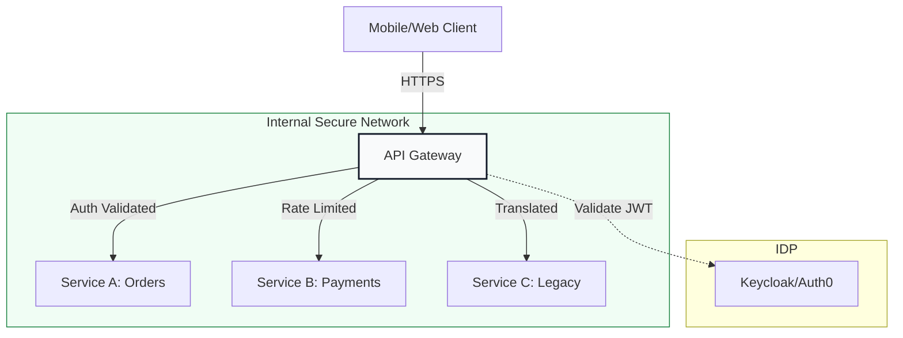

# 🚪 API Gateways & Security: The Border Patrol

> **"Listen up, Junior. Every second your API is public, it's being scanned by bots. In this module, you learn to build the 'Guard at the Wall' that protects your microservices from the chaos of the open internet."**

---

## 🧠 The Mental Model: The Border Patrol

**The Junior Struggle**: "I can just expose my microservice with a LoadBalancer. Why do I need an API Gateway? Why are JWT tokens so complicated?"

**The Architect Solution**: You realize that exposing internal services directly is like building a house with no front door. You need a **Border Patrol**:
- **Authentication (Passport Control)**: "Who are you? Show me your JWT."
- **Rate Limiting (Crowd Control)**: "One request per second, buddy. Don't crowd the building."
- **Circuit Breakers (Safety Doors)**: "Service B is slow. Close the door to Service B so it doesn't slow down the rest of the building."
- **Transformation (Translator)**: "The client speaks JSON, but the backend speaks XML. I'll translate for you."

---

## 🆚 Junior Way vs. Architect Way

| Feature | The Junior Way (Problematic) | The Architect Way (Strategic) |
|:---|:---|:---|
| **Exposure** | Direct Public IP/LoadBalancer | **Single Entry Point** (API Gateway) |
| **Auth** | Hardcoded API Keys | **OIDC / JWT / OAuth2** at the edge |
| **Traffic** | "Unlimited" (DDoS target) | **Strict Rate Limiting** based on Tier |
| **Reliability** | App crashes on high load | **Circuit Breaking & Throttling** |
| **Docs** | "I'll tell you the URL" | **OpenAPI (Swagger)** Spec-driven |

---

## 🏗️ Visual: The Secure Entry Pattern

---

## 🗺️ Curriculum Path

### 🏗️ [Part 1: Gateway Fundamentals](readme.md)
*Junior, learn the rules of the gate.* 
Architectural patterns, tool selection (Kong vs. Apigee), and the Backend-for-Frontend (BFF) pattern.

### 🔑 [Part 2: Security & Authentication](readme.md)
*Don't let just anyone in.* 
Deep dive into JWT, OAuth2 flows, and OpenID Connect (OIDC). Learn to validate tokens at the edge.

### 🚦 [Part 3: Traffic Management & Docs](readme.md)
*Control the flow.* 
Rate limiting, Circuit breaking, and the OpenAPI (Swagger) standard. Learn to treat your API as a contract.

### 🎓 [Part 4: Mastery and Resources](readme.md)
*The Architect Screening.* 
Advanced security patterns, interview prep, and real-world API outage scenarios.

---

## 🏆 Real-World DevOps Story: The Million-Request DDoS

**The Scenario**: A company released a new feature, and a botnet immediately started hitting the login endpoint with 10,000 requests per second.
**The Crisis**: Because there was no **Rate Limiting**, the database spent all its CPU checking fake passwords, and real users couldn't log in. 
**The Fix**: Implemented a **Rate Limit Policy** at the API Gateway that blocked any IP sending more than 5 requests per second.
**The Lesson**: **Junior, the internet is not a friendly place. Build the wall before the attack starts.**

---

## 🎤 Interview Preparation (API Gateways)

1. **Q: Junior, what is an 'API Gateway'?**
   - *A: It's a single entry point for all clients. It handles cross-cutting concerns like authentication, rate limiting, and request routing.*

2. **Q: Explain 'JWT' (JSON Web Token) and why we use it.**
   - *A: JWT is a compact, URL-safe way of representing claims between two parties. We use it because it's stateless—the gateway can verify the token's signature without calling the database.*

3. **Q: What is 'Rate Limiting' vs. 'Throttling'?**
   - *A: **Rate Limiting** is a hard cap on how many requests a user can make in a time period. **Throttling** is the act of slowing down those requests to prevent system overload.*

4. **Q: What is a 'Circuit Breaker' in API management?**
   - *A: It's a pattern that detects if a downstream service is failing and 'trips' the circuit, returning an immediate error to the client instead of waiting for a timeout.*

5. **Q: Explain 'OIDC' (OpenID Connect).**
   - *A: It's an identity layer built on top of OAuth 2.0. It allows clients to verify the identity of the end-user based on the authentication performed by an Authorization Server.*

6. **Q: What is the 'BFF' (Backend-for-Frontend) pattern?**
   - *A: Creating a specific gateway or service for a specific client type (e.g., a Mobile BFF vs. a Desktop BFF) to optimize the data sent over the wire.*

7. **Q: What is 'TLS Termination' at the gateway?**
   - *A: The gateway decrypts the HTTPS traffic from the user and passes it as plain HTTP to the internal services (which are in a secure, private network).*

8. **Q: Explain 'CORS' (Cross-Origin Resource Sharing).**
   - *A: A security feature implemented by browsers that prevents a webpage from making requests to a different domain than the one that served the webpage, unless the server explicitly allows it.*

9. **Q: What is 'Horizontal Scaling' for a Gateway?**
   - *A: Adding more gateway instances behind a load balancer to handle increased traffic.*

10. **Q: Junior, why is 'API Versioning' critical?**
    - *A: Because you can't force every user to update their mobile app instantly. You must support old versions of the API (e.g., `/v1/`) while releasing new ones (e.g., `/v2/`).*

---

## 📝 Knowledge Check

1. **Which tool is a popular open-source API Gateway?**
   - [x] Kong.

2. **What does 'JWT' stand for?**
   - [x] JSON Web Token.

3. **Which part of the JWT ensures it hasn't been tampered with?**
   - [x] Signature.

4. **True/False: An API Gateway can act as a Load Balancer.**
   - [x] **True**. (But it does much more).

5. **Which pattern prevents a slow service from slowing down others?**
   - [x] Circuit Breaker.

6. **What is the purpose of 'Rate Limiting'?**
   - [x] To prevent a single user or bot from overwhelming the system.

7. **Which standard is used for describing API endpoints?**
   - [x] OpenAPI (Swagger).

8. **What happens to a request if a 'Circuit' is 'Open'?**
   - [x] It is immediately rejected with an error.

9. **Where should you validate a user's identity?**
   - [x] At the Gateway ('The Edge').

10. **What is 'Payload Transformation'?**
    - [x] Changing the format of the data (e.g., XML to JSON) as it passes through the gateway.

---

## 🔗 Next Steps
Junior, the borders are secure. Now let's see how our Intelligent Agents use these tools.
1. Proceed to: **[04. MCP (Model Context Protocol)](../04-mcp/readme.md)** →
2. Return to: **[Phase 3 Hub](../readme.md)** →

---
## 🧭 Additional Modules
- [01 Gateway Fundamentals](01-gateway-fundamentals/readme.md)
- [02 Security and Authentication](02-security-and-authentication/readme.md)
- [03 Traffic Management and Docs](03-traffic-management-and-docs/readme.md)
- [04 Mastery and Resources](04-mastery-and-resources/readme.md)
