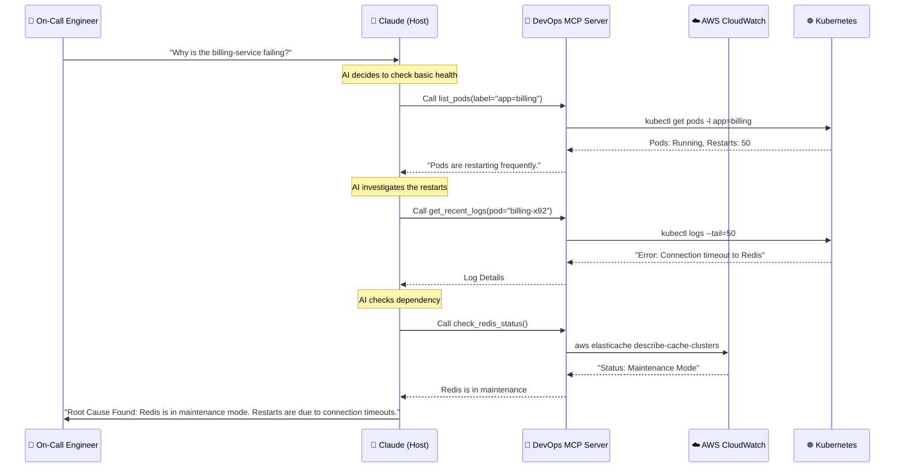

# 06: Real-Life Scenarios

**[⬅️ Back to MCP Module Index](../readme.md)** | **[Next: Advanced Level ➡️](readme.md)**

---

# 🌍 MCP in the Wild: Real-World DevOps Stories

It is easy to get lost in the theory of protocols and transports. This module looks at how engineering teams are actually using Model Context Protocol (MCP) to solve messy, real-world problems.

## 🛠️ Scenario 1: The AI Incident Commander

**Context**: A backend service is throwing 500 errors in production. The on-call engineer is overwhelmed by alerts.
**Challenge**: Quickly identify the root cause among millions of logs and multiple microservices without context switching.

### The Workflow

**Outcome**: The engineer didn't open terminal, AWS Console, or Datadog. The answer was synthesized in 30 seconds.

---

## 📈 Scenario 2: The "Sanity Check" Bot

**Context**: A developer just merged a complex Terraform change that modifies the core networking of a staging VPC.
**Problem**: Terraform `apply` says "Success", but did it break the internal routing table?
**Solution**: An **MCP-driven Verification Step**.

1.  **Trigger**: After `terraform apply`, the engineer asks the AI: *"Run a sanity check on the staging VPC."*
2.  **Tools Used**: 
    *   `verify_dns(hostname)`
    *   `check_port_connectivity(ip, port)`
    *   `curl_internal_endpoint(url)`
3.  **Result**: The AI orchestrates a series of pings and curls from inside the network (via the MCP server's access) and reports:
    > "✅ DNS resolves for internal API."
    > "❌ Port 5432 (Postgres) is unreachable from the App Subnet. **Rollback recommended.**"

---

## 🔑 Scenario 3: Secure Secrets Retrieval

**Context**: An AI assistant needs to fetch an API key to run a temporary smoke test against a 3rd party API.
**Constraint**: NEVER show the API key in the chat window or save it to a file.

**The MCP Solution**:
The MCP server implements a tool `run_smoke_test(api_key_secret_name: str)`.
1.  The AI calls the tool: `run_smoke_test(api_key_secret_name="stripe_test_key")`.
2.  The **Server** reads the secret from AWS Secrets Manager directly into its memory.
3.  The **Server** executes the HTTP request to Stripe.
4.  The **Server** cleans up memory.
5.  The **Server** returns only: `{"status": "success", "latency": "120ms"}`.

**Key Takeaway**: The "Brain" (LLM) never touched the secret. It only orchestrated the *use* of the secret.

---

## ⚡ Scenario 4: The CI/CD "Janitor"

**Context**: A development Kubernetes cluster is cluttered with hundreds of "Evicted" pods, "Completed" jobs, and unused PVCs, causing resource quotas to hit limits.
**Challenge**: Cleanup scripts are brittle and often delete the wrong things.

**The Agentic Approach**:
1.  **Prompt**: "Identify all resources in the `dev` namespace that are older than 7 days and not in `Running` state. Propose a cleanup plan."
2.  **Discovery**: usage of `list_resources` with various filters.
3.  **Proposal**: The AI presents a formatted markdown table:
    *   `job/nightly-build-x` (14 days old) -> **DELETE**
    *   `pod/worker-failing` (Evicted) -> **DELETE**
    *   `pvc/unused-cache` (Unmounted) -> **DELETE**
4.  **Approval**: User types "Approved".
5.  **Execution**: AI loops through the list and calls `delete_resource` for each item.

---

## 🚀 Conclusion

These scenarios demonstrate that MCP is not just about "chatting with code". It is about **orchestrating complex, multi-step engineering tasks** while keeping the human in the loop for critical decisions.

Ready to build these systems? Return to **[02-Building-MCP-Servers](../02-building-mcp-servers/readme.md)** to start coding.

