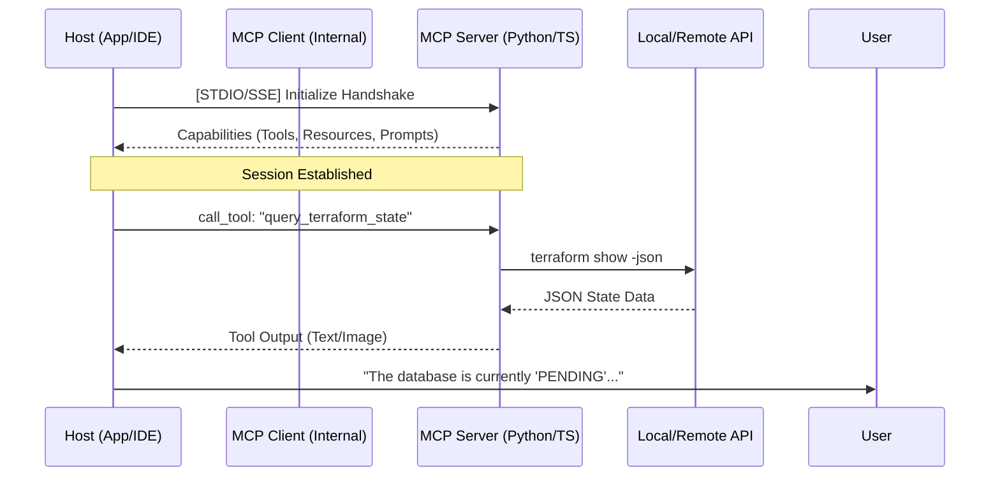

# 📔 MASTER_MCP_REFERENCE: The Architect's Source of Truth

> **"Junior, if you want to build the nervous system of an AI-driven infrastructure, you stop copy-pasting. You start architecting. This is your bible for the Model Context Protocol (MCP)."**

---

## 🏗️ 1. The MCP Blueprint: Architectural Flow

The Model Context Protocol is a client-server architecture that allows AI Hosts (like Claude Desktop, Cursor, or your own apps) to communicate with local or remote "Tools" and "Resources" using a standardized **JSON-RPC** handshake.

### The Handshake Sequence


### Core Primitives
1.  **Tools**: Functions the AI can execute (e.g., `git_commit`). Must have strict JSON schemas.
2.  **Resources**: Data the AI can read (e.g., `logs://app-1`). These are URI-based.
3.  **Prompts**: Reusable context templates (e.g., "Explain this Kubernetes error as an SRE").

---

## 🛠️ 2. SDK Implementation Guide

### A. TypeScript SDK (The Enterprise Choice)
Best for high-concurrency or Node-based environments.
*   **Package**: `@modelcontextprotocol/sdk`
*   **Key Concept**: Use `zod` for schema validation.

```typescript
import { McpServer } from "@modelcontextprotocol/sdk/server/mcp.js";
import { StdioServerTransport } from "@modelcontextprotocol/sdk/server/stdio.js";
import { z } from "zod";

const server = new McpServer({
  name: "DevOps-TS-Companion",
  version: "1.0.0",
});

// Registering a Tool
server.tool("get_pod_logs", {
  namespace: z.string().describe("K8s namespace"),
  podName: z.string().describe("Name of the pod"),
}, async ({ namespace, podName }) => {
  // logic to call kubectl...
  return { 
    content: [{ type: "text", text: `Logs for ${podName} in ${namespace}...` }] 
  };
});

const transport = new StdioServerTransport();
await server.connect(transport);
```

### B. Python SDK (The AI Engineer's Choice)
Best for quick prototyping or integration with ML libraries.
*   **Library**: `mcp` (or `fastmcp` for rapid dev).

```python
from mcp.server.fastmcp import FastMCP

mcp = FastMCP("Python-SRE-Bot")

@mcp.tool()
def check_aws_billing(region: str = "us-east-1"):
    """Queries the current month's AWS spend."""
    # Implementation using boto3...
    return "Your current spend is $452.12"
```

---

## 🚀 3. DevOps Use Cases: Bridging the Gap

| Use Case | Implementation Pattern | Why it matters |
| :--- | :--- | :--- |
| **Terraform Auditor** | MCP Server calls `terraform plan -json` and parses the output. | AI can explain *exactly* what infrastructure will change before you hit 'Apply'. |
| **K8s Log Scanner** | Resource-based URI `k8s://logs/{pod}/{container}`. | Instead of copy-pasting, the AI "looks" at live logs to diagnose OOMKills. |
| **GitHub Actions Helper** | Tool to query workflow status and re-run failed jobs. | AI can triage CI/CD failures and suggest fixes for YAML errors. |
| **Local Config Grounding** | Resource mapping `/etc/hosts` or `~/.kube/config` (Read-only). | AI understands your local environment context. |

---

## 🛡️ 4. The Security Framework: Hardening the Nervous System

**"Junior, an AI with `rm -rf` is a guided missile pointed at your career. Sandbox it."**

### Transport Protocols
*   **STDIO**: Used for local execution. The host spawns the server as a child process.
*   **SSE (Server-Sent Events)**: Used for remote execution. The server lives in a container/VM and the Host connects via HTTP.

### Sandboxing Best Practices
1.  **Docker Isolation**: Run your MCP server in a container.
    ```dockerfile
    FROM node:20-slim
    USER node
    WORKDIR /app
    # Limit capabilities for maximal safety
    # docker run --cap-drop ALL --read-only ...
    ```
2.  **Path Sanitization**: Never allow the AI to pass raw strings to a shell. Use structured arguments and validate paths.
3.  **Human-in-the-Loop (HITL)**: Always require manual approval for `Mutating` tools (Create, Update, Delete).

---

## 📂 5. Standardized Directory Structure: 'The MCP Project'

Propose this layout to your senior team to ensure maintainability:

```text
/mcp-project-root
├── 📂 servers/              # All MCP Servers
│   ├── 📂 devops-py/        # Python implementations
│   │   ├── server.py
│   │   └── requirements.txt
│   └── 📂 devops-ts/        # TypeScript implementations
│       ├── src/
│       └── package.json
├── 📂 clients/              # Client-side configuration
│   └── claude_config.json   # Reference for local setup
├── 📂 config/               # Shared environment variables/secrets
├── 📂 docker/               # Containerization files
│   └── Dockerfile.server
└── MASTER_MCP_REFERENCE.md  # <--- You Are Here
```

---

## 🏁 Conclusion: The Path Forward
Junior, the Model Context Protocol is not just a trend. It is the decoupling of **Capability** from **Intelligence**. You build the capability; the LLM provides the intelligence.

**Next Steps**:
1. Implement the `devops-ts` skeleton in the `/servers` folder.
2. Connect it to your **Claude Desktop** using the absolute path.
3. Test your first tool using the `npx @modelcontextprotocol/inspector` command.
