# 🔌 MCP: The Central Nervous System (AI Operations)

> **"Listen up, Junior. In traditional DevOps, you are the one running the commands. In AI-Ops, you are building the 'Nervous System' that allows an AI to understand and interact with the infrastructure."**

---

## 🧠 The Mental Model: The Central Nervous System

**The Junior Struggle**: "I can just copy-paste logs into ChatGPT. Why do I need a 'Protocol' for my AI? Why is it so hard to give it access to my cluster?"

**The Architect Solution**: You realize that copy-pasting is slow and error-prone. You need an **Agentic System** where the AI has "Hands" (Tools) and "Eyes" (Resources) to act on its own.
- **The Host (The Brain)**: The LLM (Claude, GPT) that makes decisions.
- **The Client (The Spinal Cord)**: The application (like Antigravity or Desktop app) that connects the brain to the body.
- **The Server (The Hands)**: The MCP server that actually runs the `kubectl` or `aws` commands.
- **Human-in-the-Loop (The Conscious)**: YOU, Junior, who must approve the dangerous actions before they happen.

---

## 🆚 Junior Way vs. Architect Way

| Feature | The Junior Way (Problematic) | The Architect Way (Strategic) |
|:---|:---|:---|
| **AI Interaction**| Copy-pasting logs into a chat | **Direct Context Injection** via MCP |
| **Execution** | Manual command running | **Agentic Tool Execution** (with approval) |
| **Context** | "Fix this error" (Vague) | **Full Grounding** (Cluster topology + Logs) |
| **Security** | Giving AI full Admin keys | **Granular Scoped Tools** (Least Privilege) |
| **Workflow** | Linear "Ask -> Answer" | **Investigative Loops** (AI explores root cause) |

---

### 🏗️ Visual: The MCP Handshake (HITL Pattern)

```mermaid
sequenceDiagram
    autonumber
    participant User as 👤 Principal SRE
    participant Host as 🧠 AI Host (Claude)
    participant Server as 📦 MCP Server (K8s)
    participant Infra as 🏗️ Infrastructure

    rect rgb(30, 30, 46)
    Note over User,Host: The Investigative Phase
    User->>Host: "Why is the payments service slow?"
    Host->>Server: call_tool: get_pod_metrics
    Server->>Infra: kubectl top pods
    Infra-->>Server: Metrics (High CPU on pod-x)
    Server-->>Host: Resource: Metric Data
    end

    rect rgb(49, 50, 68)
    Note over Host,User: The Human-in-the-Loop (HITL) Check
    Host->>User: "I found high CPU. Should I scale the deployment?"
    User->>Host: "Approved. Scale to 3 replicas."
    end

    rect rgb(17, 17, 27)
    Note over Host,Infra: The Execution Phase
    Host->>Server: call_tool: scale_deployment(name='payments', count=3)
    Server->>Infra: kubectl scale ...
    Infra-->>Server: Success
    Server-->>Host: Tool Result: "Deployment Scaled"
    Host-->>User: "Incident mitigated. 3 pods running."
    end
```

---

## 🗺️ Curriculum Path

### 0. [🏆 MASTER_MCP_REFERENCE](./MASTER_MCP_REFERENCE.md)
**The definitive guide for this module.** Start here for the architectural deep-dive, SDK implementations, and security hardening.

### 1. [01-MCP-Fundamentals](./01-mcp-fundamentals/readme.md)
*Junior, learn the language of the agents.* 
Core Architecture: Hosts, Clients, and Servers. Why JSON-RPC is the bridge to the future.

### 2. [02-Building-MCP-Servers](./02-building-mcp-servers/readme.md)
*Give the AI some eyes.* 
Using the Python/TS SDKs to build your first server. Implementing Tools, Resources, and Prompts.

### 3. [03-MCP-for-Kubernetes-and-Cloud](./03-mcp-for-kubernetes-and-cloud/readme.md)
*Deploying the SRE Sidekick.* 
Building expert agents for Kubernetes and AWS. Scaling tool access across the enterprise.

### 4. [04-Security-and-Auth](./04-security-and-auth/readme.md)
*The AI Guardrails.* 
The Human-in-the-loop security model. Ensuring your AI agent doesn't accidentally delete production.

---

## 📂 Module Structure (The Architect Way)
We have reorganized this directory to follow standard project layouts:
- `/servers`: Source code for custom MCP servers (Python/TS).
- `/clients`: Configuration templates for hosts (Claude/Cursor).
- `/config`: Centralized environment and security settings.

---

## 🏆 Real-World DevOps Story: The 2 AM Investigation

**The Scenario**: A production cluster started throwing 500 errors while the lead SRE was asleep. 
**The Solution**: An AI agent, connected via MCP, was able to:
1. Detect the alert.
2. Use the `get_logs` tool to see a database timeout.
3. Use the `check_db_conn` tool to see a locked table.
4. Prepare a summary and a "Proposed Fix" for the SRE to review the moment they woke up.
**The Lesson**: **Junior, the AI isn't here to replace you; it's here to do the boring investigation so you can make the decision.**

---

## 🎤 Interview Preparation (MCP & AI-Ops)

1. **Q: Junior, what is the 'Model Context Protocol' (MCP)?**
   - *A: It's an open standard that allows LLMs to interact with external data sources and tools in a secure and standardized way.*

2. **Q: Explain Host, Client, and Server in the MCP model.**
   - *A: The **Host** is the LLM; the **Client** is the software connecting the LLM to the MCP; and the **Server** provides the tools and resources (e.g., a Database tool).*

3. **Q: What is 'Grounding' in AI-Ops?**
   - *A: Providing the AI with real-world, real-time data (logs, metrics, code) so its answers are based on reality rather than training data.*

4. **Q: Why is 'Human-in-the-Loop' critical for agentic infrastructure?**
   - *A: Because AI can hallucinate or make mistakes. Humans must approve any 'Mutating' action (delete, create, update) to maintain system safety.*

5. **Q: What is a 'Tool' in MCP vs. a 'Resource'?**
   - *A: A **Tool** is an action the AI can take (e.g., `restart_pod`). A **Resource** is data the AI can read (e.g., `app_logs`).*

6. **Q: How does MCP improve security over traditional API access?**
   - *A: MCP allows for granular tool scoping. You can give an AI a tool to `view_logs` but NOT `delete_pod`, following the principle of least privilege.*

7. **Q: What is an 'Agentic Workflow'?**
   - *A: A workflow where the AI is given a goal (e.g., 'Fix the latency issue') and can use multiple tools in a loop to investigate, diagnose, and propose a solution.*

8. **Q: What is 'Prompt Injection' and how do we prevent it in MCP?**
   - *A: It's an attack where a user tricks the AI into running malicious commands. We prevent it by validating and sanitizing all tool inputs on the MCP server side.*

9. **Q: How do you build an MCP server in Python?**
   - *A: By using the `mcp[cli]` library, defining `@mcp.tool()` decorators for functions, and running the server via a transport mechanism (like STDIO).*

10. **Q: Junior, what is 'Context Window management' in MCP?**
    - *A: Since LLMs have limited 'memory' (context window), MCP helps by only providing the specific resources or tool outputs needed for the current task.*

---

## 📝 Knowledge Check

1. **Which role in MCP represents the LLM itself?**
   - [x] Host.

2. **What is the standard communication format for MCP?**
   - [x] JSON-RPC.

3. **Which MCP primitive represents an 'action' the AI can perform?**
   - [x] Tool.

4. **True/False: An MCP server must be public on the internet to work.**
   - [x] **False**. (It can run on a local machine via STDIO).

5. **What is 'HITL'?**
   - [x] Human In The Loop.

6. **Which library is the standard for building MCP servers in Python?**
   - [x] `mcp`.

7. **What happens if an AI 'hallucinates' a tool command?**
   - [x] The MCP server should reject it with an error message.

8. **In an SRE context, which tool would be the most 'Dangerous'?**
   - [x] `delete_namespace`.

9. **What is 'Context Grounding'?**
   - [x] Linking the AI to real-time system data.

10. **Which transport method is used for local MCP communication?**
    - [x] STDIO (Standard Input/Output).

---

## 🔗 Next Steps
Junior, the nervous system is alive. Now let's learn how to manage the Immutable Ledger.
1. Proceed to: **[05. Blockchain Infrastructure](../05-blockchain/readme.md)** →
2. Return to: **[Phase 3 Hub](../readme.md)** →

---
## 🧭 Additional Modules
- [05 Interview Questions and Quizzes](05-interview-questions-and-quizzes/readme.md)
- [06 Real Life Scenarios](06-real-life-scenarios/readme.md)
