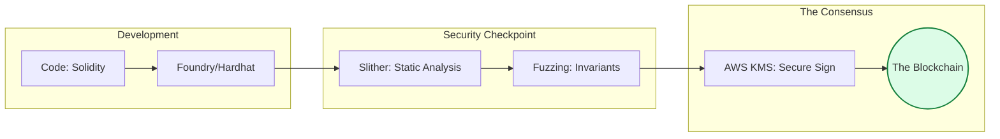

# ⛓️ Blockchain Operations: The Immutable Ledger

> **"Listen up, Junior. In traditional DevOps, you can fix a bug and redeploy in minutes. In Blockchain DevOps, once the contract is on the mainnet, it's permanent. In this module, you learn to treat code as 'The Immutable Truth'."**

---

## 🧠 The Mental Model: The Immutable Ledger

**The Junior Struggle**: "I'll just fix it in the next release. Why do I need 5 different security scanners and formal verification for 50 lines of code? Why is Gas so expensive?"

**The Architect Solution**: You realize that a smart contract is like a **Digital Safe**:
- **Bytecode**: The permanent locking mechanism. Once the safe is shut, you can't change the gears.
- **ABI**: The technical specs of the safe's keyhole.
- **Gas**: The fuel required to move the safe. If your code is inefficient, it costs more to operate the safe.
- **Verification**: Proving to the world that your safe behaves exactly as you say it does.

---

## 🆚 Junior Way vs. Architect Way

| Feature | The Junior Way (Problematic) | The Architect Way (Strategic) |
|:---|:---|:---|
| **Deployment** | Manual script with a private key | **Multi-Sig & KMS** signed deployments |
| **Testing** | "It works on my machine" | **Fuzzing & Formal Verification** |
| **Recovery** | "I'll just redeploy it" | **Upgradability Patterns** (Proxies/Diamonds) |
| **Keys** | Stored in `.env` files | **HSMs or Secure Enclaves** |
| **Efficiency** | "Code readability first" | **Gas Optimization** as a core metric |

---

## 🏗️ Visual: The Immutable Pipeline

---

## 🗺️ Curriculum Path

### 1. [01-Foundations](./01-blockchain-development-foundations/readme.md)
*Junior, learn the laws of the EVM.* 
Hardhat vs. Foundry. The Smart Contract Build Lifecycle (Bytecode vs. ABI). Gas economics 101.

### 2. [02-CI/CD](./02-smart-contract-ci-cd/readme.md)
*Automation for the decentralized web.* 
GitHub Actions for EVM-based projects. Secure Private Key management and "Self-Verifying" deployments.

### 3. [03-Security](./03-security-and-analysis/readme.md)
*Trust, but verify.* 
Static analysis with Slither and MythX. Fuzz Testing and Formal Verification. Learn why 'Code is Law' means your errors are permanent.

### 4. [04-Testing](./04-testing-and-testnets/readme.md)
*Practice on the stage before the big show.* 
Unit, Integration, and Fork testing. Public Testnets (Sepolia) and managing faucets.

---

## 🏆 Real-World DevOps Story: The $60 Million Typo

**The Scenario**: A project deployed a smart contract with a simple "greater-than" instead of a "greater-than-or-equal-to" in the withdrawal logic.
**The Crisis**: $60 million in user funds were trapped in the contract forever because there was no "Upgrade" mechanism and the code couldn't be changed. 
**The Fix**: There was no fix. The money was lost.
**The Lesson**: **Junior, in Blockchain, there are no 'hotfixes'. Testing is your only defense.**

---

## 🎤 Interview Preparation (Blockchain Ops)

1. **Q: Junior, what is the 'ABI' in a smart contract?**
   - *A: ABI (Application Binary Interface) is a JSON file that acts as a translator between human-readable code and the machine-readable bytecode on the blockchain.*

2. **Q: Explain 'Gas' and why it matters to a DevOps engineer.**
   - *A: Gas is the measure of computational effort required to execute an operation on the blockchain. High gas usage means high costs for the user and the project.*

3. **Q: What is a 'Blockchain Fork' in a testing context?**
   - *A: Fork testing is copying the state of the real blockchain at a specific block number into a local environment, allowing you to test against real-life data without spending real money.*

4. **Q: What is 'Formal Verification'?**
   - *A: It's the use of mathematical proofs to ensure that a smart contract behaves exactly as specified under all conditions, leaving no room for logic errors.*

5. **Q: Explain the 'Proxy Pattern' for upgradability.**
   - *A: It's a design where users interact with a 'Proxy' contract that points to an 'Implementation' contract. To upgrade the code, the proxy is updated to point to a new implementation.*

6. **Q: Why should you never store a private key in a `.env` file for production?**
   - *A: Because `.env` files can be accidentally committed to Git. Production deployments should use KMS (Key Management Service) or HSMs (Hardware Security Modules).*

7. **Q: What is 'Fuzz Testing'?**
   - *A: Feeding a contract thousands of random, unexpected inputs to find edge cases or 'invariants' that break the logic.*

8. **Q: What is 'Etherscan Verification'?**
   - *A: The process of submitting your source code to Etherscan so they can compile it and verify it matches the bytecode on-chain, proving to users what the code actually does.*

9. **Q: Explain 'Slither' and what it does.**
   - *A: Slither is a static analysis framework for Solidity that finds common security vulnerabilities (like reentrancy or uninitialized variables) within seconds.*

10. **Q: Junior, what is 'Mainnet' vs. 'Testnet'?**
    - *A: **Mainnet** is where real money lives. **Testnet** (like Sepolia) is a clone of the network used for testing where the coins have no real-world value.*

---

## 📝 Knowledge Check

1. **Which block framework uses Rust and is known for its fast testing?**
   - [x] Foundry.

2. **What happens to data on a blockchain after it's committed?**
   - [x] It becomes Immutable (cannot be changed).

3. **Which file is needed for a frontend to talk to a smart contract?**
   - [x] ABI.

4. **True/False: You can use AWS KMS to sign blockchain transactions.**
   - [x] **True**.

5. **What is 'Reentrancy'?**
   - [x] A security vulnerability where a contract calls an external contract before updating its own state.

6. **Which testnet is currently the standard for Ethereum testing?**
   - [x] Sepolia.

7. **What does 'Solc' do?**
   - [x] Compiles Solidity code into Bytecode and ABI.

8. **Which tool is used for static analysis of Solidity code?**
   - [x] Slither.

9. **What is a 'Cold Wallet'?**
   - [x] A hardware device that stores private keys offline for maximum security.

10. **What is 'Gas Limit'?**
    - [x] The maximum amount of gas a user is willing to spend on a transaction.

---

## 🔗 Next Steps
Junior, the ledger is secure. Now let's learn how to balance the Cloud Books.
1. Proceed to: **[06. FinOps Mastery](../06-finops/readme.md)** →
2. Return to: **[Phase 3 Hub](../readme.md)** →

---
## 🧭 Additional Modules
- [05 Interview Questions and Quizzes](05-interview-questions-and-quizzes/readme.md)
- [06 Real Life Scenarios](06-real-life-scenarios/readme.md)
