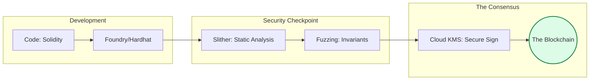

# ⛓️ Blockchain Operations: The Immutable Ledger

> **"Listen up, Junior. In traditional DevOps, you can fix a bug and redeploy in minutes. In Blockchain DevOps, once the contract is on the mainnet, it's permanent. In this module, you learn to treat code as 'The Immutable Truth'."**

---

## 🧠 The Mental Model: The Digital Safe

**The Junior Struggle**: "Why so much security for 50 lines of code? Why is Gas so expensive?"

**The Architect Solution**: You realize that a smart contract is like a **Digital Safe**:
- **Bytecode**: The permanent locking mechanism. Once the safe is shut, the gears are unchangeable.
- **ABI**: The technical specs of the keyhole.
- **Gas**: The fuel required to operate the safe. Inefficiency costs real money.
- **Consensus**: The locks only turn if the whole network agrees they should.

---

## 🆚 Junior Way vs. Architect Way

| Feature | The Junior Way | The Architect Way |
|:---|:---|:---|
| **Deployment** | Manual script + Private Key | **CI/CD + Cloud KMS** signed transactions |
| **Testing** | "Works on my machine" | **Fuzzing & Invariant Testing** |
| **Recovery** | "I'll just redeploy" | **Upgradable Proxy Patterns** |
| **Security** | Static analysis icons | **Formal Verification & Formal Proofs** |
| **Identity** | Metamask in a browser | **Hardware Security Modules (HSMs)** |

---

## 🏗️ Visual: The Immutable Pipeline

---

## 🗺️ Curriculum Path

### 1. [🏁 Blockchain Foundations](./01-blockchain-development-foundations/readme.md)
*Learn the laws of the EVM.* 
Foundry vs. Hardhat. The Bytecode & ABI lifecycle. Gas economics 101.

### 2. [🤖 Smart Contract CI/CD](./02-smart-contract-ci-cd/readme.md)
*Automation for the decentralized web.* 
GitHub Actions for Solidity. Secure Key management and self-verifying deployments.

### 3. [🛡️ Security & Analysis](./03-security-and-analysis/readme.md)
*Trust, but formally verify.* 
Static analysis with Slither. Fuzz testing and the "Checks-Effects-Interactions" pattern.

### 4. [🧪 Testing & Testnets](./04-testing-and-testnets/readme.md)
*Practice on the stage before the big show.* 
Unit, Integration, and **Mainnet Fork** testing. Managing Sepolia faucets and Etherscan verification.

### 5. [🎓 Interview Questions & Quizzes](./05-interview-questions-and-quizzes/readme.md)
*Seal your knowledge.* 
Tiered interview questions and a 20-question blockchain audit quiz.

### 6. [🌍 Real-Life Scenarios](./06-real-life-scenarios/readme.md)
*Production implementation.* 
Case studies on $60M typos, secure secret rotation, and the "CI/CD Janitor."

---

## 📂 Standardized Module Structure

We have standardized our reference implementations across all modules:
- **/src**: Ready-to-run Solidity source code and test scripts.
- **challenges.md**: Hands-on scenarios for each topic.
- **readme.md**: Detailed architectural walkthroughs.

---

## 🏆 Final Challenge: The "Secure Vault" Project
To graduate from this module, you must:
1.  **Write** a simple Vault contract in Solidity.
2.  **Verify** it using Slither for reentrancy vulnerabilities.
3.  **Deploy** it to the Sepolia testnet using an automated script.

---
## 🔗 Navigation
1. Proceed to: **[06. FinOps Mastery](../06-finops/readme.md)** →
2. Return to: **[Phase 3 Hub](../readme.md)** →
3. View References: **[📔 YouTube Lessons](./youtube-lessons.md)**
