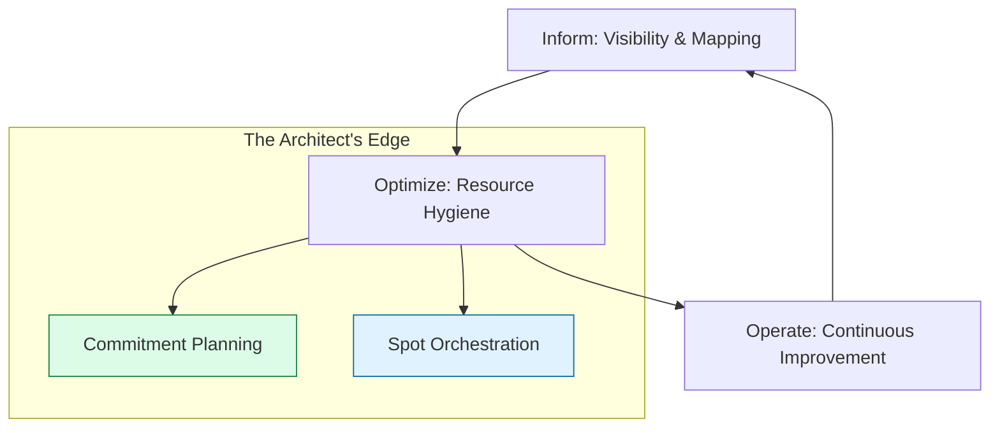

# 💰 FinOps Mastery: The Cloud Economist

> **"Listen up, Junior. In the Beginner phase, you learned how to read a bill. In Phase 3, you learn how to engineer the bill. High-level architecture isn't just about uptime—it's about unit economics."**

---

## 🧠 The Mental Model: The Cloud Economist

**The Junior Struggle**: "I built a high-availability cluster with triple redundancy across 6 regions! Why is my boss yelling at me about the $50,000 bill?"

**The Architect Solution**: You realize that cloud resources are like **Variable Utility Bills**:
- **On-Demand (The Pay-as-you-go Rate)**: The most expensive way to buy power.
- **Savings Plans (The Bulk Discount)**: Committing to a base level of usage to get 50% off.
- **Spot Instances (The Surplus Market)**: Buying "spare capacity" at 90% off, but knowing the power might be cut at any moment.
- **Unit Economics**: Instead of saying "We spent $10k," you say "It cost us $0.05 to process one user order."

---

## 🆚 Junior Way vs. Architect Way

| Feature | The Junior Way | The Architect Way |
|:---|:---|:---|
| **Architecture** | "Build it big so it doesn't fail" | **Right-sized & Elastic** |
| **Visibility** | Total monthly bill | **Cost-per-unit / Cost-per-team** |
| **Commitment** | Always using On-Demand | **Savings Plans & RI Portfolios** |
| **Efficiency** | Manual cleanup occasionally | **Cost-as-Code (Infracost/Policies)** |
| **Culture** | "Finance handles the money" | **Shared Accountability** |

---

## 🏗️ Visual: The FinOps Lifecycle

---

## 🗺️ Curriculum Path

### 1. [🏁 Cost Allocation](./01-cost-allocation/readme.md)
*Junior, follow the money.* 
Tagging governance, showback vs. chargeback models, and mapping cloud spend to business units.

### 2. [🔄 Optimization Strategies](./02-optimization-strategies/readme.md)
*Cut the fat, keep the muscle.* 
Right-sizing instances, storage tiering (S3 Glacier), and cleaning up "zombie" resources.

### 3. [📉 Reserved Capacity](./03-reserved-instances/readme.md)
*The Broker's game.* 
Mastering Savings Plans, Reserved Instances (RI), and building a commitment portfolio.

### 4. [📊 Showback & Chargeback](./04-showback-chargeback/readme.md)
*Accountability in action.* 
How to report costs to stakeholders and drive financial responsibility within teams.

### 5. [🤖 FinOps-as-Code](./05-automation/readme.md)
*Build the cost guardrails.* 
Using Infracost in CI/CD, automated shutdown scripts, and setting up anomaly detection.

---

## 🏆 Real-World DevOps Story: The $100k NAT Gateway Mistake

**The Scenario**: A Junior engineer deployed a new Kubernetes cluster and accidentally routed all internal traffic through a NAT Gateway instead of using VPC Endpoints.
**The Crisis**: Because NAT Gateways charge per GB processed, the bill spiked by **$100,000** in a single month of "free" internal data transfers. 
**The Fix**: Implemented **VPC Endpoints** (Interface/Gateway) which cost nearly $0 for internal traffic.
**The Lesson**: **Junior, architecture decisions ARE financial decisions. Know your data flow costs.**

---

## 📂 Module Structure (Standardized)

We have standardized our reference implementations across all modules:
- **/src**: Ready-to-run scripts for cost auditing and optimization.
- **challenges.md**: Hands-on scenarios for each topic.
- **readme.md**: Detailed architectural walkthroughs.

---

## 🏆 Final Challenge: The "Cloud Waste Hunter"
To graduate from this module, you must:
1.  **Identify** 3 types of cloud waste using an automated script.
2.  **Calculate** the potential savings if moved to Spot instances or Savings Plans.
3.  **Implement** a tagging policy that prevents non-compliant resources from being created.

---
## 🔗 Navigation
1. Return to: **[Phase 3 Hub](../readme.md)** →
2. Graduation: **[Advanced Course](../../../readme.md)** →
3. View References: **[📔 YouTube Lessons](./youtube-lessons.md)**
