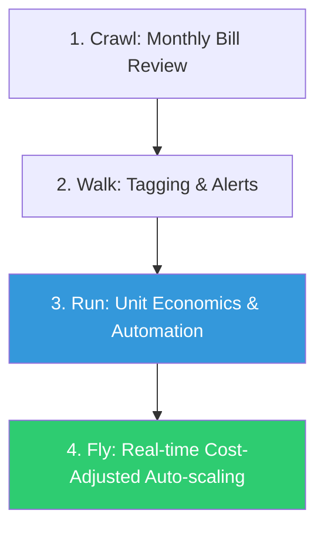

# Advanced FinOps & Cost Governance Reference

**Doc Version:** 1.0.0
**Role:** FinOps Practitioner / Cloud Financial Analyst
**Scope:** Cost Allocation, Commitment Management, and Unit Economics

---

## 1. The FinOps Lifecycle (Inform - Optimize - Operate)

Advanced FinOps moves beyond just "reading the bill" to creating a culture of financial accountability.

1.  **Inform**: Providing visibility into spend. This requires a robust tagging strategy and automated showback/chargeback reports.
2.  **Optimize**: Real-time rightsizing and commitment management (Reserved Instances/Savings Plans).
3.  **Operate**: Continuously tracking business value (Unit Economics) and aligning cloud spend with revenue growth.

---

## 2. Advanced Cost Allocation

How to attribute every dollar to a specific team or product.

- **Shared Costs**: Allocating costs that aren't tied to a single team (e.g., Support fees, Shared NAT Gateways, Centralized Logging).
- **Showback**: Reporting costs to teams to increase awareness (No money moves).
- **Chargeback**: Actually billing the team's internal budget for their cloud consumption.
- **Unallocated Spend**: Any spend that doesn't meet the "95% Tagging Standard" is considered technical debt and must be remediated.

---

## 3. Commitment Management (RI & Savings Plans)

Commitments allow you to trade flexibility for lower prices (up to 72% discount).

- **Standard RI**: Higher discount, fixed instance type/region.
- **Convertible RI**: Lower discount, can change instance types.
- **Savings Plans**: Extremely flexible (can apply to Fargate and Lambda too) based on a dollar-per-hour commitment.
- **The Portfolio Approach**: Maintain a mix of On-Demand (for spikes), Spot (for batch/test), and Commitments (for baseline load).

---

## 4. Visualizing the FinOps Maturity Model

---

## 5. Unit Economics: Cloud Cost per X

The ultimate metric for FinOps. Instead of "Cloud cost is up 10%," use:
- **Cost per Active User**
- **Cost per Transaction**
- **Cost per Build/PR**

If your total spend is up 20% but your **Cost per Transaction** is down 50%, your infrastructure is becoming *more efficient* as you scale.

---

## 6. Enterprise Governance Standards

- **Tagging Law**: No resource can live more than 24 hours without mandatory tags (`Owner`, `Project`, `Environment`, `CostCenter`). Automated "sweeper" scripts terminate non-compliant resources.
- **Cost-Aware CI/CD**: Integrating **Infracost** or **Rego** to comment on Pull Requests with the projected cost change.
- **Commitment Quorum**: Ensuring that any purchase of 1-year or 3-year commitments is approved by both Engineering and Finance leads.

> **Enterprise Pattern**: Implement **Automated Waste Elimination**. Set up automated triggers to identify and delete "Zombie" resources: unattached EBS volumes, aged snapshots (>90 days), and idle Elastic IPs. This "hygiene" alone can often reduce cloud spend by 10-15%.
