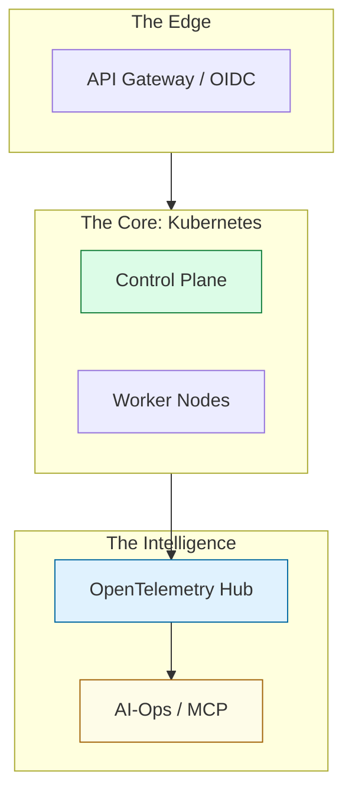

# 🏗️ Phase 3: Advanced Orchestration & Intelligence (The Master Architect)

> **"Welcome to the summit, Junior. In Phase 1 and 2, you learned how to build and automate the engine. In Phase 3, you learn to design the entire ship and steer it through the stars. You are moving from 'Engineer' to 'Architect'."**

---

## 🧠 The Mental Model: The Command Center

**The Junior Struggle**: "I can run a Docker container. Why do I need to learn K8s Control Planes, OpenTelemetry, API Gateways, and AI-Ops? It feels like I'm building a spaceship to cross the street."

**The Senior Solution**: You realize that in an enterprise with 500 microservices and 10 million users, you don't manage servers; you manage **systems of systems**.
- **Kubernetes**: The command center that decides which "crew member" (container) goes where and what to do if they fail.
- **Observability**: The sensors and radars that monitor every inch of the ship.
- **API Gateways**: The border patrol that verifies every person (request) before they enter the ship.
- **AI-Ops (MCP)**: The artificial intelligence that helps the captain manage the complexity.

---

## 🆚 Junior Way vs. Architect Way

| Feature | The Junior Way (Problematic) | The Architect Way (Strategic) |
|:---|:---|:---|
| **Orchestration** | Manual Docker Compose | **K8s High Availability** (Control Plane) |
| **Visibility** | Looking at a few logs | **Full-Stack Observability** (OTel/Tracing) |
| **Security** | Basic Username/Password | **Zero Trust & OIDC/JWT** Gateways |
| **AI** | Chatting with a bot | **Model Context Protocol** (Agentic Tools) |
| **Economy** | "We'll figure it out in the budget" | **FinOps Unit Economics** (Cost visibility) |

---

## 🏗️ Visual: The Architectural Stack

---

## 🗺️ Learning Path

### ☸️ [01. Container Orchestration](./01-container-orchestration/readme.md)
*Junior, the cluster is your canvas.* 
Advanced Kubernetes mastery, diving into ETCD, API-Server internals, and managing multi-cluster fleets with zero downtime.

### 📊 [02. Observability Foundations](./02-observability-foundations/readme.md)
*If you can't measure it, you don't own it.* 
Moving beyond logs to distributed tracing with **OpenTelemetry**, high-cardinality metrics, and self-healing alert loops.

### 🛡️ [03. API Gateways & Security](./03-api-gateways-security/readme.md)
*The border is the first line of defense.* 
Mastering OIDC/JWT, rate-limiting, and microservice mesh security using tools like Kong, Istio, or Traefik.

### 🔌 [04. MCP (Model Context Protocol)](./04-mcp/readme.md)
*Give the AI some hands.* 
Building the bridge between LLMs and your infrastructure. Learn to build agentic servers that can investigate and fix outages.

### ⛓️ [05. Blockchain Infrastructure](./05-blockchain/readme.md)
*Decentralized resilience.* 
Node deployment, validator security, and managing the infrastructure for the decentralized web (Web3).

### 💰 [06. FinOps Mastery](./06-finops/readme.md)
*Efficiency is the ultimate engineering goal.* 
Cost-as-code, advanced budgeting, and ensuring your "Architectural Masterpiece" doesn't cost $50k/day.

---

## 🎯 Phase Goal
Junior, by the end of this phase, you will move from being a "builder of parts" to a **Designer of Ecosystems**. You will be ready to lead architectural discussions and design the future of cloud computing.

---
*Next Step: Take command, Junior. Head into [01. Container Orchestration](./01-container-orchestration/readme.md).*
