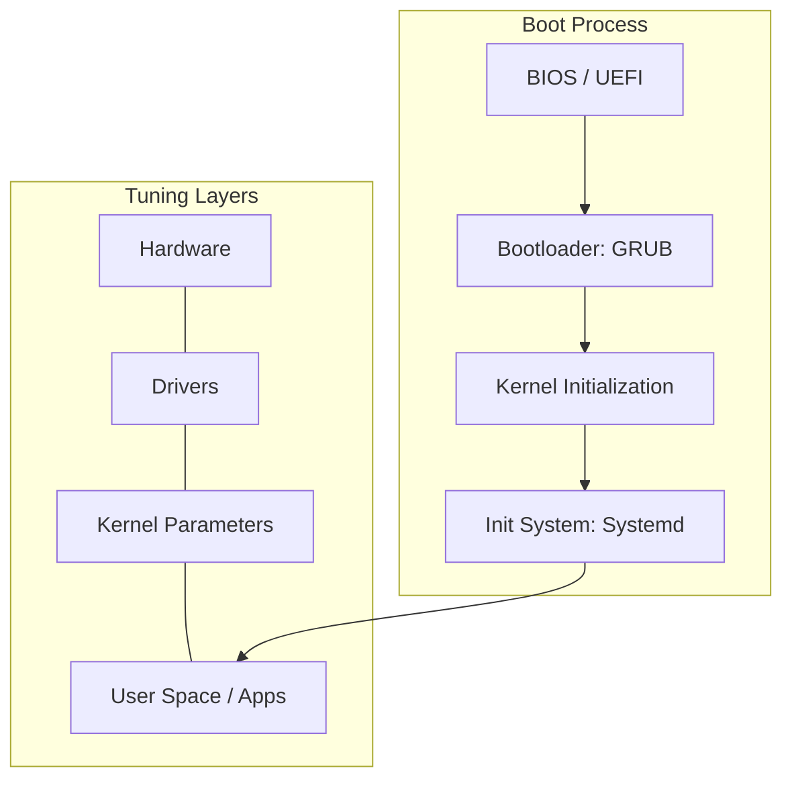

---

## 🎯 Junior's Mission: The Performance Wall
**Scenario**: You have migrated a database to a high-speed NVMe drive, but the application is actually *slower* than before. You suspect the Linux kernel is the bottleneck, not the hardware.
**Your Goal**: Use **eBPF** or **strace** to identify if the latency is coming from "Syscall Overload" or a misconfigured **Transparent Huge Pages (THP)** setting and apply a `sysctl` fix to unlock the performance.

---

## 🏗️ Operational Reality: Production Hazards
At the kernel level, a single character change in a config file can bring down an entire data center.
1.  **The "Max Files" Crash**: Your server has plenty of RAM and CPU, but it suddenly stops accepting new connections. You realize you hit the `ulimit` (Open Files) limit. The server isn't busy; it's just "out of handles."
2.  **SELinux Context Drift**: You use a custom script to move files into `/var/www`. The web server can't see them. You realize the files lost their "Security Label" during the move, and SELinux is silently blocking them.
3.  **Swappiness Death Spiral**: Your server hits 90% RAM usage. Instead of killing the least important process, Linux starts "Swapping" memory to the slow SSD. Now the entire server is unresponsive for 10 minutes while it tries to "breathe" through a tiny straw.
4.  **Zombie Process Leak**: A developer's script spawns thousands of "Child" processes that finish but don't close. You run out of "Process IDs" (PIDs), and you can't even run `ls` because there are no PIDs left to start the command.

---

## 🛠️ The Kernel Engineer's Toolbelt (Advanced Tracing)
| Tool/Command | Why it matters |
| :--- | :--- |
| `strace -p <pid> -c` | Summarize the system calls of a running process. Is it spending all its time reading files? |
| `sysctl -a` | The "Master Knob" list. Seeing every single tunable parameter in the Linux kernel. |
| `bpftool` | The modern way to interact with eBPF programs. High-speed monitoring with zero overhead. |
| `sar -A` | The "Time Machine." What was the CPU and Disk usage 4 hours ago during the outage? |
| `numastat` | Checking if your multi-CPU server is passing data "across" CPUs, which causes massive lag. |

---

---

## 📂 Module Structure

### 🛡️ Advanced Topics
- **[Security & Hardening](./Security/)**: SELinux, AppArmor, `sysctl` hardening, and auditing.
- **[Performance & Optimization](./Performance/)**: CPU/IO tuning, `eBPF`, and observability tools (`perf`, `bpftrace`).
- **[Virtualization & WSL](./Virtualization-WSL/)**: Advanced WSL2 config, KVM/QEMU, and container runtimes.
- **[Advanced SSH](./SSH/)**: Certificates, Bastion hosts, and proxying.

---

## 🏗️ Core Concepts

### 1. Kernel Parameter Tuning (`sysctl`)
Optimizing the network stack and memory management for high-concurrency workloads.
- **`net.core.somaxconn`**: Increasing the listen queue for high-traffic web servers.
- **`vm.swappiness`**: Controlling how aggressively the kernel swaps memory to disk.
- **`fs.file-max`**: Increasing the system-wide limit for open files.

### 2. Advanced Security Models
- **SELinux (Security-Enhanced Linux)**: Label-based access control (Red Hat default).
- **AppArmor**: Path-based access control (Ubuntu/Debian default).
- **Auditd**: Tracking every system call for compliance and forensics.

### 3. Observability & Tracing
- **`perf`**: Sampling performance profiling.
- **`eBPF`**: Running sandboxed programs in the kernel for high-performance monitoring without overhead.
- **`strace`**: Intercepting and recording system calls made by a process.

---

## 📊 Linux Boot & Performance Layers

---

## ❓ Interview Questions & Quiz
**[Explore Advanced Interview Questions & Quizzes](./Interview_Questions_and_Quiz.md)**

---

## ✅ Advanced Knowledge Check
- [ ] Configure `sysctl` for network performance optimization
- [ ] Implement and troubleshoot SELinux/AppArmor policies
- [ ] Use `perf` or `bpftrace` to identify kernel-level bottlenecks
- [ ] Secure a server using `fail2ban` and advanced firewall rules
- [ ] Manage multi-tenant isolation using Linux namespaces and cgroups
- [ ] Design a secure SSH infrastructure with bastion hosts and MFA
