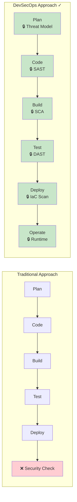
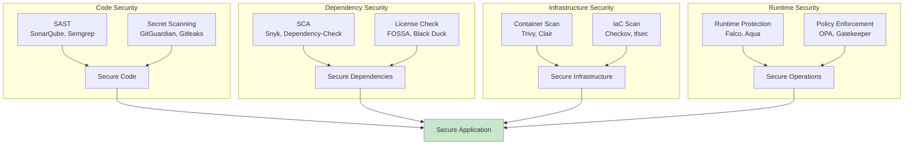

---

## 🎯 Junior's Mission: The Pipeline Sabotage
**Scenario**: Your CI/CD pipeline suddenly starts failing at the "Build" stage, but no one has changed the source code. You suspect a third-party dependency has been hijacked or restricted.
**Your Goal**: Use **Snyk** or **Trivy** to scan the dependency lockfile and identify which package is causing the security violation, then implement a "Version Pin" to restore stability.

---

## 🏗️ Operational Reality: Production Hazards
Security in DevOps isn't just about locks; it's about **System Integrity**.
1.  **The "Blind" Scanner**: You run a security scan every day, but it's only scanning the *application* code. The underlying Linux image has 200 unpatched vulnerabilities, and you don't even know it.
2.  **Secret Sprawl**: A developer puts a password in an environment variable "just for a second" to test. That variable is now logged in plain text in the Cloud Provider's console, where it stays forever.
3.  **The False Positive Fatigue**: Your scanner reports 500 "Critical" vulnerabilities. 499 of them are for tools you don't even use. The engineers start ignoring the alerts, and the 1 real attack goes unnoticed.
4.  **Runtime Bypass**: You have a perfect secure pipeline, but an attacker finds a way to pull an un-scanned image directly from a public registry into your production cluster using a hacked developer laptop.

---

## 🛠️ The DevSecOps Toolbelt (Security Commands)
| Tool/Command | Why it matters |
| :--- | :--- |
| `trivy image --severity HIGH,CRITICAL <image>` | The first line of defense. Never deploy an image without this check. |
| `gitleaks detect --source .` | Scanning your local Git history for that AWS key you accidentally committed last week. |
| `falco -c /etc/falco/falco.yaml` | The "Security Camera" for your cluster. Is anyone trying to spawn a shell inside a pod? |
| `cosign verify <image>` | "Checking the ID." Is this image actually the one our build system signed? |
| `semgrep --config p/owasp-top-10` | Intelligent code scanning that looks for logic flaws, not just text matches. |

---

---

### Learning Path
1. [Security Overview](./README.md)
2. [📺 YouTube Lessons](./Youtube_Lessons.md)
3. [❓ Interview Questions & Quiz](./Interview_Questions_and_Quiz.md)

## ⬅️ The Shift-Left Philosophy



### Security Stages

| Stage | Security Activities | Tools | Purpose |
|-------|---------------------|-------|---------|
| **Plan** | Threat modeling, security requirements | OWASP Threat Dragon, IriusRisk | Identify risks early |
| **Code** | SAST, secret scanning, code review | SonarQube, GitGuardian, Semgrep | Catch vulnerabilities in code |
| **Build** | Dependency scanning (SCA), license checks | Snyk, OWASP Dependency-Check, Trivy | Find vulnerable dependencies |
| **Test** | DAST, penetration testing, API security | OWASP ZAP, Burp Suite | Test running applications |
| **Deploy** | Container scanning, IaC security | Trivy, Checkov, tfsec | Secure infrastructure |
| **Operate** | Runtime protection, compliance, monitoring | Falco, OPA, Prometheus | Continuous security |

---

## 🛠️ DevSecOps Tool Ecosystem



### Tool Categories

#### Static Analysis (SAST)
- **SonarQube**: Code quality and security
- **Semgrep**: Fast, customizable code scanning
- **Checkmarx**: Enterprise SAST platform

#### Software Composition Analysis (SCA)
- **Snyk**: Developer-first vulnerability scanning
- **OWASP Dependency-Check**: Open-source SCA
- **WhiteSource**: License and vulnerability management

#### Dynamic Analysis (DAST)
- **OWASP ZAP**: Web application security scanner
- **Burp Suite**: Manual and automated testing
- **Nikto**: Web server scanner

#### Container Security
- **Trivy**: Comprehensive vulnerability scanner
- **Clair**: Container vulnerability analysis
- **Anchore**: Container security and compliance

#### Secrets Management
- **HashiCorp Vault**: Secrets and encryption management
- **AWS Secrets Manager**: Cloud-native secrets
- **Azure Key Vault**: Microsoft cloud secrets

#### Policy & Compliance
- **Open Policy Agent (OPA)**: Policy-based control
- **Gatekeeper**: Kubernetes policy enforcement
- **Checkov**: Infrastructure as Code scanning

---

## 📚 Documentation Structure

### 🟢 [Security Fundamentals](01-Security-Fundamentals/README.md)

Core DevSecOps concepts and principles:
- Shift-Left security explained
- Security in the SDLC
- Threat modeling basics
- Security mindset for developers

### 🔧 [Security Tools](../../../README.md)

Comprehensive guides for each tool:
- **[Trivy](../../../README.md)**: Container and filesystem scanning
- **[SonarQube](../../../README.md)**: Code quality and security
- **[Vault](../../../README.md)**: Secrets management
- **[Snyk](../../../README.md)**: Developer security platform
- **[OWASP Tools](../../../README.md)**: Dependency checking

### 🔍 [SAST & DAST](../../../README.md)

Implementation guides for security testing:
- Static Application Security Testing (SAST)
- Dynamic Application Security Testing (DAST)
- Interactive Application Security Testing (IAST)
- Integration patterns and best practices

### 🐳 [Container Security](../../../README.md)

Securing containerized applications:
- Image scanning and hardening
- Runtime security with Falco
- Registry security
- Best practices and patterns

### 🔐 [Secrets Management](../../../README.md)

Managing sensitive data securely:
- HashiCorp Vault implementation
- Cloud secrets managers (AWS, Azure, GCP)
- Secret rotation strategies
- Best practices and anti-patterns

### 📋 [Compliance as Code](../../../README.md)

Automating compliance and auditing:
- Open Policy Agent (OPA) policies
- Kubernetes Gatekeeper
- Automated audit trails
- Compliance frameworks (SOC2, HIPAA, PCI-DSS)

### 🔄 [CI/CD Security](../../../README.md)

Securing the deployment pipeline:
- Secure pipeline design
- Security gates and quality gates
- Examples for Jenkins, GitLab, GitHub Actions
- Supply chain security (SLSA framework)

---

## 🎯 Learning Paths

### Beginner Path (1-2 weeks)

1. **[Security Fundamentals](01-Security-Fundamentals/README.md)** - Understand core concepts
2. **[Container Security Basics](../../../README.md)** - Secure your containers
3. **[Secrets Management](../../../README.md)** - Never hardcode credentials
4. **[CI/CD Security](../../../README.md)** - Basic pipeline security

**Goal**: Implement basic security practices in your pipeline

### Intermediate Path (2-4 weeks)

1. Complete Beginner Path
2. **[Security Tools](../../../README.md)** - Master Trivy, SonarQube
3. **[SAST/DAST](../../../README.md)** - Implement automated testing
4. **[Compliance](../../../README.md)** - Policy enforcement with OPA

**Goal**: Automate security across development lifecycle

### Advanced Path (1-2 months)

1. Complete Intermediate Path
2. **Runtime Security**: Falco, AppArmor, SELinux
3. **Zero Trust Architecture**: mTLS, service mesh security
4. **Advanced Compliance**: Multi-framework auditing
5. **Security Operations**: Incident response, forensics

**Goal**: Enterprise-grade DevSecOps implementation

---

## 🚀 Quick Start Guide

### 1. Scan Your First Container

```bash
# Install Trivy
curl -sfL https://raw.githubusercontent.com/aquasecurity/trivy/main/contrib/install.sh | sh -s -- -b /usr/local/bin

# Scan a container image
trivy image nginx:latest

# Scan with severity filter
trivy image --severity HIGH,CRITICAL nginx:latest
```

### 2. Set Up Code Scanning

```bash
# Using SonarQube Scanner
sonar-scanner \
  -Dsonar.projectKey=my-project \
  -Dsonar.sources=. \
  -Dsonar.host.url=http://localhost:9000
```

### 3. Scan Dependencies

```bash
# Using Snyk
npm install -g snyk
snyk auth
snyk test

# Using OWASP Dependency-Check
dependency-check --project my-app --scan ./
```

### 4. Add to CI/CD Pipeline

```yaml
# GitLab CI example
security_scan:
  stage: test
  image: aquasec/trivy:latest
  script:
    - trivy image --exit-code 1 --severity HIGH,CRITICAL $CI_REGISTRY_IMAGE:$CI_COMMIT_SHA
```

---

## 💡 Best Practices

### Essential Security Practices

1. **Fail Fast**: Stop builds on high-severity vulnerabilities
2. **Automate Everything**: Manual security checks don't scale
3. **Shift Left**: Find issues early in development
4. **Version Control Security**: Treat policies as code
5. **Continuous Monitoring**: Security doesn't stop at deployment
6. **Least Privilege**: Minimal permissions everywhere
7. **Defense in Depth**: Multiple security layers
8. **Zero Trust**: Never trust, always verify

### Security Gates Checklist

- [ ] No secrets in code (use secret scanners)
- [ ] No critical vulnerabilities in dependencies
- [ ] Code passes SAST scans
- [ ] Container images scanned and approved
- [ ] Infrastructure as Code validated
- [ ] Security policies enforced
- [ ] Compliance requirements met
- [ ] Runtime protection enabled

---

## 🔗 Related Documentation

### Internal Resources

- [Docker Security](../../../README.md) - Container security basics
- [Kubernetes Security](../../../README.md) - K8s security
- [CI/CD Documentation](README.md) - Pipeline integration
- [Identity & Governance](../../../README.md) - Access management
- [Compliance](../04-Container-Orchestration/Advanced-K8s/Compliance) - Kubernetes compliance

### External Resources

- [OWASP Top 10](https://owasp.org/www-project-top-ten/) - Web application security risks
- [CIS Benchmarks](https://www.cisecurity.org/cis-benchmarks/) - Security configuration standards
- [NIST Cybersecurity Framework](https://www.nist.gov/cyberframework) - Security framework
- [DevSecOps Manifesto](https://www.devsecops.org/) - Core principles
- [SLSA Framework](https://slsa.dev/) - Supply chain security

---

## 🔍 Network Security Monitoring & Threat Detection

Advanced DevSecOps involves not just preventing attacks, but detecting them in real-time.

### 1. The Pyramid of Pain
Derived from the *Network Security Bible*, this model helps prioritize detection:
- **Trivial**: Hash values (MD5, SHA1).
- **Easy**: IP addresses.
- **Simple**: Domain names.
- **Annoying**: Network/Host artifacts.
- **Challenging**: Tools used by attackers.
- **Tough**: TTPs (Tactics, Techniques, and Procedures).

### 2. Network-Based Intrusion Detection (NIDS)
Implement tools like **Suricata** or **Snort** to monitor traffic patterns for:
- **Known Signatures**: Comparing traffic against a database of attack patterns (from IBM X-Force).
- **Anomaly Detection**: Identifying deviations from a "normal" baseline (e.g., a massive spike in outbound traffic to an unknown IP).

### 3. Traffic Mirroring for Deep Packet Inspection (DPI)
In Cloud environments (AWS/Azure), use **VPC Traffic Mirroring** to send a copy of all traffic to a security appliance for inspection without impacting application performance.

---

## 📊 Security Metrics

Track these metrics to measure DevSecOps maturity:

| Metric | Target | Purpose |
|--------|--------|---------|
| **Mean Time to Remediate (MTTR)** | < 7 days | Speed of fixing vulnerabilities |
| **Vulnerability Density** | < 1 per 1000 LOC | Code quality |
| **Security Test Coverage** | > 80% | Protection level |
| **False Positive Rate** | < 10% | Tool accuracy |
| **Pipeline Security Compliance** | 100% | Policy enforcement |
| **Secrets Detected** | 0 | Credential safety |

---

## 🚨 Common Security Pitfalls

### ❌ Anti-Patterns to Avoid

1. **Security Theater**: Tools configured but not enforced
2. **Hardcoded Secrets**: Credentials in source code
3. **Ignored Warnings**: "We'll fix it later" syndrome
4. **Over-Privileged Access**: Running everything as root
5. **Outdated Dependencies**: Not updating libraries
6. **No Security Training**: Developers without security knowledge
7. **Manual Processes**: Security checks that can't scale
8. **Compliance Kitchen Sink**: Implementing everything without understanding

### ✅ Solutions

1. Enforce security gates in CI/CD
<b>2. Use secrets managers</b>
<details>
<summary>Show Answer</summary>
Answer: Vault, cloud providers
</details>

3. Break builds on security violations
4. Implement least privilege everywhere
5. Automated dependency updates
6. Regular security training
7. Automate all security checks
8. Start with critical controls, expand gradually

---

## 🎓 Training Resources

- **[OWASP DevSlop](https://devslop.co/)** - DevSecOps training project
- **[Kubernetes Security Specialist](https://training.linuxfoundation.org/certification/certified-kubernetes-security-specialist/)** - CKS certification
- **[AWS Security Specialty](https://aws.amazon.com/certification/certified-security-specialty/)** - Cloud security
- **[SANS DevSecOps](https://www.sans.org/cyber-security-courses/dev544-secure-coding-java-jee/)** - Professional training

---

---

## 🧠 Training & Assessment

### Knowledge Quiz

**1. What does it mean to "Shift Left" in security?**
- A) Moving all security tools to the left side of the data center
- B) Integrating security early in the development lifecycle (Planning/Coding)
- C) Delegating security only to the operations team
- D) Ignoring security until the deployment phase

**2. Which tool is best suited for scanning container images for vulnerabilities (CVEs)?**
- A) SonarQube
- B) HashiCorp Vault
- C) Trivy
- D) OPA

**3. In a Zero Trust architecture, what is the core assumption?**
- A) Users on the VPN can be trusted
- B) Internal traffic is always safe
- C) Never trust, always verify (no one is trusted by default)
- D) Trust but verify

---

### Real-World Troubleshooting Scenarios

#### Scenario 1: The "Secret Leak" Incident
**Problem:** A junior developer accidentally committed an AWS Access Key to a public Git repository.
**Investigation:**
1.  **Detection:** GitGuardian or a similar secret-scanner alerts the security team.
2.  **Impact:** The key is now compromised and could be used by anyone.
**Solution:**
    - **IMMEDIATELY** revoke/deactivate the key in AWS.
    - Purge the secret from Git history (using BFG Repo-Cleaner or `git filter-repo`).
    - Rotate all keys and audit for any unauthorized actions.

#### Scenario 2: Pipeline Failed on SCA
**Problem:** Your Jenkins pipeline fails at the "Dependency Scan" stage.
**Investigation:**
1.  **Check Logs:** Snyk/Trivy found a `CRITICAL` vulnerability in a core package (e.g., `log4j`).
2.  **Decision:** The security policy forbids deploying images with critical vulnerabilities.
**Solution:** Update the dependency to a patched version in your `package.json` or `pom.xml`, test for breaking changes, and re-run the pipeline.

---

## 🏆 Related Certifications

- **Certified Kubernetes Security Specialist (CKS)**: Secure container-based applications and Kubernetes platforms during build, deployment, and runtime.
- **AWS Certified Security - Specialty**: Validates expertise in securing data and workloads in the AWS Cloud.
- **Microsoft Certified: Cybersecurity Architect Expert (SC-100)**: Design zero trust strategy and architecture.

---

## 📞 Next Steps

1. **Start**: Begin with [Security Fundamentals](01-Security-Fundamentals/README.md)
2. **Implement**: Pick a tool from [Security Tools](../../../README.md)
3. **Integrate**: Add security to your [CI/CD Pipeline](../../../README.md)
4. **Expand**: Explore advanced topics as needed

**Remember**: DevSecOps is a journey, not a destination. Start small, iterate, and continuously improve.

---

**Last Updated**: 2025-12-21  
**Maintainer**: DevOps Team  
**Feedback**: Open issues or submit PRs to improve this documentation