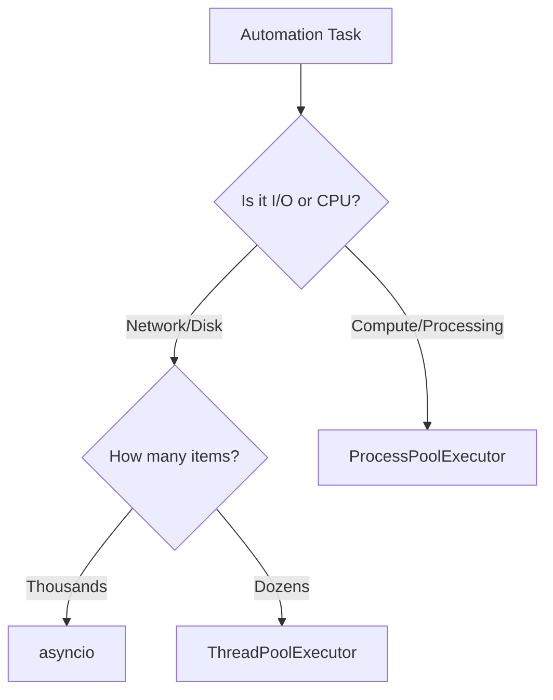

# Concurrent Futures & Parallelism
*Bypassing the GIL for Heavy Compute*

When your automation task is **CPU-bound** (e.g., decrypting large secrets, compressing logs, or complex data processing), `asyncio` won't help because it only runs on one CPU core. To leverage all cores of your server, you need **Multiprocessing** or **Threads**. The `concurrent.futures` module provides a high-level interface for both.

---

## 🏗️ Core Patterns

### ThreadPoolExecutor (I/O Bound)
Best for network calls if you prefer a threaded model over async.

```python
from concurrent.futures import ThreadPoolExecutor
import requests

def get_site(url):
    return requests.get(url).status_code

with ThreadPoolExecutor(max_workers=5) as executor:
    results = list(executor.map(get_site, ["https://google.com", "https://aws.com"]))
```

### ProcessPoolExecutor (CPU Bound)
Best for operations handled by separate CPU cores.

```python
from concurrent.futures import ProcessPoolExecutor
import hashlib

def hash_log(data):
    return hashlib.sha256(data).hexdigest()

# This runs in parallel on multiple CPUs
with ProcessPoolExecutor() as executor:
    hashes = list(executor.map(hash_log, [b"log1", b"log2"]))
```

---

## 📊 Logic Flow: Choosing the Right Engine



---

## 🛠️ Hands-On Challenges

Master parallel execution by building these high-performance workers.

| Challenge | Topic | Description | Starter Code | Solution |
| :--- | :--- | :--- | :--- | :--- |
| **01. Log Hasher** | Multiprocessing | Compute hashes for 10 large log files in parallel using `ProcessPoolExecutor`. | [Link](./challenges/challenge_01_log_hasher.py) | [Link](./challenges/solutions/solution_01_log_hasher.py) |
| **02. SSH Batcher** | Threading | Use `ThreadPoolExecutor` to run the same command on 20 servers simultaneously. | [Link](./challenges/challenge_02_ssh_batch.py) | [Link](./challenges/solutions/solution_02_ssh_batch.py) |
| **03. Hybrid Worker** | Hybrid Logic | Build a script that uses Threads for fetching data and Processes for parsing it. | [Link](./challenges/challenge_03_hybrid.py) | [Link](./challenges/solutions/solution_03_hybrid.py) |

---

## ❓ Interview Questions

1. **What is the main difference between a Thread and a Process in Python?**
   * *Answer*: Threads share the same memory space and are managed by the GIL (limited parallelism). Processes have their own memory space and their own GIL, allowing true parallel execution on multiple CPU cores.
2. **When should you NOT use `ProcessPoolExecutor`?**
   * *Answer*: When the task is very short. Spawning a new process (pickling data, starting a new interpreter instance) has a high overhead. If the task takes 0.01s, the overhead will make it slower than sequential execution.
3. **What happens if a task in the pool raises an exception?**
   * *Answer*: The exception is captured by the future object. When you call `.result()` on the future or iterate through the results of `.map()`, the exception will be raised in the main thread.

---

**Next Step**: [Advanced OOP & Design Patterns →](../003-Advanced-OOP-and-Design-Patterns/README.md)
