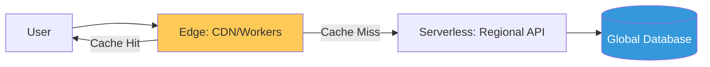

# Modern Platform Delivery Patterns Reference (SaaS, Serverless & Edge)

**Doc Version:** 1.0.0
**Role:** Platform Architect / SaaS Engineer
**Scope:** Multi-tenancy, FaaS, Edge Computing, and Global Scaling

---

## 1. SaaS Architecture: Multi-Tenancy Models

Building software as a service requires isolation and scaling across many customers (tenants).

- **Silo Model**: Each tenant has their own separate infrastructure (High isolation, higher cost).
- **Pool Model**: Tenants share the same database and compute resources (Cost-effective, complex isolation).
- **Bridge Model**: A hybrid approach (Shared app tier, separate databases).

---

## 2. Serverless & FaaS (Function as a Service)

Moving from long-running servers to event-driven execution.

### A. The Serverless Lifecycle
1.  **Trigger**: Event (HTTP, Pub/Sub, S3 Upload).
2.  **Execution**: Ephemeral container starts, runs the code, and dies.
3.  **Scaling**: Automatically scales to zero when not in use.

### B. Overcoming "Cold Starts"
Minimizing the latency of the first request by keeping functions "warm" or using lightweight runtimes (Node.js/Go vs Java).

---

## 3. Edge Computing: Low-Latency Delivery

Moving compute closer to the end-user (The "Edge") to bypass internet congestion.

- **Edge Functions**: Running logic at the CDN level (Lambda@Edge, Cloudflare Workers).
- **Edge Caching**: Intelligent TTLs and globally distributed state.
- **Data Sovereignty**: Processing user data locally in the region it was generated to comply with GDRP.

---

## 4. Visualizing the Global Delivery Mesh

---

## 5. Cost Governance (Metering & Billing)

- **Usage-Based Tracking**: Implementing telemetry to charge customers based on actual consumption (Requests, Data, GPU hours).
- **Unit Economics**: Calculating the margin for every single API call to ensure SaaS profitability.

---

## 6. Enterprise Governance Standards

- **Tenant Isolation**: Strict enforcement of data boundaries; one tenant must NEVER be able to query another's data.
- **Fail-Fast Deployment**: Using Canary releases at the Edge to test new logic on a tiny percentage of global traffic.
- **Zero-Trust Edge**: Treating the Edge as an untrusted environment; every request must be re-validated regardless of where it entered the network.

> **Enterprise Pattern**: Implement **The "Serverless-First" Policy**. New services MUST be built as serverless functions by default. Only move to containers (Kubernetes) if the workload is 24/7 high-volume or requires specific hardware that serverless providers cannot yet provide. This minimizes operational overhead and maximizes capital efficiency.
