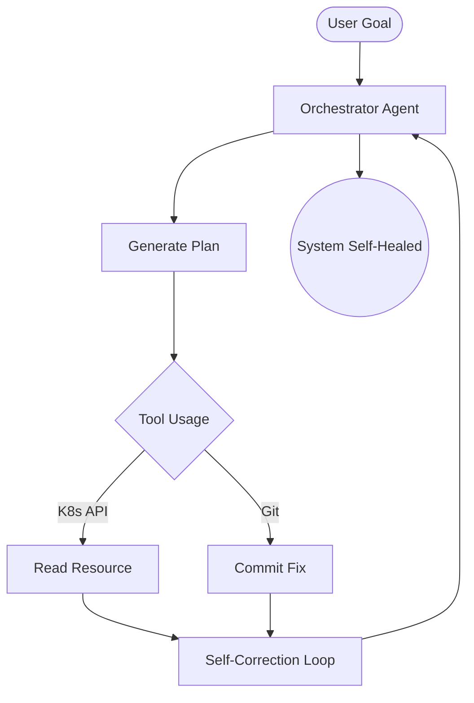

# Prompt Engineering for Advanced Automation

> **Agentic AI systems, autonomous workflows, and intelligent DevOps guardrails**

## Core Concept: Agentic Systems & Continuous Reasoning
**[REFERENCE: Prompt Engineering & Agentic Workflows](./REFERENCE/Prompt-Engineering-Agentic-Workflows-Ref.md)**

At the enterprise level, Prompt Engineering transitions from manual interaction to **Agentic Systems** that can plan, execute, and self-correct across highly complex environments:
- **Autonomous Reasoning (ReAct)**: Utilizing specialized "Thought-Action-Observation" loops to interact with CLIs, APIs, and clusters without human intervention.
- **Context-Enriched Prompting (RAG)**: Augmenting LLM "brains" with real-time enterprise logs, documentation, and codebase context to eliminate hallucinations.
- **Task Orchestration**: Breaking complex DevOps goals (e.g., "Migrate this app to AWS") into verifiable sub-tasks managed by AI planners.

## Enterprise Governance: The Governed AI Guardrail
**[REFERENCE: AI Governance & DevOps Guardrails](./REFERENCE/AI-Governance-DevOps-Guardrails-Ref.md)**

Scaling AI assistance while maintaining strict security, cost, and safety standards:
- **Multi-Agent Orchestration**: Implementing "Red-Team/Blue-Team" workflows where agent outputs are rigorously critiqued by independent security agents.
- **Strict Execution Sandboxing**: Ensuring all AI-generated code and commands are validated and executed in ephemeral, isolated environments.
- **PII & Data Redaction**: Automatically stripping sensitive tokens and metrics at the proxy level before they reach external LLM providers.
- **Token Economy & Cost Control**: Implementing semantic caching and model-tiering to optimize AI performance-to-cost ratios.

---

At the enterprise level, Prompt Engineering transitions from manual interaction to **Agentic Systems** that can plan, execute, and self-correct across highly complex environments.

---
## 1. Agentic Workflows
Unlike standard prompts, an "Agent" uses a loop to verify its own work and use tools (CLI, API) to achieve a goal.

### The React Pattern (Reason + Act)
1. **Thought**: AI analyzes the environment.
2. **Action**: AI executes a command (e.g., `aws ec2 describe-instances`).
3. **Observation**: AI reads the command result.
4. **Repeat**: AI adjusts its next action based on findings.

### Mermaid: Autonomous Agent Architecture

---

## 2. Multi-Agent Orchestration

In large-scale DevOps, we use multiple AI agents with specific roles working together.

**Advanced Pattern: The Security Guardrail**
- **Agent A (Developer)**: Generates Terraform code.
- **Agent B (Security Auditor)**: Critiques the code for vulnerabilities.
- **Agent C (Manager)**: Finalizes the code only when B approves.

---
## 3. Practical Example: Autonomous Security Audit

**Comprehensive Enterprise Prompt:**
> "You are an AI Security Architect. Your goal is to review the following GitLab CI/CD pipeline for 10 critical security risks (e.g., hardcoded secrets, privileged containers).
> 
> **Mission**:
> 1. Perform a deep-scan analysis.
> 2. For every risk found, provide a severity score (1-10).
> 3. **Draft a remediation commit** that fixes the issue without breaking the pipeline logic.
> 4. Generate a summary for the CISO.
> 
> **Pipeline for Review**: [Insert YAML Here]"

---
## 4. Advanced Concepts
- **System Prompts**: Creating a "Ghost in the Machine" that governs every interaction in a DevOps platform.
- **Self-Healing Infrastructure**: Prompts that triggered by Prometheus alerts to automatically scale or restart services.
- **Cost Governance**: Agents that analyze cloud bills and proactively suggest `gcloud`/`aws` commands to delete orphaned resources.

---
## Interview Questions (Advanced)

1. **What is the difference between an LLM and an 'Agentic' system?**
   - An LLM predicts text; an Agent uses the LLM as a 'brain' to make decisions and interact with external environments via tools.
2. **How do you handle 'Hallucination' in automated DevOps prompts?**
   - By using **RAG (Retrieval-Augmented Generation)** to provide the AI with real documentation/logs and by implementing strictly validated output formats (e.g., JSON schema).
3. **Describe a scenario for 'Multi-Agent' orchestration in a Deployment pipeline.**
   - One agent generates the deployment manifest, another validates it against a staging cluster, and a third creates the Jira ticket/documentation for the release.

---

## 5. Knowledge Quiz

1. **What is the 'ReAct' pattern?**
   - A) A React.js library
   - B) Reason + Act loop for agents
   - C) Reformatting Action logs
   - D) Reactor cooling system

2. **Autonomous DevOps agents primarily use:**
   - A) Static code
   - B) Feedback loops and tool-usage
   - C) Manual approval for every step

3. **In an enterprise AI pipeline, a 'Guardrail Agent' is responsible for:**
   - A) Writing faster code
   - B) Enforcing security and compliance standards
   - C) Managing the cloud budget

---
## Case Studies
1. **Project Phoenix**: Building an LLM-based agent that automatically resolves 90% of VPC routing issues.
2. **CyberShield**: AI-native SDLC that scans and closes PRs with security flaws before they reach the main branch.