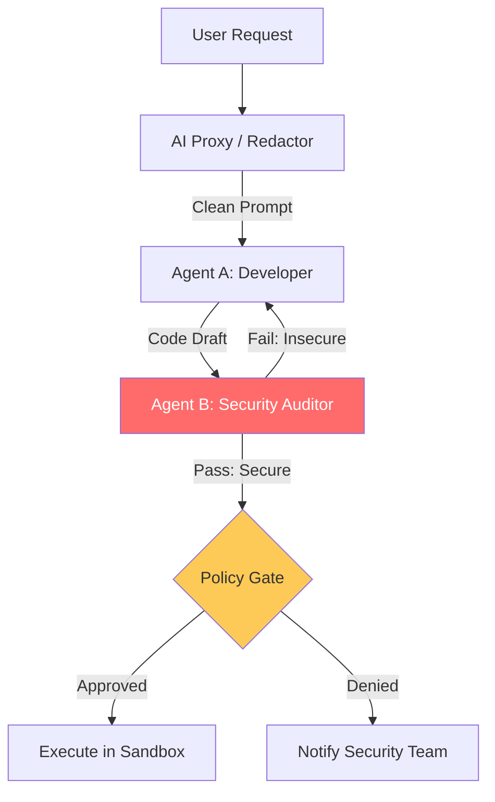

# AI Governance & DevOps Guardrails Reference

**Doc Version:** 1.0.0
**Role:** AI Safety Officer / SecOps Lead
**Scope:** Multi-Agent Orchestration, Security Guardrails, and Ethics/Bias in AI

---

## 1. Multi-Agent Orchestration (The "Team" Model)

Complex DevOps tasks are too big for one prompt. We divide the work among specialized agents.

- **The Developer Agent**: Focuses on writing code/manifests.
- **The Security Agent**: Focuses exclusively on finding vulnerabilities in the Developer Agent's output.
- **The Reviewer Agent**: Validates the logic and ensures it follows enterprise coding standards.
- **The Manager Agent**: Controls the flow and decides when the task is "Done."

---

## 2. Security Guardrails for AI

AI can "Hallucinate" commands or be tricked into leaking secrets. We must build non-AI safety layers around the AI.

### A. Sandbox Execution
AI-generated code or commands must ONLY run in isolated containers with no access to production databases until verified.

### B. Command Filtering (Deny-List)
Implementation of a proxy that intercepts AI commands and blocks destructive ones like `rm -rf /` or `terraform destroy` without specific approval flags.

### C. Redaction (PII/Secrets)
Automated filtering of logs and prompts to ensure API keys, passwords, and PII never reach external LLM providers (OpenAI/Anthos).

---

## 3. Cost Governance (Token Management)

AI can be expensive if not monitored.

1.  **Token Budgeting**: Setting hard limits on how many tokens a specific team or agent can consume per day.
2.  **Model Tiering**: Using smaller, cheaper models (GPT-4o mini, Llama-3-8B) for simple tasks like summarization, and reserving "Frontier" models (Claude 3.5 Sonnet, GPT-4o) for complex architectural decisions.
3.  **Caching**: Using semantic cache (memcached/redis) to reuse responses for similar prompts.

---

## 4. Visualizing the Governed AI Pipeline

---

## 5. Ethics & Bias in DevOps AI

AI models can inherit biases from their training data (e.g., assuming "Admin" roles are only for certain users).
- **Auditability**: Every AI decision must be logged with the "Reasoning" field for post-incident review.
- **Fairness Testing**: Regularly testing prompt templates to ensure they provide consistent results regardless of the terminology used.

---

## 6. Enterprise Governance Standards

- **Zero-Static-Prompting**: Prompts must be version-controlled in Git (PromptOps) just like code.
- **Standardized "Character" Profiles**: All agents must use enterprise-approved "System Prompts" that define their limitations and safety boundaries.
- **The "Broken Glass" AI Access**: In a production outage, AI agents can be granted temporary, highly-audited elevated access if the Standard Operating Procedure (SOP) fails.

> **Enterprise Pattern**: Implement **The "Adversarial" Security Loop**. Before any AI-generated infrastructure change is applied, a dedicated "Attacker Agent" attempts to find a way to exploit the new configuration. If the Attacker Agent succeeds, the change is rejected. This creates a "Red Team / Blue Team" dynamic that occurs entirely in milliseconds within the CI pipeline.
