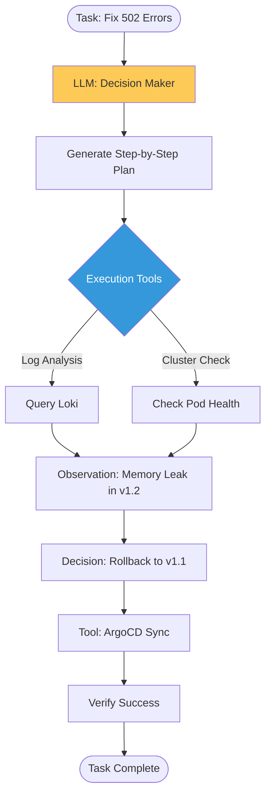

# Prompt Engineering & Agentic Workflows Reference

**Doc Version:** 1.0.0
**Role:** AI Engineer / Automation Architect
**Scope:** LLM Prompting, Agentic Patterns, and Tool Integration

---

## 1. Beyond Static Prompts: The Agentic Shift

In enterprise DevOps, prompt engineering transitions from simple "Chat" to "Task Execution." We move from zero-shot prompting to multi-step agentic loops.

- **Zero-Shot**: Single prompt, single response. (e.g., "Write a Terraform file for an S3 bucket.")
- **Few-Shot**: Proving examples within the prompt to guide the output format.
- **Chain-of-Thought (CoT)**: Forcing the AI to explain its reasoning step-by-step.
- **Agentic**: The AI plans, executes tools, observes results, and self-corrects until a goal is met.

---

## 2. The ReAct Pattern (Reason + Act)

The ReAct pattern is the backbone of autonomous agents. It allows the LLM to interact with the real world (CLIs, APIs, Databases).

1.  **Thought**: "I need to check the status of the Kubernetes nodes to see why the deployment is failing."
2.  **Action**: `kubectl get nodes -o wide`
3.  **Observation**: "Node 'worker-1' is in NotReady state due to DiskPressure."
4.  **Action**: "Scale the cluster" or "Clean up old images."

---

## 3. Retrieval-Augmented Generation (RAG)

LLMs have a "Knowledge Cutoff." RAG allows us to inject real-time enterprise context into the prompt.

- **The Problem**: The AI doesn't know your specific internal company naming standards or recent cloud updates.
- **The Solution (RAG)**:
    1.  **Retrieve**: Search internal docs, logs, or codebase.
    2.  **Augment**: Add the found context to the prompt.
    3.  **Generate**: The AI answers based on the provided facts rather than its internal training data.

---

## 4. Visualizing the Agentic Loop

---

## 5. Structuring Prompts for DevOps

For reliable automation, prompts must be structured using the **CREATE** framework:
- **C**haracter: "You are a Senior SRE."
- **R**equirement: "Analyze these logs for OOMKills."
- **E**constraints: "Do not suggest deleting the namespace."
- **A**ctionable: "Provide the specific `kubectl` command to fix."
- **T**emplate: "Format output as valid JSON for a CI pipeline."
- **E**xamples: (Optional) "See this previous example of a successful fix."

---

## 6. Enterprise Governance Standards

- **Validated Output**: Prompts for automation MUST require JSON or YAML output to be parsed by scripts.
- **Context Window Management**: Limit the logs/code sent to the LLM to avoid token overflow and high costs.
- **Human-in-the-Loop (HITL)**: For destructive actions (e.g., `terraform destroy`), the agent must provide the plan and wait for manual user confirmation.

> **Enterprise Pattern**: Implement **The "Self-Healing" SRE Agent**. Connect your Prometheus AlertManager to an AI Agent. When a "Critical" alert fires, the agent analyzes the metrics, checks the recent Git commits to see what changed, and proposes a fix in a Slack thread—drastically reducing MTTR (Mean Time to Resolution).
