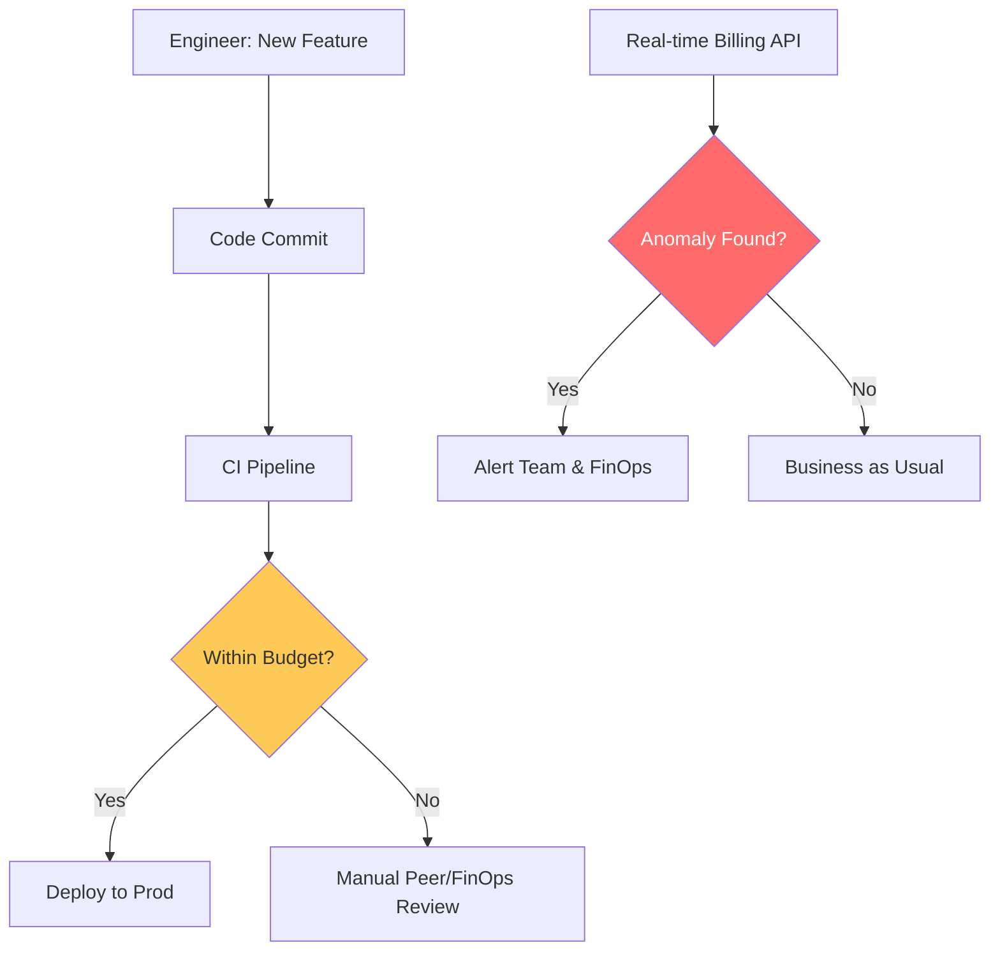

# Enterprise FinOps Governance & Cultural Alignment Reference

**Doc Version:** 1.0.0
**Role:** FinOps Director / CFO for Cloud
**Scope:** Policy Enforcement, Automated Guardrails, and Shared Accountability Cultural Models

---

## 1. The FinOps Governance Framework

Governance is the set of rules, processes, and tools that ensure cloud spending remains within the boundaries of the business's tolerance for risk and budget.

- **Inform**: Accountability through visibility and allocation.
- **Optimize**: Real-time decision-making to reduce waste.
- **Operate**: Continuous improvement and alignment with business goals.

---

## 2. Automated Financial Guardrails

Scaling governance beyond manual checklists.

### A. Infrastructure-as-Cost (Infracost)
Integrating cost estimation directly into the CI/CD pipeline.
- **Rule**: If a PR increases monthly cost by >$1,000, it requires secondary approval from the FinOps Lead.

### B. Auto-Remediation (Policy Enforcement)
- **Zombie Resource Cleaning**: Automatically deleting unattached EBS volumes or unassigned Elastic IPs after 24 hours of idleness.
- **Namespace Quotas**: Implementing hard `ResourceQuotas` in Kubernetes to prevent "cost bombs" from runaway microservices.

---

## 3. Cultural Models: Decentralized Accountability

The goal of FinOps is to decentralize cost ownership to the engineering teams.

1.  **Shared Awareness**: Engineers see the cost of their services in real-time dashboards.
2.  **The "Cloud-Budget" Owner**: Each engineering manager is responsible for their service's P&L (Profit and Loss).
3.  **Incentive Alignment**: Gamifying cost efficiency with "Top Optimizer" awards or reinvestment opportunities.

---

## 4. Visualizing the Governance Gate

---

## 5. Showback vs. Chargeback

- **Showback**: Reporting costs to teams for awareness (No actual budget transfer).
- **Chargeback**: Directly deducting cloud spend from the department's internal budget.
- **Strategy**: Start with Showback to build trust and data quality, then transition to Chargeback for maximum accountability.

---

## 6. Enterprise Governance Standards

- **Metadata Perfection**: 100% of resources MUST have `AppID`, `Department`, and `CostCenter` tags. Resources without tags are automatically terminated in non-prod.
- **Quarterly Value Reviews**: Moving from "Monthly Billing Reviews" to "Quarterly Value Assessments" where teams present their cloud spend in the context of the business value delivered.
- **The "Broken Glass" Budget**: Emergency procedures for overriding financial guardrails during critical production outages or peak demand events (e.g., Black Friday).

> **Enterprise Pattern**: Implement **The "Internal Billing API"**. Provide an API internally where developers can query the cost of their specific namespace/service. This allows developers to integrate cost checks into their own scripts and dashboards, making cost a first-class citizen of the developer experience (DevEx).
