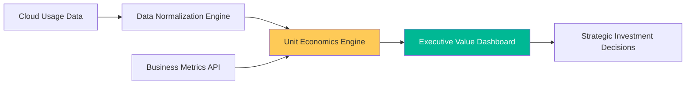

# FinOps Unit Economics & Value Strategy Reference

**Doc Version:** 1.0.0
**Role:** FinOps Principal / Cloud Economist
**Scope:** Unit Economics, Value Metrics, and Strategic Cost-Value Alignment

---

## 1. The Shift to Unit Economics

Unit Economics in FinOps is the practice of calculating the cloud cost per business unit (e.g., cost per customer, cost per transaction). This shifts the conversation from "how much are we spending?" to "is our spending driving profitable growth?"

### A. Total Cost vs. Unit Cost
- **Total Cost**: The monthly cloud bill (unfiltered).
- **Unit Cost**: Total Cloud Cost / Business Metric (e.g., $ spend per active user).

### B. Business Value Metrics
- **Performance-based**: Cost per transaction processed.
- **Revenue-based**: Cloud spend as a percentage of total revenue.
- **Market-based**: Cost to acquire a new user (CAC) infra component.

---

## 2. Advanced Multi-Cloud Optimization

In a multi-cloud enterprise, unit economics must be normalized across providers to ensure fair comparison.

### A. Normalizing Data
- Mapping AWS EC2, GCP GCE, and Azure VM costs into a unified "Compute Unit."
- Utilizing shared taxonomies for storage tiers (Standard, Cold, Archive) across vendors.

### B. Strategic Sourcing
- **Reserved Instance (RI) Management**: Global commitment strategies that span multiple regions/accounts.
- **Savings Plans**: Balancing flexible vs. fixed commitments to maximize coverage without over-committing.

---

## 3. Visualizing the Value Flow

---

## 4. Forecasting & Anomaly Detection (Advanced)

Predicting future spend based on business growth rather than just historical trends.

- **Trend-Based**: "Last month + 5%." (Basic)
- **Growth-Based**: "If we double our user base, our infra spend will grow by 40% due to scale efficiencies." (Advanced)
- **Anomaly Impact**: Evaluating if a cost "spike" is a bug (waste) or a successful marketing campaign (value).

---

## 5. Enterprise Governance Standards

- **Unit Cost Thresholds**: Defining "Efficiency Benchmarks" where an application is flagged if its cost per transaction exceeds a set target.
- **Value-Driven Approvals**: Requiring a business case (projected revenue/users) for any architectural change that increases recurring monthly spend by more than 15%.
- **Environmental ESG Reporting**: Linking cloud consumption to carbon footprint metrics as part of corporate sustainability reporting.

> **Enterprise Pattern**: Implement **The "Efficiency-as-a-Feature" Strategy**. Treat cost reduction as a product feature. If an engineering team reduces a service's unit cost by 20%, they are credited with "Revenue Generation" relative to the savings, which can be reinvested into their team's budget for innovation.
