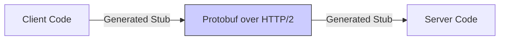

# Advanced API Architectures

In complex, highly-available systems, standard REST APIs sometimes fall short. This module explores high-performance communication, flexible queries, and enterprise design patterns.

---

## 1. gRPC (Go Remote Procedure Call)

Developed by Google, **gRPC** is a high-performance framework that uses **Protocol Buffers (Protobuf)** as its interface definition language.

### Why use gRPC?
- **Protocol Buffers**: Binary serialization (much smaller and faster than JSON).
- **HTTP/2**: Supports multiplexing and bidirectional streaming.
- **Strong Typing**: Contracts are strictly defined in `.proto` files.
- **Polyglot**: Code generation for C++, Java, Python, Go, Node.js, etc.

### Diagram:

---

## 2. GraphQL

Instead of having fixed endpoints (`/users`, `/orders`), **GraphQL** provides a single endpoint that allows clients to query for *exactly* what they need.

### Key Benefits:
- **No Over-fetching**: Get only the fields you requested.
- **No Under-fetching**: Get data from multiple "resources" in a single request.
- **Strongly Typed Schema**: Self-documenting.

---

## 3. Microservices Communication Patterns

### Synchronous (Request/Response)
- REST, gRPC, GraphQL.
- **Risk**: Over-coupling. If Service A waits for Service B, and B is down, A fails.

### Asynchronous (Event-Driven)
- Using Message Brokers (RabbitMQ, Kafka).
- **Benefit**: Decoupling. Service A sends a message and continues its work.

### BFF (Backend for Frontend)
Designing a specific API layer for different types of clients (e.g., one for Mobile, one for Web) to optimize data delivery.

### Sidecar Pattern (Service Mesh)
Offloading API logic (mTLS, retries, logging) to a "Sidecar" proxy (like Istio/Envoy) so the application code doesn't have to handle it.

---

## 4. Advanced Concepts

- **HATEOAS**: A constraint of REST. The response contains links to other actions the client can take.
- **Idempotency**: Ensuring that performing the same operation multiple times has the same effect as performing it once (Crucial for Payment APIs).
- **Versioning**:
  - URL Versioning: `/v1/users`
  - Header Versioning: `Accept: application/vnd.myapi.v2+json`

---

## Real-World Scenarios

### Scenario 1: Transitioning to gRPC
**Context**: An internal microservice system is suffering from high latency and high bandwidth costs due to massive JSON payloads.
**Solution**: Re-implement core service communication using gRPC. The binary nature of Protobuf reduces payload size by ~40-60%, and HTTP/2 multiplexing reduces connection overhead.

### Scenario 2: Mobile Optimization with GraphQL
**Context**: A mobile app needs data from 5 different services to render the home screen, causing slow load times on 3G/4G.
**Solution**: Implement a GraphQL layer. The mobile app makes one request specifying only the needed fields, and the GraphQL server orchestrates the backend calls.

---

## Interview Questions (Advanced)

1. **Compare REST vs. gRPC.**
   - REST uses JSON/XML and is human-readable/textual. gRPC uses Protobuf (binary) and HTTP/2, making it faster and more typing-efficient, but harder to debug with standard tools.
2. **What is an "Idempotent" API?**
   - An API where multiple identical requests have the same effect as a single request. (e.g., `DELETE` is typically idempotent, `POST` is usually not).
3. **Explain the Backend for Frontend (BFF) pattern.**
   - Creating a dedicated API gateway for each client type (Mobile, Web, IoT) to cater to their specific data needs and display constraints.
4. **What are Protocol Buffers?**
   - A language-neutral, platform-neutral, extensible mechanism for serializing structured data.
5. **How does a Service Mesh handle API security?**
   - It can provide Mutual TLS (mTLS) between services automatically, ensuring that all internal communication is encrypted and authenticated without app-level code changes.

---

## Knowledge Quiz

1. **Which serialisation format does gRPC use by default?**
   - A) JSON
   - B) XML
   - C) Protocol Buffers
   - D) YAML

2. **GraphQL helps prevent:**
   - A) SQL Injection
   - B) Over-fetching and Under-fetching of data
   - C) Server crashes
   - D) CSS errors

3. **HTTP/2 is a requirement for:**
   - A) Basic REST
   - B) gRPC
   - C) SOAP
   - D) FTP

4. **The BFF pattern is used to:**
   - A) Connect to a database
   - B) Provide client-specific API layers
   - C) Backup servers
   - D) Write better Python code

5. **A "Sidecar" in a Service Mesh is:**
   - A) A primary database
   - B) A proxy that handles network communication for a service
   - C) A CSS framework
   - D) A physical cable

<b>View Answers</b>

1: C, 2: B, 3: B, 4: B, 5: B

