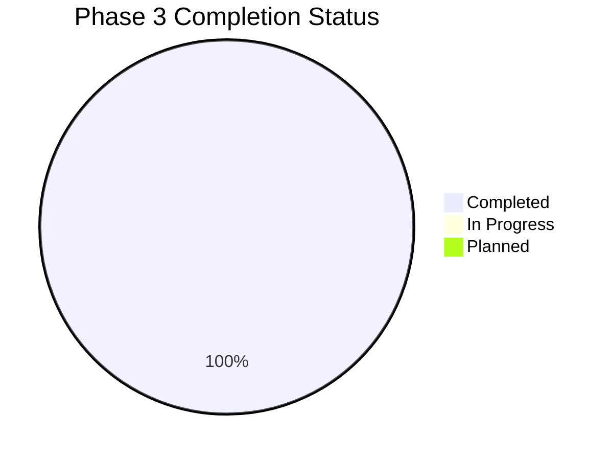

# 🎯 Phase 3: Advanced Concepts - Master Index

> **"Mastering the cutting edge of DevOps: Specialized technology, AI integration, and enterprise governance at global scale."**

## 📖 Phase 3 Navigation Guide

This document serves as the master index for the third phase of the Advanced curriculum. It covers frontier technologies and strategic enterprise patterns that define modern, high-maturity DevOps organizations.

---

### 🟢 11. Specialized Technology

**📂 Path**: `03-Advanced/03-Phase-3/11-Specialized-Tech/`  

**🎯 Learning Goals**:

- Master MLOps (Machine Learning Operations) lifecycles
- Implement Web3 infrastructure and Blockchain DevOps
- Architect multi-tenant SaaS and PaaS platforms
- Optimize Edge Computing and Serverless functions

**🔑 Key Concepts**: MLOps, Web3, SaaS/PaaS, Serverless, Edge Computing  
**⏱️ Time**: 20-25 hours  
**✅ Status**: Complete

---

#### 11.1. MLOps (Machine Learning Operations)

**📂 Path**: `03-Advanced/03-Phase-3/11-Specialized-Tech/01-MLOps/`  

**🎯 Learning Goals**:

- Deploy and monitor ML models using DevOps practices
- Master serving frameworks (TensorFlow Serving, KServe)
- Implement experiment tracking with MLflow

**🔑 Key Concepts**: Model Serving, Experiment Tracking, Drift Detection  
**⏱️ Time**: 8-10 hours  
**✅ Status**: Complete

---

#### 11.2. Web3 DevOps

**📂 Path**: `03-Advanced/03-Phase-3/11-Specialized-Tech/02-Web3-DevOps/`  

**🎯 Learning Goals**:

- Run blockchain nodes (Ethereum, Polygon, Arbitrum)
- Implement Smart Contract CI/CD with Hardhat/Foundry
- Manage decentralized application (dApp) deployment

**🔑 Key Concepts**: Blockchain Nodes, Smart Contracts, IPFS, dApp  
**⏱️ Time**: 6-8 hours  
**✅ Status**: Complete

---

#### 11.3. SaaS & PaaS Architecture

**📂 Path**: `03-Advanced/03-Phase-3/11-Specialized-Tech/03-SaaS-PaaS/`  

**🎯 Learning Goals**:

- Build multi-tenant cloud-native architectures
- Implement usage-based billing and metering
- Orchestrate global scaling strategies

**🔑 Key Concepts**: Multi-tenancy, Metering, Scaling, Cloud-Native  
**⏱️ Time**: 6-8 hours  
**✅ Status**: Complete

---

### 🟢 12. Prompt Engineering for DevOps

**📂 Path**: `03-Advanced/03-Phase-3/12-Prompt-Engineering/`  

**🎯 Learning Goals**:

- Master Agentic Workflows and ReAct patterns (Reason + Act)
- Implement Multi-Agent Orchestration for security audits
- Build autonomous self-healing infrastructure agents
- Optimize AI cost governance and RAG integration

**🔑 Key Concepts**: Agentic AI, ReAct, Multi-Agent, Self-Healing, RAG  
**⏱️ Time**: 12-15 hours  
**✅ Status**: Complete

---

### 🟢 13. Model Context Protocol (MCP)

**📂 Path**: `03-Advanced/03-Phase-3/13-MCP/`  

**🎯 Learning Goals**:

- Design enterprise-scale MCP architectures and gateways
- Implement custom transports (HTTP/WS, gRPC, Kafka)
- Master HA patterns and zero-trust security for MCP
- Orchestrate cross-cloud server federation

**🔑 Key Concepts**: MCP, Custom Transports, Federation, Zero-Trust  
**⏱️ Time**: 10-12 hours  
**✅ Status**: Complete

---

### 🟢 14. Blockchain Ops & Security

**📂 Path**: `03-Advanced/03-Phase-3/14-Blockchain/`  

**🎯 Learning Goals**:

- Orchestrate validator node fleets at scale
- Implement automated key rotation and security auditing
- Manage peer-to-peer networking performance
- Build disaster recovery for decentralized infrastructure

**🔑 Key Concepts**: Validator Nodes, P2P Networking, Key Management, Security  
**⏱️ Time**: 12-15 hours  
**✅ Status**: Complete

---

### 🟢 15. Enterprise FinOps

**📂 Path**: `03-Advanced/03-Phase-3/15-FinOps/`  

**🎯 Learning Goals**:

- Master the FinOps Foundation Framework (Crawl, Walk, Run)
- Implement multi-cloud cost governance and reporting
- Drive unit economics and business value metrics
- Build a sustainable, embedded FinOps organization culture

**🔑 Key Concepts**: FinOps Framework, Unit Economics, Governance, Culture  
**⏱️ Time**: 15-20 hours  
**✅ Status**: Complete

---

#### 15.1. FinOps Framework Deep Dive

**📂 Path**: `03-Advanced/03-Phase-3/15-FinOps/01-FinOps-Framework/`  

**🎯 Learning Goals**:

- Master the phases: Inform, Optimize, Operate
- Implement real-time decision making for cloud spend

**🔑 Key Concepts**: Inform/Optimize/Operate, Benchmarking  
**⏱️ Time**: 3-4 hours  
**✅ Status**: Complete

---

#### 15.2. Multi-Cloud FinOps

**📂 Path**: `03-Advanced/03-Phase-3/15-FinOps/02-Multi-Cloud-FinOps/`  

**🎯 Learning Goals**:

- Orchestrate cost management across AWS, GCP, and Azure
- Implement unified reporting for hybrid environments

**🔑 Key Concepts**: Multi-Cloud, Cost Allocation, Unified Reporting  
**⏱️ Time**: 3-4 hours  
**✅ Status**: Complete

---

#### 15.3. Unit Economics & Value Metrics

**📂 Path**: `03-Advanced/03-Phase-3/15-FinOps/03-Unit-Economics/`  

**🎯 Learning Goals**:

- Shift focus from "Cloud Spend" to "Cloud Value"
- Implement Cloud Unit Cost metrics for business lines

**🔑 Key Concepts**: Unit Cost, Business Value, Cloud ROI  
**⏱️ Time**: 3-4 hours  
**✅ Status**: Complete

---

#### 15.4. Building FinOps Culture

**📂 Path**: `03-Advanced/03-Phase-3/15-FinOps/04-FinOps-Culture/`  

**🎯 Learning Goals**:

- Drive accountability across engineering teams
- Establish FinOps ambassadors and training programs

**🔑 Key Concepts**: Accountability, Culture Shift, Ambassadors  
**⏱️ Time**: 2-3 hours  
**✅ Status**: Complete

---

#### 15.5. Enterprise Governance

**📂 Path**: `03-Advanced/03-Phase-3/15-FinOps/05-Enterprise-Governance/`  

**🎯 Learning Goals**:

- Implement automated policy enforcement for cloud spend
- Build guardrails to prevent cost anomalies

**🔑 Key Concepts**: Automated Enforcement, Guardrails, Anomalies  
**⏱️ Time**: 3-4 hours  
**✅ Status**: Complete

---

### 🟢 16. Advanced API Architectures

**📂 Path**: `03-Advanced/03-Phase-3/16-Advanced-API-Architectures/`  

**🎯 Learning Goals**:

- Master gRPC for high-performance service communication
- Implement GraphQL to optimize mobile & IoT data delivery
- Build asynchronous Event-Driven architectures with Kafka
- Master BFF (Backend for Frontend) and Sidecar patterns

**🔑 Key Concepts**: gRPC, GraphQL, Event-Driven, BFF, Sidecar  
**⏱️ Time**: 15-18 hours  
**✅ Status**: Complete

---

## 📊 Phase 3 Learning Statistics

### Overall Completion

### Module Breakdown

| Level | Topics | Completed | In Progress | Planned |
| :--- | :--- | :--- | :--- | :--- |
| 🔴 Strategic Tech | 6 | 6 | 0 | 0 |
| 🟠 Specialized Sub-modules | 10 | 10 | 0 | 0 |
| **TOTAL** | **16** | **16** | **0** | **0** |

### Estimated Time to Success

- **Strategic Mastery**: 90-110 hours
- **Total Depth**: Approx. 3-4 weeks full-time study

---

## 📚 Recommended Resources

### Industry Frameworks

- [FinOps Foundation](https://www.finops.org/)
- [MLOps Community](https://mlops.community/)
- [Protocol Buffers Documentation](https://protobuf.dev/)

### Tools

- **MLOps**: MLflow, Kubeflow
- **AI**: MCP SDK, OpenAI API
- **FinOps**: Kubecost, Infracost
- **APIs**: Envoy, Istio, Kafka

---

**Last Updated**: 2026-01-19  
**Version**: 1.0.0  
**Maintained by**: Enterprise Architecture Team  
**Status**: 100% Complete ✅
