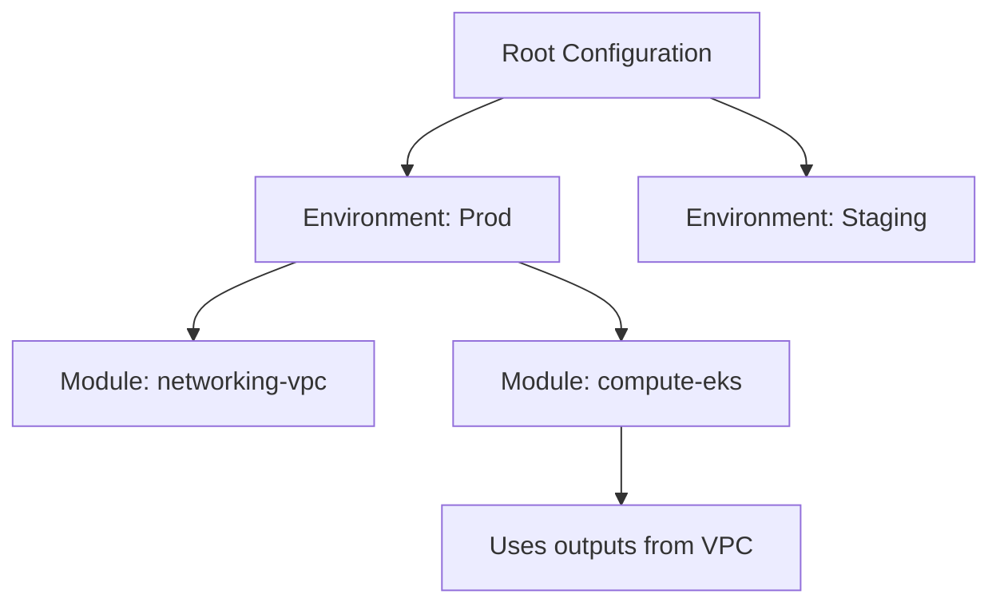
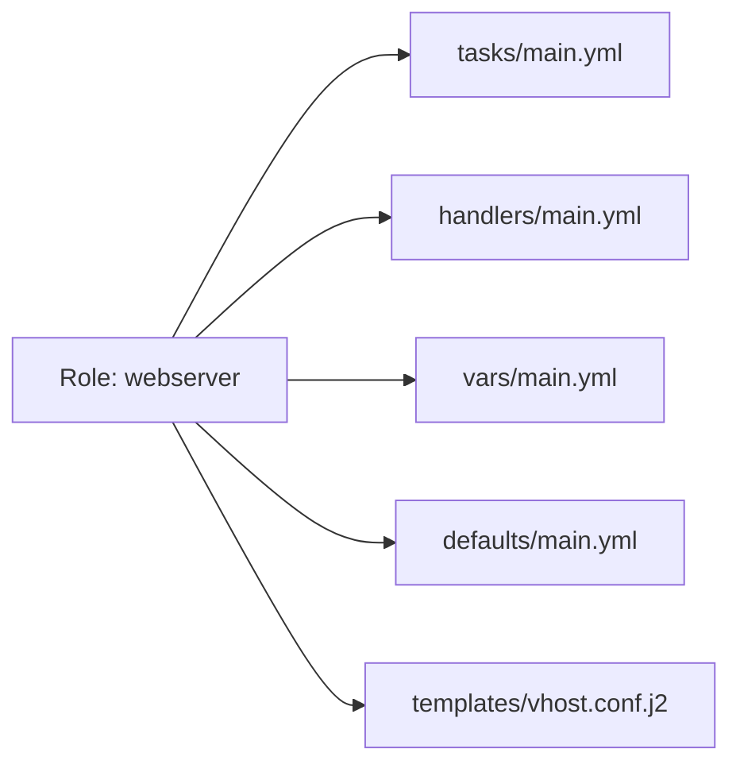

---

## 🎯 Junior's Mission: The Multi-Provider Panic
**Scenario**: Your company is moving from a single cloud (AWS) to a multi-cloud (AWS + Azure) strategy. You need to provision a global networking bridge that works identically on both platforms.
**Your Goal**: Design a **Terraform Module** that abstracts the Cloud Provider and provides a single, uniform interface for "Provision-Network," ensuring all security tags are applied correctly on both sides.

---

## 🏗️ Operational Reality: Production Hazards
Advanced automation is a "Heavy Machinery" environment. Small mistakes lead to massive accidents.
1.  **Selection Error**: You run `terraform destroy` in the wrong terminal tab (Production instead of Staging). Because you don't use "State Locking" or "Workspace Protection," the production database disappears in 30 seconds.
2.  **The "Immutability" Trap**: You use Packer to build an image, but you forget to "Update" the Terraform code to use the new image ID. Your 500 servers are now "Pinned" to a vulnerable image from 6 months ago.
3.  **Ansible Parallelism Overload**: You try to patch 1,000 servers at once with `forks: 1000`. The sudden burst of SSH connections crashes your Bastion host and triggers a "DDoS" alert in your security system.
4.  **Module Version Drift**: You update a shared Terraform module used by 10 different teams. 9 teams are fine, but the 10th team's environment crashes because they were using a deprecated feature you removed.

---

## 🛠️ The Platform Toolbelt (Advanced Automation)
| Tool/Command | Why it matters |
| :--- | :--- |
| `terraform state rm <address>` | The "Surgical" command. Remove a resource from Terraform's memory without actually deleting it from the cloud. |
| `ansible-inventory --graph` | The "X-Ray" vision for your fleet. See exactly which servers belong to which group before running a playbook. |
| `spacelift stack local-run` | Testing your "Policy as Code" (Rego) on your own machine before pushing it to the global platform. |
| `molecule test` | The "Test Flight" for Ansible. Creating a temporary server, testing your code, and deleting it automatically. |
| `tflint --recursive` | Scanning every nested module in your repo for AWS/Azure service limit violations. |

---

### Learning Path
1. [Advanced Terraform](./terraform/)
2. [Advanced Ansible](./ansible/)
3. [Spacelift & GitOps](./spacelift/)
4. [❓ Interview Questions & Quiz](./interview-questions-and-quiz.md)

---

## 🏗️ Advanced Terraform (Infrastructure as Code)

### Module Hierarchy Strategy
Instead of a single flat file, production Terraform is organized into a hierarchy to enable reuse and blast-radius isolation.



### Remote State locking
Multiple engineers cannot run `terraform apply` at the same time without risking state corruption.

**Example S3 Backend + DynamoDB Locking:**
```hcl
terraform {
  backend "s3" {
    bucket         = "my-enterprise-tf-state"
    key            = "global/s3/terraform.tfstate"
    region         = "us-east-1"
    dynamodb_table = "terraform-locks"
    encrypt        = true
  }
}
```

---

## 🚀 Collaborative IaC (Spacelift)

Standard Terraform works fine for individuals, but teams need a "Management Plane."
**[Explore the Spacelift Module](./spacelift/readme.md)** covering:
- **Stacks & Contexts**: Organizing enterprise state.
- **Policy as Code**: Writing OPA/Rego guardrails.
- **Drift Detection**: Automatic self-healing of infrastructure.

---

## ❓ Interview Questions & Quiz
**[Test your knowledge!](./interview-questions-and-quiz.md)**

---

## ⚙️ Advanced Ansible (Configuration Management)

### Role Structure Architecture
Roles allow you to package variables, tasks, and templates into a logical unit.



### Complex Logic & Filters
Using advanced loops and conditional filters to manage complex system states.

**Example Dynamic Loop with Filter:**
```yaml
- name: Ensure specific users exist with custom shells
  ansible.builtin.user:
    name: "{{ item.name }}"
    shell: "{{ item.shell | default('/bin/bash') }}"
    groups: "wheel"
  loop: "{{ users }}"
  when: item.enabled | default(true)
```

---

## 💡 Key Philosophies
1. **DRY (Don't Repeat Yourself)**: If you use the same config twice, it belongs in a module.
2. **Immutability**: Prefer replacing infrastructure (Terraform) over patching it (Ansible) for core components.
3. **Automated Testing**: Use tools like `tflint`, `ansible-lint`, and `molecule` to verify your code before it hits production.

---
**EKS Automation**: See how these tools combine to build managed Kubernetes clusters in the [Advanced K8s Module](../../../readme.md).
