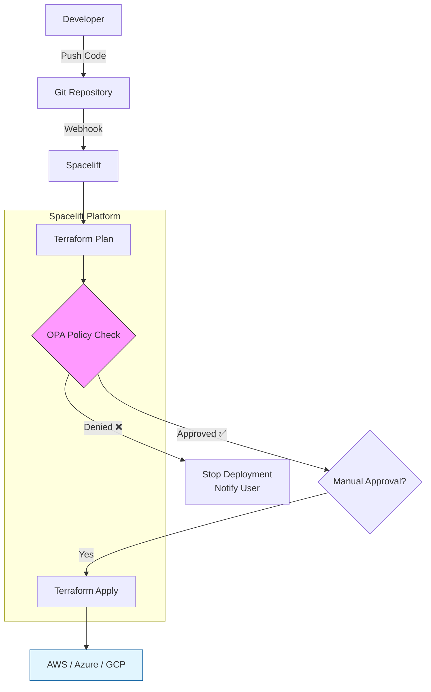

# 🚀 Spacelift: Enterprise Infrastructure as Code (IaC) Management

Spacelift is a specialized Continuous Integration and Deployment (CI/CD) platform designed specifically for Infrastructure as Code. It acts as a collaborative layer above Terraform, OpenTofu, Pulumi, and CloudFormation, adding critical enterprise features like **Policy as Code (OPA)**, **State Management**, and **Drift Detection**.

Unlike generic CI/CD tools (Jenkins, GitHub Actions), Spacelift understands state files, plans, and the infrastructure lifecycle.

---

## 🏛️ Core Architecture & Concepts

### 1. Stacks
A Stack is the fundamental unit of management in Spacelift. It connects a Git repository (and specific branch/path) to a state backend.
- **Microservices for Infra**: You typically break your infrastructure into multiple stacks (e.g., `vpc-stack`, `eks-stack`, `db-stack`).
- **State Management**: Spacelift manages the state file for you (similar to Terraform Cloud).

### 2. Contexts
Contexts are reusable bundles of configuration (Environment Variables, Mounted Files, Hooks) that can be attached to multiple stacks.
- **Example**: An `AWS-Credentials` context attached to all AWS-related stacks.

### 3. Policy as Code (OPA)
This is Spacelift's superpower. Using **Open Policy Agent (OPA)** and the Rego language, you can define guardrails that automatically block compliant deployments.
- **Plan Policies**: Analyze the `terraform plan` JSON. *Example: "Block if any Security Group allows 0.0.0.0/0 on port 22"*
- **Login Policies**: Control who can log in and what permissions they have.
- **Trigger Policies**: Define complex dependency graphs between stacks.

### 4. Drift Detection
Spacelift can perform scheduled runs to check if the *actual* cloud infrastructure has drifted from the *defined* Git configuration. If drift is detected, it can alert or automatically remediate (Self-Healing).

---

## 📊 Visualizing the Spacelift Workflow



---

## 🏗️ Real-Life Scenarios

### 🛡️ Scenario 1: Compliance Guardrails
**Problem**: Developers keep creating public S3 buckets by accident, violating company security policy.
**Spacelift Solution**: Implement a **Plan Policy** using Rego.
```rego
package spacelift

deny[msg] {
  # Analyze the planned changes
  resource := input.terraform.resource_changes[_]
  
  # Check for S3 buckets
  resource.type == "aws_s3_bucket"
  
  # Check if ACL is public
  resource.change.after.acl == "public-read"
  
  msg := sprintf("❌ Public S3 buckets are forbidden! Resource: %s", [resource.address])
}
```
*Result*: The pipeline fails automatically before any infrastructure is created.

### 🔗 Scenario 2: Stack Dependencies (Trigger Policies)
**Problem**: You have a `VPC` stack and an `App-Cluster` stack. The App stack cannot run until the VPC stack is successfully updated.
**Spacelift Solution**: Use a **Trigger Policy**.
- When `vpc-stack` finishes a successful apply, it automatically triggers `app-cluster-stack`.
- Passes the VPC ID as a dynamic output to the child stack.

### 🔐 Scenario 3: Private Workers
**Problem**: Your banking regulations forbid any external CI/CD tool from having direct network access to your private databases.
**Spacelift Solution**: Deploy **Private Worker Pools**.
- You run a small Dockerized agent inside your private AWS VPC.
- Spacelift orchestrates the job, but the actual Terraform execution happens inside **your** isolated network.

---

## 🛠️ Comparison: Spacelift vs. Others

| Feature | Spacelift | Terraform Cloud | GitHub Actions |
| :--- | :--- | :--- | :--- |
| **State Management** | ✅ Native | ✅ Native | ❌ Manual (S3/GCS blobls) |
| **Policy Engine** | Open Policy Agent (Rego) | Sentinel | Custom Scripts |
| **Drift Detection** | ✅ Native & Alerting | ✅ Native | ❌ Custom Cron Jobs |
| **Role-Based Access**| ✅ Granular (spaces) | ✅ Teams | ⚠️ Basic |
| **Cloud Agnostic** | ✅ (TF, Pulumi, Ansible) | ⚠️ Mostly Terraform | ✅ Generic |

---

## 📝 Summary
Spacelift creates a "Management Plane" for your infrastructure. It shifts Terraform from being a tool run on a developer's laptop to a governed, observable, and automated enterprise process. By mastering Spacelift, you enable **Self-Service Infrastructure** while maintaining strict **Security & Compliance**.

---

# 🎤 Spacelift & Advanced IaC Interview Questions

### 1. What differentiates Spacelift from executing Terraform in GitHub Actions?
*   **Strategic Answer**: While GitHub Actions is a generic task runner, Spacelift is a dedicated IaC platform. Spacelift manages the **State File** securely, provides native **Drift Detection**, offers a **Policy as Code** engine (OPA) to validate plans *before* they apply, and handles **Stack Dependencies**. GitHub Actions requires building all of this manually (backend config, locking, OPA integration), which is high-maintenance and prone to error.

### 2. Explain the concept of "Policy as Code" in Spacelift. How is it implemented?
*   **Strategic Answer**: Policy as Code allows us to define infrastructure rules programmatically. Spacelift uses **Open Policy Agent (OPA)** and the **Rego** language. I can write policies that intercept various stages of the lifecycle:
    *   **Plan Policies**: Inspect the Terraform Plan JSON to block non-compliant resources (e.g., "No 0.0.0.0/0 SG rules").
    *   **Login Policies**: Map IdP groups (like Okta/GSuite) to Spacelift Spaces and permissions (Admin/Read-Only).

### 3. What is a "Private Worker Pool" and when would you use it?
*   **Strategic Answer**: A Private Worker Pool consists of agents hosted inside the customer's own infrastructure (e.g., inside a private AWS VPC). You use this when the infrastructure being deployed is not accessible from the public internet (security requirement) or when you need to access private resources (like a database or internal API) during the apply phase without opening firewall ports.

### 4. How does Spacelift handle "Drift Detection" and why is it important specifically for SREs?
*   **Strategic Answer**: Drift occurs when infrastructure is changed manually (ClickOps) outside of Terraform. Spacelift schedules period runs (e.g., every night) to check the live state against the desired state. If differences are found, it alerts the SRE team or can be configured to "Self-Heal" (automatically overwriting the manual changes). This is critical for maintaining infrastructure immutability and compliance.

### 5. Describe the relationship between "Stacks" and "Contexts".
*   **Strategic Answer**: A **Stack** represents a single deployment unit (mapped to a Git repo/path and a State backend). A **Context** is a shared bag of configurations (Env Vars, Files, Scripts) that can be attached to multiple Stacks. For example, I would create an `AWS-Production-Creds` Context and attach it to `Network-Prod-Stack`, `App-Prod-Stack`, and `DB-Prod-Stack`, managing the secret in one place rather than three.

### 6. How can you manage dependencies between multiple Terraform stacks in Spacelift?
*   **Strategic Answer**: Spacelift uses **Trigger Policies** or the **Stack Dependencies** feature (Chain of Stacks). You can configure it so that when the `VPC-Stack` successfully applies, it triggers the `EKS-Stack`. You can also pass outputs from the parent stack (like `vpc_id`) to the child stack as environment variables or input variables, automating the flow of data between decoupled architectural layers.

### 7. What is "Blueprints" in Spacelift?
*   **Strategic Answer**: Blueprints are self-service templates. Instead of asking DevOps to spin up a repo, a developer can fill out a form in the Spacelift UI (defined by the Blueprint YAML), and Spacelift will automatically generate a Stack based on a standard template. This enables "Platform Engineering" patterns where developers provision approved infrastructure on demand.

### 8. How does Spacelift handle detailed role-based access control (RBAC)?
*   **Strategic Answer**: It uses **Spaces** (hierarchical containers for stacks) and **Login Policies**. You can define that the "Engineering Team" (from GitHub Teams) has `Write` access to the `Dev Space` but only `Read` access to the `Prod Space`. This granular control is strictly enforced via OPA policies, making it much more flexible than simple predefined roles.

### 9. Can Spacelift work with tools other than Terraform?
*   **Strategic Answer**: Yes. While known for Terraform, it also supports **OpenTofu**, **Pulumi**, **CloudFormation**, and can even run **Ansible** playbooks (often using the `ansible` provider or customized runners). It is meant to be a general-purpose IaC orchestrator.

### 10. How would you debug a failed Spacelift run that works locally?
*   **Strategic Answer**: First, I would check the **Contexts** and **Environment Variables** attached to the stack to ensure credentials mimic my local setup. Second, I would ensure the **Terrform Version** matches. Third, I might use the **"Ad-hoc Task"** feature in Spacelift to open a debug session on the runner or simply replicate the runner environment locally using Docker to inspect network connectivity or missing dependencies.

---

# 🧠 Spacelift & Advanced IaC Quiz

Test your specific knowledge on Spacelift architecture, policies, and workflows.

---

<b>1. What is the primary role of "Contexts" in Spacelift?</b>
<details><summary>Show Answer</summary>
Answer: <b>To share common configuration (env vars, files) across multiple stacks.</b>
</details>

<b>2. Which language is used to define "Policy as Code" in Spacelift?</b>
<details><summary>Show Answer</summary>
Answer: <b>Rego (Open Policy Agent)</b>
</details>

<b>3. What feature allows Spacelift to manage infrastructure that is not accessible via the public internet?</b>
<details><summary>Show Answer</summary>
Answer: <b>Private Worker Pools</b>
</details>

<b>4. Which policy type would you use to prevent a specific user group from logging into the Spacelift console?</b>
<details><summary>Show Answer</summary>
Answer: <b>Login Policy</b>
</details>

<b>5. What does Spacelift use to detect when the actual cloud state differs from the Git configuration?</b>
<details><summary>Show Answer</summary>
Answer: <b>Drift Detection</b>
</details>

<b>6. In Spacelift, what is a "Stack"?</b>
<details><summary>Show Answer</summary>
Answer: <b>The fundamental unit that connects a Git repo source to a State Backend.</b>
</details>

<b>7. How can you trigger a child stack to run immediately after a parent stack completes successfully?</b>
<details><summary>Show Answer</summary>
Answer: <b>Using Trigger Policies (or Stack Dependencies).</b>
</details>

<b>8. Which Spacelift feature allows developers to spin up infrastructure using pre-defined, governed templates?</b>
<details><summary>Show Answer</summary>
Answer: <b>Blueprints</b>
</details>

<b>9. Unlike GitHub Actions, Spacelift natively manages which critical Terraform component?</b>
<details><summary>Show Answer</summary>
Answer: <b>The State File</b>
</details>

<b>10. What happens if a "Plan Policy" denies a proposed change in Spacelift?</b>
<details><summary>Show Answer</summary>
Answer: <b>The run is blocked and cannot be applied until the violation is fixed or overridden (if permitted).</b>
</details>

<b>11. Can Spacelift manage tools other than Terraform?</b>
<details><summary>Show Answer</summary>
Answer: <b>Yes, it supports OpenTofu, Pulumi, CloudFormation, Kubernetes, and Ansible.</b>
</details>

<b>12. What concept allows you to group multiple Stacks together for easier permission management?</b>
<details><summary>Show Answer</summary>
Answer: <b>Spaces</b>
</details>

<b>13. If you want to mount a `kubeconfig` file into your run capability, where should you define it?</b>
<details><summary>Show Answer</summary>
Answer: <b>In a Context (as a Mounted File)</b>
</details>

<b>14. How does Spacelift handle "Pull Request" previews?</b>
<details><summary>Show Answer</summary>
Answer: <b>It automatically runs a `terraform plan` on the PR branch and posts the result back to the Git provider (GitHub/GitLab) as a comment or status check.</b>
</details>

<b>15. What is the benefit of "Plan Policies" over "Sentinel"?</b>
<details><summary>Show Answer</summary>
Answer: <b>Plan Policies use OPA (Open Source standard), whereas Sentinel is proprietary to HashiCorp Terraform Cloud.</b>
</details>

<b>16. Which Permission Level is needed to confirm and apply a Run in Spacelift?</b>
<details><summary>Show Answer</summary>
Answer: <b>Write (or Admin) permissions on the Space/Stack.</b>
</details>

<b>17. How can you pass the VPC ID from a Network Stack to an App Stack in Spacelift?</b>
<details><summary>Show Answer</summary>
Answer: <b>By using Terraform Outputs in the parent stack and reading them as input variables in the child stack (via Contexts/Triggers).</b>
</details>

<b>18. True or False: You can debug a failed runner session by logging into it interactively (if enabled).</b>
<details><summary>Show Answer</summary>
Answer: <b>True (using the Ad-Hoc Task or Debug feature).</b>
</details>

<b>19. What is the underlying container technology used for specific runners in Spacelift?</b>
<details><summary>Show Answer</summary>
Answer: <b>Docker Images</b>
</details>

<b>20. To ensure High Availability for Private Workers, how many agents should you run?</b>
<details><summary>Show Answer</summary>
Answer: <b>At least two, preferably across different Availability Zones.</b>
</details>

<b>21. What is the role of the "Initialization Phase" in a Spacelift run?</b>
<details><summary>Show Answer</summary>
Answer: <b>It clones the repo, downloads dependencies, and sets up the environment before Planning.</b>
</details>
