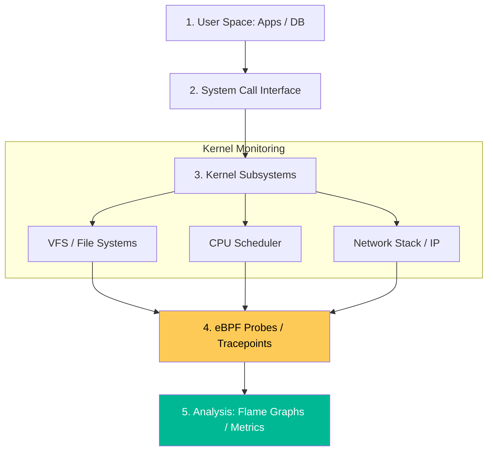

# Linux Kernel Performance & Observability Reference

**Doc Version:** 1.0.0
**Role:** Senior Systems Engineer / Performance Architect
**Scope:** Kernel Tuning, eBPF, and Observability Stack

---

## 1. The Linux Kernel Observability Stack

In advanced Linux environments, traditional tools like `top` are insufficient. We use a multi-layered approach to identify bottlenecks.

### A. The 60-Second Analysis
A standard sequence of commands to diagnose a failing system:
1.  `uptime`: Check load averages over 1, 5, and 15 mins.
2.  `dmesg | tail`: Look for kernel OOM kills or hardware errors.
3.  `vmstat 1`: Check context switches, interrupts, and swap activity.
4.  `mpstat -P ALL 1`: Check per-CPU utilization to identify "single-core" bottlenecks.
5.  `iostat -xz 1`: Check disk latency and utilization.
6.  `free -m`: Verify available memory and buffer/cache levels.

### B. Profiling with `perf`
`perf` is the primary tool for sampling CPU performance.
- **Flame Graphs**: Aggregating millions of samples into a visual representation of the most expensive code paths (functions) in the system.

---

## 2. Kernel Parameter Tuning (`sysctl`)

Tuning the kernel is essential for high-concurrency cloud applications (e.g., Load Balancers, Databases).

| Parameter | Recommended Value | Why? |
| :--- | :--- | :--- |
| **`net.core.somaxconn`** | `4096` | Prevents "Connection Refused" during traffic spikes. |
| **`net.ipv4.tcp_tw_reuse`** | `1` | Allows reusing sockets in TIME_WAIT state for fast recycling. |
| **`vm.swappiness`** | `1-10` | Minimizes disk I/O by keeping data in RAM longer. |
| **`vm.max_map_count`** | `262144` | Required for memory-intensive apps like Elasticsearch. |
| **`fs.file-max`** | `2097152` | Increases the global limit for concurrent open files/connections. |

---

## 3. High-Performance Tracing with eBPF

eBPF (Extended Berkeley Packet Filter) allows you to run sandboxed programs in the kernel without modifying kernel source or loading a traditional module.

- **`bpftrace`**: A high-level tracing language for eBPF.
- **`execsnoop`**: Tracing every new process execution system-wide.
- **`biolatency`**: Visualizing disk I/O latency distribution (Histograms).
- **`tcplife`**: Summarizing every TCP connection's lifespan and throughput.

---

## 4. Visualizing the Linux Performance Layers

---

## 5. Cgroups and Namespaces (The Container Core)

Advanced Linux mastery requires understanding the primitives that make containers possible.
- **Namespaces**: Provide **Process Isolation**. (Mount, Process ID, Network, User).
- **Cgroups (Control Groups)**: Provide **Resource Limitation**. (CPU, Memory, Disk I/O).
- **Governance**: Using `systemd-cgtop` to monitor resource usage and ensuring no single tenant can starve the entire system.

---

## 6. Enterprise Governance Standards

- **Immutable Configuration**: Never manually edit `/etc/sysctl.conf`. All tuning must be applied via Configuration Management (Ansible/Terraform) to ensure consistency across the fleet.
- **Baseline Monitoring**: Establishing 95th percentile baselines for disk latency and CPU wait time to distinguish "normal" load from "abnormal" behavior.
- **Tracing Audit**: Restricting access to powerful tracing tools (`perf`, `strace`, `eBPF`) in production to senior SREs, as they can inadvertently leak sensitive data from memory.

> **Enterprise Pattern**: Implement **Self-Healing OOM Protection**. Instead of letting the kernel kill a random process during memory exhaustion, use **`systemd-oomd`** to monitor cgroups and kill the specific service that is exceeding its defined memory budget before the entire system becomes unresponsive.
