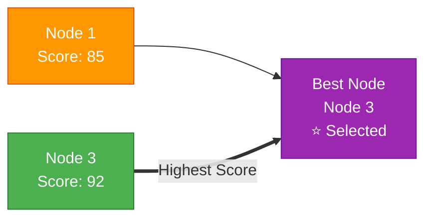
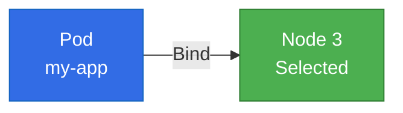
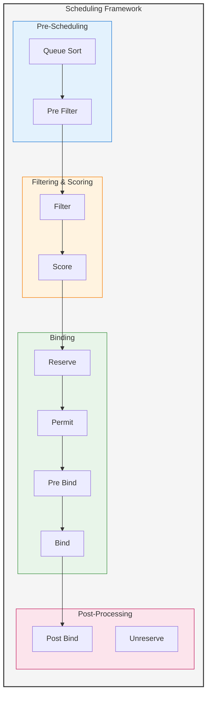

# Kube-Scheduler in Kubernetes Control Plane

## Overview

**Kube-Scheduler** is a core component of the Kubernetes control plane responsible for making scheduling decisions about where to place pods on worker nodes. It watches for newly created pods with no assigned node and selects the most suitable node based on resource requirements, constraints, and policies.

## What is Kube-Scheduler?

The Kube-Scheduler is:
- A control plane component that assigns pods to nodes
- A policy-rich, topology-aware, workload-specific function
- Responsible for resource optimization across the cluster
- Extensible through scheduling frameworks and plugins

## Role in Kubernetes Architecture

### Primary Functions

1. **Pod Placement**
   - Watches for unscheduled pods via API Server
   - Evaluates available nodes for pod placement
   - Makes optimal scheduling decisions

2. **Resource Management**
   - Considers CPU, memory, and storage requirements
   - Evaluates node capacity and availability
   - Ensures efficient resource utilization

3. **Constraint Satisfaction**
   - Enforces node selectors and affinity rules
   - Respects taints and tolerations
   - Applies scheduling policies and priorities

## Scheduling Process

### 1. Filtering Phase (Predicates)

```mermaid
flowchart TB
    node1["Node 1<br/>✓ Available"]:: available
    node2["Node 2<br/>✗ No CPU"]:::unavailable
    node3["Node 3<br/>✓ Available"]:::available
    
    feasible["Feasible Nodes<br/>[1, 3]"]
    
    node1 & node3 --> feasible
    node2 -.x|Filtered Out| feasible
    
    classDef available fill:#4caf50,color:#fff,stroke:#2e7d32
    classDef unavailable fill:#f44336,color:#fff,stroke:#c62828
    style feasible fill:#2196f3,color:#fff,stroke:#1565c0
```

### 2. Scoring Phase (Priorities)



### 3. Binding Phase



## Scheduling Framework

### Plugin Architecture



### Extension Points

1. **QueueSort**: Determines pod scheduling order
2. **PreFilter**: Pre-processes pod information
3. **Filter**: Filters out unsuitable nodes
4. **PostFilter**: Handles scheduling failures
5. **PreScore**: Pre-processes nodes for scoring
6. **Score**: Ranks feasible nodes
7. **NormalizeScore**: Normalizes scoring results
8. **Reserve**: Reserves resources on chosen node
9. **Permit**: Approves or denies scheduling
10. **PreBind**: Performs pre-binding operations
11. **Bind**: Binds pod to node
12. **PostBind**: Performs post-binding operations

## Built-in Scheduling Plugins

### Filtering Plugins

#### NodeResourcesFit
```yaml
# Checks if node has sufficient resources
resources:
  requests:
    cpu: "500m"
    memory: "1Gi"
  limits:
    cpu: "1000m"
    memory: "2Gi"
```

#### NodeAffinity
```yaml
# Node selection constraints
affinity:
  nodeAffinity:
    requiredDuringSchedulingIgnoredDuringExecution:
      nodeSelectorTerms:
      - matchExpressions:
        - key: kubernetes.io/arch
          operator: In
          values: ["amd64"]
```

#### PodAffinity/PodAntiAffinity
```yaml
# Pod co-location rules
affinity:
  podAffinity:
    requiredDuringSchedulingIgnoredDuringExecution:
    - labelSelector:
        matchLabels:
          app: database
      topologyKey: kubernetes.io/hostname
```

#### TaintToleration
```yaml
# Taint and toleration matching
tolerations:
- key: "node-type"
  operator: "Equal"
  value: "gpu"
  effect: "NoSchedule"
```

### Scoring Plugins

#### NodeResourcesFit
- Scores nodes based on resource utilization
- Prefers balanced resource allocation
- Configurable scoring strategies

#### ImageLocality
- Prefers nodes with required container images
- Reduces image pull time
- Improves pod startup performance

#### InterPodAffinity
- Scores based on pod affinity preferences
- Considers soft affinity rules
- Balances workload distribution

## Scheduling Policies and Profiles

### Default Scheduling Profile
```yaml
apiVersion: kubescheduler.config.k8s.io/v1beta3
kind: KubeSchedulerConfiguration
profiles:
- schedulerName: default-scheduler
  plugins:
    queueSort:
      enabled:
      - name: PrioritySort
    preFilter:
      enabled:
      - name: NodeResourcesFit
      - name: NodeAffinity
    filter:
      enabled:
      - name: NodeResourcesFit
      - name: NodeAffinity
      - name: PodTopologySpread
    score:
      enabled:
      - name: NodeResourcesFit
      - name: ImageLocality
```

### Custom Scheduling Profile
```yaml
apiVersion: kubescheduler.config.k8s.io/v1beta3
kind: KubeSchedulerConfiguration
profiles:
- schedulerName: gpu-scheduler
  plugins:
    filter:
      enabled:
      - name: NodeResourcesFit
      - name: NodeAffinity
      disabled:
      - name: TaintToleration
  pluginConfig:
  - name: NodeResourcesFit
    args:
      scoringStrategy:
        type: LeastAllocated
```

## Advanced Scheduling Features

### Priority Classes
```yaml
apiVersion: scheduling.k8s.io/v1
kind: PriorityClass
metadata:
  name: high-priority
value: 1000
globalDefault: false
description: "High priority class for critical workloads"
```

### Pod Disruption Budgets
```yaml
apiVersion: policy/v1
kind: PodDisruptionBudget
metadata:
  name: myapp-pdb
spec:
  minAvailable: 2
  selector:
    matchLabels:
      app: myapp
```

### Topology Spread Constraints
```yaml
apiVersion: v1
kind: Pod
spec:
  topologySpreadConstraints:
  - maxSkew: 1
    topologyKey: zone
    whenUnsatisfiable: DoNotSchedule
    labelSelector:
      matchLabels:
        app: myapp
```

## Multi-Scheduler Setup

### Custom Scheduler Deployment
```yaml
apiVersion: apps/v1
kind: Deployment
metadata:
  name: custom-scheduler
spec:
  replicas: 1
  selector:
    matchLabels:
      app: custom-scheduler
  template:
    spec:
      containers:
      - name: kube-scheduler
        image: k8s.gcr.io/kube-scheduler:v1.28.0
        command:
        - kube-scheduler
        - --config=/etc/kubernetes/scheduler-config.yaml
        - --v=2
```

### Using Custom Scheduler
```yaml
apiVersion: v1
kind: Pod
metadata:
  name: myapp
spec:
  schedulerName: custom-scheduler
  containers:
  - name: app
    image: nginx
```

## Performance Tuning

### Scheduler Configuration
```yaml
apiVersion: kubescheduler.config.k8s.io/v1beta3
kind: KubeSchedulerConfiguration
parallelism: 16
profiles:
- schedulerName: default-scheduler
  plugins:
    score:
      enabled:
      - name: NodeResourcesFit
        weight: 1
      - name: ImageLocality
        weight: 2
```

### Resource Limits
```yaml
# Scheduler pod resource limits
resources:
  requests:
    cpu: "100m"
    memory: "128Mi"
  limits:
    cpu: "500m"
    memory: "512Mi"
```

## Monitoring and Observability

### Key Metrics

#### Scheduling Metrics
- **scheduler_scheduling_duration_seconds**: Time to schedule pods
- **scheduler_pending_pods**: Number of pending pods
- **scheduler_schedule_attempts_total**: Total scheduling attempts

#### Performance Metrics
- **scheduler_framework_extension_point_duration_seconds**: Plugin execution time
- **scheduler_queue_incoming_pods_total**: Pods entering scheduling queue
- **scheduler_preemption_attempts_total**: Preemption attempts

### Health Checks
```bash
# Check scheduler health
kubectl get componentstatuses

# View scheduler logs
kubectl logs -n kube-system kube-scheduler-master-node

# Check scheduling events
kubectl get events --field-selector reason=Scheduled
```

### Prometheus Monitoring
```yaml
apiVersion: monitoring.coreos.com/v1
kind: ServiceMonitor
metadata:
  name: kube-scheduler
spec:
  selector:
    matchLabels:
      component: kube-scheduler
  endpoints:
  - port: http-metrics
    interval: 30s
    path: /metrics
```

## Troubleshooting

### Common Issues

#### 1. Pods Stuck in Pending State
```bash
# Check pod events
kubectl describe pod <pod-name>

# Check node resources
kubectl describe nodes

# Check scheduler logs
kubectl logs -n kube-system kube-scheduler-<node>
```

#### 2. Scheduling Failures
```bash
# View failed scheduling events
kubectl get events --field-selector reason=FailedScheduling

# Check node taints
kubectl describe node <node-name> | grep -i taint

# Verify resource requests
kubectl describe pod <pod-name> | grep -A 10 "Requests:"
```

#### 3. Performance Issues
```bash
# Check scheduler metrics
kubectl top pod -n kube-system kube-scheduler-*

# Monitor scheduling latency
kubectl get --raw /metrics | grep scheduler_scheduling_duration
```

### Debug Commands
```bash
# Enable verbose logging
kube-scheduler --v=4 --config=/etc/kubernetes/scheduler-config.yaml

# Dry run scheduling
kubectl create --dry-run=server -f pod.yaml

# Check scheduler configuration
kubectl get configmap -n kube-system kube-scheduler-config -o yaml
```

## Best Practices

### 1. Resource Management
- Set appropriate resource requests and limits
- Use resource quotas to prevent resource exhaustion
- Monitor cluster resource utilization

### 2. Scheduling Policies
- Use node affinity for hardware-specific workloads
- Implement pod anti-affinity for high availability
- Configure priority classes for critical workloads

### 3. Performance Optimization
- Tune scheduler parallelism for large clusters
- Use custom schedulers for specialized workloads
- Monitor and optimize plugin performance

### 4. High Availability
- Run multiple scheduler replicas
- Use leader election for active-passive setup
- Implement proper monitoring and alerting

## Integration with Other Components

### API Server Integration
```yaml
# Scheduler watches for unscheduled pods
apiVersion: v1
kind: Pod
metadata:
  name: unscheduled-pod
spec:
  nodeName: ""  # Empty indicates unscheduled
  containers:
  - name: app
    image: nginx
```

### Kubelet Integration
```bash
# Scheduler updates pod spec with nodeName
# Kubelet on target node picks up the pod
# Pod lifecycle management begins
```

### Controller Manager Integration
- ReplicaSet controller creates pods
- Scheduler assigns nodes to pods
- Node controller monitors node health
- Deployment controller manages rolling updates

## Security Considerations

### RBAC Configuration
```yaml
apiVersion: rbac.authorization.k8s.io/v1
kind: ClusterRole
metadata:
  name: system:kube-scheduler
rules:
- apiGroups: [""]
  resources: ["pods"]
  verbs: ["get", "list", "watch", "update", "patch"]
- apiGroups: [""]
  resources: ["nodes"]
  verbs: ["get", "list", "watch"]
```

### Secure Communication
```yaml
# TLS configuration
--tls-cert-file=/etc/kubernetes/pki/kube-scheduler.crt
--tls-private-key-file=/etc/kubernetes/pki/kube-scheduler.key
--client-ca-file=/etc/kubernetes/pki/ca.crt
```

## Future Enhancements

### Scheduler Extender
- HTTP-based scheduler extension
- Custom scheduling logic
- Integration with external systems

### Scheduling Gates
- Block pod scheduling until conditions are met
- Custom admission controllers
- Advanced workflow management

### Machine Learning Integration
- Predictive scheduling algorithms
- Workload pattern recognition
- Automated optimization

## Conclusion

The Kube-Scheduler is essential for:
- Efficient resource utilization across the cluster
- Meeting application placement requirements
- Maintaining cluster performance and stability
- Enabling advanced scheduling scenarios

Understanding scheduler behavior and configuration is crucial for optimizing Kubernetes cluster performance and ensuring workloads are placed optimally according to requirements and constraints.