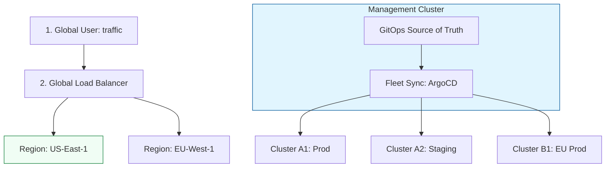

# Multi-Cluster Kubernetes Governance & Fleet Management

**Doc Version:** 1.0.0
**Role:** Platform Engineer / Infrastructure Lead
**Scope:** Multi-cluster architecture, Fleet management, and Disaster Recovery

---

## 1. The Multi-Cluster Reality

As organizations scale, they move from a "Single Monolithic Cluster" to a "Fleet of Small Clusters."

### Why Multi-Cluster?
- **Isolation**: Separate clusters for Dev, Staging, and Production for strict security boundaries.
- **Blast Radius**: Ensuring a misconfiguration in one cluster doesn't crash the entire company's infrastructure.
- **Compliance**: Keeping data in specific geographic regions (GDPR, Data Residency).
- **Scale**: Overcoming etcd or API server limits of a single cluster.

---

## 2. Fleet Management Patterns

Managing 100 clusters individually is impossible. We use **Fleet Management** patterns to centralize control.

### A. The Hub-and-Spoke Pattern
- **The Hub**: A central cluster (e.g., ArgoCD Hub or Anthos Config Management) that stores the "Source of Truth" for all other clusters.
- **The Spokes**: Managed clusters that pull their configuration from the Hub.

### B. Cluster API (CAPI)
A Kubernetes sub-project that allows you to manage clusters *using* Kubernetes. You define a "Cluster" resource in your management cluster, and CAPI provisions the real machines in AWS/Azure/GCP.

---

## 3. Global Traffic and Failover (GSLB)

How do you route users between clusters in different regions?

1.  **Global Load Balancer (GSLB)**: Route traffic based on geographic proximity or cluster health.
2.  **ExternalDNS**: Automatically updating DNS records (Cloudflare, Route53) when a new Ingress is created in any cluster.
3.  **Cross-Cluster Connectivity**: Using a Service Mesh (Istio Multi-primary) or Submariner to allow pods in Cluster A to talk directly to pods in Cluster B.

---

## 4. Visualizing the Global Fleet

---

## 5. Drift Detection Across the Fleet

Consistency is the biggest challenge in fleet management.
- **Configuration Drift**: Cluster A having a different version of a security policy than Cluster B.
- **Remediation**: Using **GitOps (ArgoCD/Flux)** to force the state of all clusters to match the target repository every 5-10 minutes.

---

## 6. Enterprise Governance Standards

- **Uniform RBAC**: Ensuring a developer has the same permissions in every cluster by syncing IAM roles via OIDC.
- **Policy Synchronization**: Using **OPA Gatekeeper** to enforce that no pod can run as root across the entire fleet.
- **Centralized Observability**: Exporting metrics from every cluster to a single global dashboard (Prometheus Federator or Managed Grafana).

> **Enterprise Pattern**: Implement **Cluster-Level Disaster Recovery (DR)**. Use **Velero** with a cross-region S3 bucket. If an entire cloud region goes offline, a new cluster can be provisioned in a different region and the entire state (including PV data) restored within a target RTO (Recovery Time Objective) of < 1 hour.
