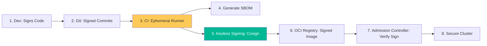

# Software Supply Chain Security & SLSA Reference

**Doc Version:** 1.0.0
**Role:** DevSecOps Architect / Supply Chain Lead
**Scope:** SLSA Framework, SBOM, and Artifact Provenance

---

## 1. The Supply Chain Threat Landscape

Modern applications are 80-90% third-party code. Attacks are shifting from the application itself to the "Supply Chain" that builds it.

### Attack Vectors:
- **Dependency Confusion**: Tricking a build system into pulling a malicious package from a public registry instead of a private one.
- **Compromised Build Tools**: Injecting malicious code into the compiler or CI/CD runner (e.g., SolarWinds).
- **Insecure Artifacts**: Tampering with a container image after it has been built but before it is deployed.

---

## 2. The SLSA Framework (Supply-chain Levels for Software Artifacts)

SLSA is a security framework from Google that provides a checklist of standards to secure the software build and deployment process.

- **Level 1 (Scripted Build)**: The build is automated and generates a "provenance" (record of how it was built).
- **Level 2 (Hosted Build)**: The build runs on a hosted service (GitHub Actions, GitLab CI) with signed provenance.
- **Level 3 (Hardened Build)**: The build environment is ephemeral and isolated, preventing cross-build contamination.
- **Level 4 (Verifiable Build)**: Includes two-party reviews and reproducible builds.

---

## 3. SBOM (Software Bill of Materials)

An SBOM is a nested inventory of every library, plugin, and dependency used in your software.

- **Format**: CycloneDX or SPDX.
- **Why?**: When a new vulnerability (like Log4j) is discovered, you use your SBOM database to instantly find every affected application across your entire enterprise without re-scanning.
- **Tools**: **Syft** (generate SBOMs), **Grype** (scan SBOMs).

---

## 4. Visualizing the Secure Supply Chain

---

## 5. Keyless Signing with Sigstore (Cosign)

Managing private keys for artifact signing is a nightmare. Sigstore simplifies this using OIDC (OpenID Connect).

- **Short-lived Keys**: The CI runner receives a 10-minute certificate based on its GitHub Actions identity.
- **Transparency Log**: The signature is recorded in a public, immutable ledger (**Rekor**).
- **Verification**: The deployment target verifies the signature against the transparency log using the CI's identity.

---

## 6. Enterprise Governance Standards

- **Binary Authorization**: Mandating that no container image can run in Production unless it has a valid signature from the "Secure Build" pipeline.
- **Vulnerability Freshness**: Purging or re-scanning any artifact in the registry that hasn't been scanned in the last 24 hours.
- **Least-Privilege Runners**: Ensuring CI/CD runners have NO access to long-lived credentials, using IAM Roles for Service Accounts (IRSA) exclusively.

> **Enterprise Pattern**: Implement **Provenance Attestation**. Every build should generate an "Attestation" file (a signed JSON) that includes the Git commit hash, the build parameters, and the exact build tool version. Before deployment, the Kubernetes admission controller checks this file to guarantee the image wasn't tampered with outside the CI/CD pipeline.
