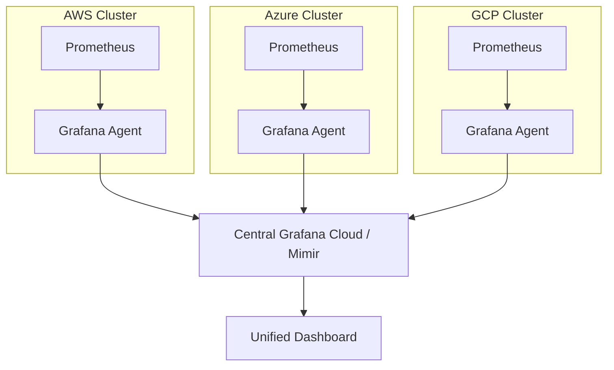

# Multi-Cloud Management & Governance

Operating across multiple clouds increases complexity exponentially. This guide focuses on centralizing management, automation, and cost control.

---

## 1. Centralized Operations (Single Pane of Glass)

The goal of multi-cloud management is to have visibility into all resources from a single console.
- **Unified Logging**: Streaming logs from all clouds to a central SIEM (e.g., Splunk, Elastic).
- **Global Observability**: Using platform-agnostic tools like Datadog, New Relic, or Prometheus/Grafana.

### Centralized Monitoring Architecture


---

## 2. Multi-Cloud FinOps

Managing costs in multi-cloud requires a unified approach to:
- **Unified Billing**: Using third-party tools to aggregate spend across providers.
- **Cross-Cloud Rightsizing**: Comparing instance costs (e.g., AWS t3.medium vs. Azure B2s) to find the best value.

### Cost Allocation Tagging (Standardized)
| Key | Value (Example) | Description |
| :--- | :--- | :--- |
| `Environment` | `Production`, `Staging` | Environment classification |
| `Project` | `Payment-Gateway` | Shared project across clouds |
| `CostCenter` | `IT-Operations-012` | Billing department |
| `Owner` | `alice@company.com` | Responsible engineer |

---

## 3. Governance Strategies
- **Enforcement**: Using Azure Policy, AWS Config, and GCP Organization Policy.
- **Policy as Code**: Using Sentinel or OPA (Open Policy Agent) to enforce compliance regardless of the cloud API.

### Cross-Cloud OPA Example
```rego
package multicloud.governance

# Deny instances in unapproved regions
deny_region[msg] {
    input.provider == "aws"
    not input.region == "us-east-1"
    msg := "AWS resources must be in us-east-1"
}

deny_region[msg] {
    input.provider == "azure"
    not input.location == "eastus"
    msg := "Azure resources must be in eastus"
}
```

---

## 4. Best Practices
- **Minimize Data Transfer (Egress)**: Data transfer between clouds is expensive. Keep data-heavy workloads co-located with their storage.
- **Prefer IaC**: Avoid manual console changes at all costs to ensure platform drift is detectable.
- **Unified Identity**: Use a single IDP (Azure AD, Okta) across all providers.