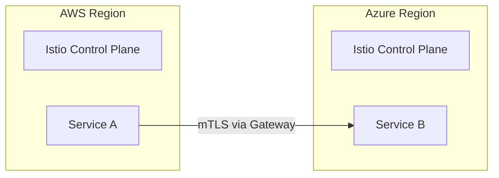

# Multi-Cloud Security & Identity

Complete guide to securing multi-cloud environments, identity management, and compliance federation.

---

## 1. Workload Identity Federation

Workload Identity Federation is the modern way to allow services in one cloud to access resources in another without long-lived secrets.

### GCP to AWS Access
To allow a GCP Service Account to access an S3 bucket:
1. **AWS Side**: Create an OIDC Identity Provider in IAM pointing to Google's OIDC issuer (`https://accounts.google.com`).
2. **AWS Side**: Create an IAM Role with a Trust Policy that allows the Google OIDC provider.
3. **GCP Side**: The application uses the Google STS token to exchange it for temporary AWS credentials.

### Azure to GCP Access
```bash
# Register Azure as an identity provider in GCP
gcloud iam workload-identity-pools create "azure-pool" \
    --location="global" \
    --display-name="Azure Identity Pool"

# Add a provider to the pool
gcloud iam workload-identity-pools providers create-oidc "azure-provider" \
    --location="global" \
    --workload-identity-pool="azure-pool" \
    --issuer-uri="https://sts.windows.net/YOUR_AZURE_TENANT_ID/" \
    --allowed-audiences="api://YOUR_GCP_PROJECT_NUMBER" \
    --attribute-mapping="google.subject=assertion.sub"
```

---

## 2. Centralized Secret Management

Using a single secret manager or federating existing ones.

| Strategy | Tools | Pros | Cons |
| :--- | :--- | :--- | :--- |
| **Central Vault** | HashiCorp Vault | Single source of truth | Extra infrastructure |
| **Secret Sync** | External Secrets Operator | Native cloud experience | Sync lag potential |
| **Trust Federation** | Workload Identity | No secrets to rotate | Complex setup |

### HashiCorp Vault Multi-Cloud Config
```bash
# Enable AWS, Azure, and GCP auth in a single Vault cluster
vault auth enable aws
vault auth enable azure
vault auth enable gcp

# Define roles that bind to specific cloud identities
vault write auth/aws/role/app-role \
    auth_type=iam \
    bound_iam_principal_arn="arn:aws:iam::123:role/app-role" \
    policies="app-policy"
```

---

## 3. Cross-Cloud Network Security

- **mTLS Everywhere**: Using Service Meshes like Istio or Linkerd to secure traffic between clouds.
- **Micro-segmentation**: Defining policies that follow the workload, not the IP.

### Istio Multi-Primary Cross-Cloud


---

## 4. Compliance and Policy as Code

Use Open Policy Agent (OPA) to ensure that security standards are consistent across providers.

```rego
package security.compliance

# Enforce encryption on all storage services
deny[msg] {
    input.resource_type == "aws_s3_bucket"
    not input.encryption_enabled
    msg := "S3 bucket must be encrypted"
}

deny[msg] {
    input.resource_type == "azurerm_storage_account"
    input.https_only == false
    msg := "Azure Storage must enforce HTTPS"
}
```