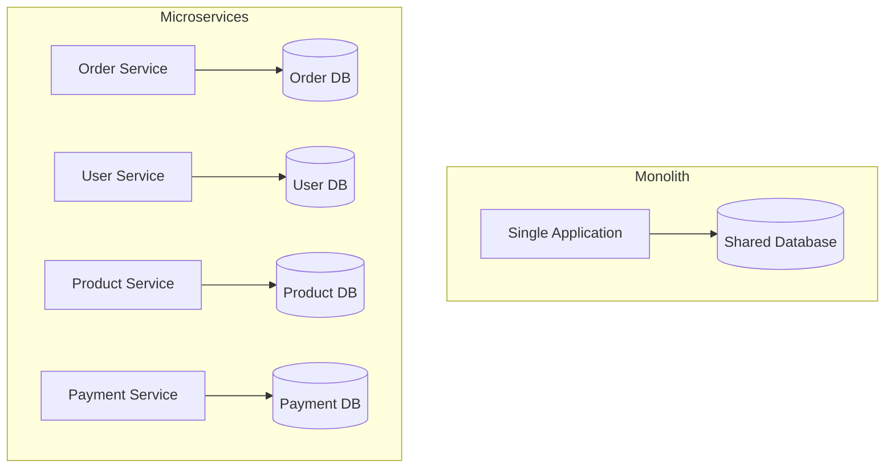
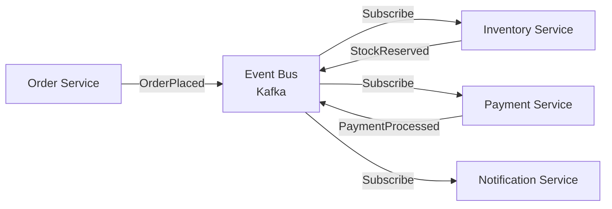

# Image Assets - Microservices Architecture

This directory contains visual assets for the Microservices Architecture module.

## 📁 Required Images

### 1. microservices_vs_monolith_comparison.png

**Description:**  
Side-by-side comparison of monolithic and microservices architectures.

**Specifications:**
- **Dimensions**: 1920x1080 (16:9)
- **Format**: PNG with transparency
- **Color Scheme**: Dark background (#1a1b26) with vibrant accent colors
- **Content**:
  - Left side: Monolith architecture (single box with database)
  - Right side: Microservices architecture (multiple services with individual databases)
  - Visual comparison table highlighting differences

**Suggested Visual Elements:**
```
Monolithic Architecture          Microservices Architecture
┌─────────────────────┐         ┌──────┐ ┌──────┐ ┌──────┐
│                     │         │Order │ │Inven │ │Paymt │
│   Single            │         │Svc   │ │Svc   │ │Svc   │
│   Application       │         └──┬───┘ └──┬───┘ └──┬───┘
│                     │            │        │        │
└──────────┬──────────┘         ┌──▼──┐ ┌──▼──┐ ┌──▼──┐
           │                    │DB 1 │ │DB 2 │ │DB 3 │
    ┌──────▼──────┐            └─────┘ └─────┘ └─────┘
    │   Database  │
    └─────────────┘
```

**Key Points to Highlight:**
- ✅ Scalability (monolith scales as whole, microservices scale independently)
- ✅ Deployment (monolith = single deployment, microservices = multiple deployments)
- ✅ Technology (monolith = one stack, microservices = polyglot)
- ✅ Failure impact (monolith = total failure, microservices = isolated failures)

---

### 2. event_driven_architecture_flow.svg

**Description:**  
Flowchart illustrating event-driven communication pattern between microservices.

**Specifications:**
- **Dimensions**: 1600x900
- **Format**: SVG (scalable vector graphics)
- **Color Scheme**: 
  - Event Bus: Purple gradient (#845ef7 → #5f3dc4)
  - Services: Blue (#4c6ef5), Green (#51cf66), Orange (#ff6b6b)
  - Events: Yellow (#ffd43b)
- **Content**:
  - Central event bus (Kafka/RabbitMQ)
  - 4-5 microservices publishing and subscribing to events
  - Event flow arrows with labels
  - Event types clearly labeled

**Event Flow Example:**
```
Order Service ──[OrderPlaced]──► Event Bus ──► Inventory Service
                                      │
                                      ├──► Payment Service
                                      │
                                      └──► Notification Service

Inventory Service ──[StockReserved]──► Event Bus ──► Order Service
```

**Include These Events:**
1. `OrderPlaced` → triggers inventory, payment
2. `StockReserved` → confirms inventory availability
3. `PaymentProcessed` → finalizes transaction
4. `OrderConfirmed` → notifies user
5. `PaymentFailed` → triggers compensation

---

### 3. database_per_service_pattern.jpg

**Description:**  
Diagram showing the "Database per Service" pattern with data isolation.

**Specifications:**
- **Dimensions**: 1400x1000
- **Format**: JPG (high quality, 90%)
- **Color Scheme**: Professional business theme
  - Services: Various colors for distinction
  - Databases: Consistent database icon color (#2ea043)
  - Data flow: Dashed lines for API calls
- **Content**:
  - 3-4 microservices
  - Each service with its own database
  - Cross-service communication via APIs (not direct database access)
  - Icons showing different database types (PostgreSQL, MongoDB, Redis)

**Visual Structure:**
```
┌─────────────────┐              ┌─────────────────┐
│  User Service   │──────API────►│  Order Service  │
└────────┬────────┘              └────────┬────────┘
         │                                │
    ┌────▼─────┐                    ┌────▼─────┐
    │PostgreSQL│                    │PostgreSQL│
    │  User DB │                    │ Order DB │
    └──────────┘                    └──────────┘

┌─────────────────┐              ┌─────────────────┐
│Product Service  │              │  Cache Service  │
└────────┬────────┘              └────────┬────────┘
         │                                │
    ┌────▼─────┐                    ┌────▼─────┐
    │ MongoDB  │                    │  Redis   │
    │Product DB│                    │  Cache   │
    └──────────┘                    └──────────┘
```

**Annotations:**
- ✅ "Each service owns its data"
- ✅ "No direct database access across services"
- ✅ "Services communicate via APIs"
- ❌ "Never access another service's database directly"

---

## 🎨 Design Guidelines

### Color Palette

**Dark Mode Theme** (Primary):
```css
Background:       #1a1b26
Surface:          #24283b
Primary:          #4c6ef5  (Blue)
Success:          #51cf66  (Green)
Warning:          #ffd43b  (Yellow)
Error:            #ff6b6b  (Red)
Purple:           #845ef7
Text:             #c0caf5
Text Secondary:   #a9b1d6
```

**Light Mode Theme** (Alternative):
```css
Background:       #ffffff
Surface:          #f8f9fa
Primary:          #4c6ef5
Success:          #37b24d
Warning:          #fab005
Error:            #f03e3e
```

### Typography

- **Headings**: Inter, Roboto, or SF Pro (Bold, 24-32pt)
- **Body Text**: Inter, Roboto (Regular, 14-16pt)
- **Code/Technical**: Fira Code, JetBrains Mono (Mono, 12-14pt)

### Icons

Use modern, consistent icon sets:
- **Recommended**: Lucide, Heroicons, Feather Icons
- **Style**: Outline style for consistency
- **Size**: 24x24px or 32x32px

---

## 🖼️ Image Generation Prompts

If using AI image generation tools, use these prompts:

### Prompt 1: Microservices vs Monolith
```
Create a professional technical diagram comparing monolithic and microservices architecture.
Dark background (#1a1b26).
Left side shows a single large box labeled "Monolith" connected to one database.
Right side shows 5 smaller boxes labeled "Order Service", "User Service", "Product Service", 
"Payment Service", "Notification Service", each connected to its own database.
Include a comparison table at the bottom highlighting: Scalability, Deployment, Technology Stack, Failure Impact.
Modern, clean design with vibrant accent colors (blue, green, orange).
Software architecture infographic style.
```

### Prompt 2: Event-Driven Flow
```
Create an SVG diagram showing event-driven microservices architecture.
Central purple event bus (Kafka) in the middle.
5 microservices arranged around it: Order Service (blue), Inventory Service (green), 
Payment Service (orange), Notification Service (yellow), Analytics Service (purple).
Arrows showing events: "OrderPlaced", "StockReserved", "PaymentProcessed", "EmailSent".
Modern, professional style with clear labels.
Dark background.
```

### Prompt 3: Database Per Service
```
Create a technical diagram showing the "Database per Service" pattern.
4 microservices, each with their own database.
Show different database types: PostgreSQL, MongoDB, Redis.
Include API call arrows between services (no direct database access).
Annotate with checkmarks (✅) and crosses (❌) explaining best practices.
Professional business style, clean and clear.
Light background with colorful service boxes.
```

---

## 📐 Creating Mermaid Diagrams Alternative

If images are not available, you can use Mermaid diagrams directly in the README. Here are the equivalents:

### Microservices vs Monolith (Mermaid)


### Event-Driven Architecture (Mermaid)


---

## ✅ Image Checklist

Before considering this section complete, ensure:

- [ ] All three images are created and placed in this directory
- [ ] Images follow the specified dimensions and format
- [ ] Color scheme matches the dark mode theme
- [ ] Images are referenced correctly in the main README.md
- [ ] Images are optimized for web (file size < 500KB each)
- [ ] Images have descriptive alt text for accessibility

---

## 🔧 Tools for Image Creation

**Recommended Tools:**

1. **Diagrams.net (draw.io)** - Free, browser-based
   - Best for: Architecture diagrams
   - Export as PNG/SVG

2. **Excalidraw** - Free, hand-drawn style
   - Best for: Quick sketches
   - Export as PNG/SVG

3. **Figma** - Free tier available
   - Best for: Professional designs
   - Export as PNG/JPG/SVG

4. **Mermaid Live Editor** - Free
   - Best for: Quick diagrams from code
   - Export as SVG/PNG

5. **Canva** - Free tier available
   - Best for: Polished infographics
   - Export as PNG/JPG

6. **AI Tools** (Optional):
   - DALL-E, Midjourney, Stable Diffusion
   - Use the prompts provided above

---

## 📝 Usage in README

These images are referenced in the main README.md like this:

```markdown
> **⚠️ Missing Image**: *Microservices Architecture* ('./assets/microservices_vs_monolith_comparison.png')

> **⚠️ Missing Image**: *Event-Driven Architecture* ('./assets/event_driven_architecture_flow.svg')

> **⚠️ Missing Image**: *Database Per Service* ('./assets/database_per_service_pattern.jpg')
```

---

**Last Updated:** 2026-01-19  
**Maintainer:** DevOps Advanced Curriculum
