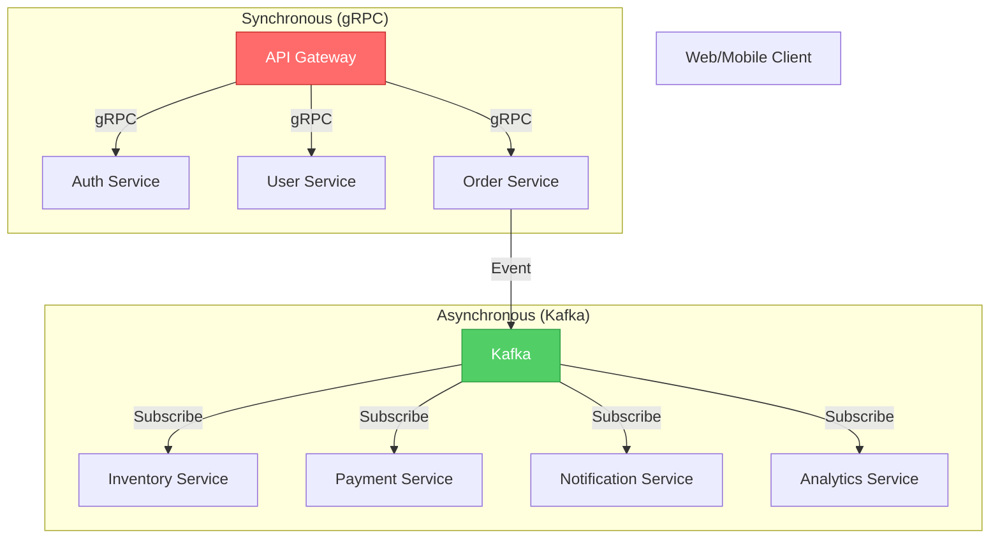

# gRPC vs. Event-Driven Communication

**Deep Dive** | Choosing the right communication pattern for microservices

---

## 📋 Overview

This guide compares synchronous (gRPC) and asynchronous (Event-Driven) communication patterns, focusing on protocol efficiency (Protobuf vs. Avro/JSON) and architectural implications.

---

## 🔄 gRPC (Synchronous Communication)

### What is gRPC?

**gRPC** (gRPC Remote Procedure Call) is a high-performance RPC framework using HTTP/2 and Protocol Buffers.

**Key Features:**
- Binary protocol (Protocol Buffers)
- HTTP/2 multiplexing
- Bi-directional streaming
- Strongly-typed contracts (.proto files)
- Code generation for multiple languages

###  Protocol Buffers (Protobuf)

**Definition:** Binary serialization format developed by Google.

#### Example .proto Definition

```protobuf
syntax = "proto3";

package ecommerce;

// Service definition
service OrderService {
  rpc CreateOrder(CreateOrderRequest) returns (CreateOrderResponse);
  rpc GetOrder(GetOrderRequest) returns (Order);
  rpc ListOrders(ListOrdersRequest) returns (stream Order);  // Server streaming
  rpc UpdateOrderStatus(stream OrderStatusUpdate) returns (UpdateSummary);  // Client streaming
}

// Message definitions
message CreateOrderRequest {
  string customer_id = 1;
  repeated OrderItem items = 2;
  ShippingAddress shipping_address = 3;
  PaymentMethod payment_method = 4;
}

message OrderItem {
  string product_id = 1;
  int32 quantity = 2;
  double unit_price = 3;
}

message CreateOrderResponse {
  string order_id = 1;
  OrderStatus status = 2;
  double total_amount = 3;
  int64 created_at = 4;  // Unix timestamp
}

message Order {
  string order_id = 1;
  string customer_id = 2;
  repeated OrderItem items = 3;
  OrderStatus status = 4;
  double total_amount = 5;
  int64 created_at = 6;
  int64 updated_at = 7;
}

enum OrderStatus {
  ORDER_STATUS_UNSPECIFIED = 0;
  PENDING = 1;
  CONFIRMED = 2;
  SHIPPED = 3;
  DELIVERED = 4;
  CANCELLED = 5;
}

message ShippingAddress {
  string street = 1;
  string city = 2;
  string state = 3;
  string zip_code = 4;
  string country = 5;
}

message PaymentMethod {
  oneof method {
    CreditCard credit_card = 1;
    PayPal paypal = 2;
    BankTransfer bank_transfer = 3;
  }
}
```

#### Go Server Implementation

```go
package main

import (
    "context"
    "log"
    "net"
    "google.golang.org/grpc"
    pb "github.com/example/ecommerce/proto"
)

type orderServiceServer struct {
    pb.UnimplementedOrderServiceServer
}

func (s *orderServiceServer) CreateOrder(ctx context.Context, req *pb.CreateOrderRequest) (*pb.CreateOrderResponse, error) {
    // Validate request
    if len(req.Items) == 0 {
        return nil, status.Error(codes.InvalidArgument, "items cannot be empty")
    }
    
    // Business logic
    orderID := generateOrderID()
    totalAmount := calculateTotal(req.Items)
    
    // Save to database
    err := saveOrder(ctx, orderID, req)
    if err != nil {
        return nil, status.Error(codes.Internal, "failed to save order")
    }
    
    // Return response
    return &pb.CreateOrderResponse{
        OrderId:     orderID,
        Status:      pb.OrderStatus_PENDING,
        TotalAmount: totalAmount,
        CreatedAt:   time.Now().Unix(),
    }, nil
}

func (s *orderServiceServer) ListOrders(req *pb.ListOrdersRequest, stream pb.OrderService_ListOrdersServer) error {
    // Server streaming example
    orders, err := fetchOrders(req.CustomerId)
    if err != nil {
        return status.Error(codes.Internal, "failed to fetch orders")
    }
    
    for _, order := range orders {
        if err := stream.Send(order); err != nil {
            return err
        }
    }
    
    return nil
}

func main() {
    lis, err := net.Listen("tcp", ":50051")
    if err != nil {
        log.Fatalf("failed to listen: %v", err)
    }
    
    s := grpc.NewServer(
        grpc.MaxRecvMsgSize(10 * 1024 * 1024),  // 10MB
        grpc.UnaryInterceptor(loggingInterceptor),
    )
    
    pb.RegisterOrderServiceServer(s, &orderServiceServer{})
    
    log.Println("gRPC server listening on :50051")
    if err := s.Serve(lis); err != nil {
        log.Fatalf("failed to serve: %v", err)
    }
}
```

#### Python Client Implementation

```python
import grpc
from proto import order_service_pb2, order_service_pb2_grpc

def create_order():
    # Create channel
    channel = grpc.insecure_channel('localhost:50051')
    stub = order_service_pb2_grpc.OrderServiceStub(channel)
    
    # Prepare request
    request = order_service_pb2.CreateOrderRequest(
        customer_id='CUST-123',
        items=[
            order_service_pb2.OrderItem(
                product_id='PROD-456',
                quantity=2,
                unit_price=29.99
            ),
            order_service_pb2.OrderItem(
                product_id='PROD-789',
                quantity=1,
                unit_price=49.99
            )
        ],
        shipping_address=order_service_pb2.ShippingAddress(
            street='123 Main St',
            city='San Francisco',
            state='CA',
            zip_code='94105',
            country='USA'
        )
    )
    
    # Make RPC call
    try:
        response = stub.CreateOrder(request, timeout=5)
        print(f"Order created: {response.order_id}")
        print(f"Status: {response.status}")
        print(f"Total: ${response.total_amount}")
    except grpc.RpcError as e:
        print(f"RPC failed: {e.code()} - {e.details()}")

def list_orders_stream():
    channel = grpc.insecure_channel('localhost:50051')
    stub = order_service_pb2_grpc.OrderServiceStub(channel)
    
    request = order_service_pb2.ListOrdersRequest(customer_id='CUST-123')
    
    # Server streaming
    for order in stub.ListOrders(request):
        print(f"Order ID: {order.order_id}, Status: {order.status}")
```

---

## 🎯 Event-Driven Architecture (Asynchronous)

### Apache Kafka with Avro

**Apache Avro:** Binary serialization format designed for data-intensive applications.

#### Avro Schema Definition

```json
{
  "namespace": "com.example.ecommerce",
  "type": "record",
  "name": "OrderPlaced",
  "doc": "Event published when an order is placed",
  "fields": [
    {
      "name": "order_id",
      "type": "string",
      "doc": "Unique order identifier"
    },
    {
      "name": "customer_id",
      "type": "string"
    },
    {
      "name": "items",
      "type": {
        "type": "array",
        "items": {
          "type": "record",
          "name": "OrderItem",
          "fields": [
            {"name": "product_id", "type": "string"},
            {"name": "quantity", "type": "int"},
            {"name": "unit_price", "type": "double"}
          ]
        }
      }
    },
    {
      "name": "total_amount",
      "type": "double"
    },
    {
      "name": "timestamp",
      "type": "long",
      "logicalType": "timestamp-millis"
    },
    {
      "name": "event_version",
      "type": "string",
      "default": "1.0"
    },
    {
      "name": "correlation_id",
      "type": "string",
      "doc": "For distributed tracing"
    }
  ]
}
```

#### Producer (Python with Confluent Kafka + Avro)

```python
from confluent_kafka import Producer
from confluent_kafka.avro import AvroProducer
from confluent_kafka.avro import loads as avro_loads
import uuid
import time

# Load Avro schema
order_placed_schema = avro_loads(open('schemas/OrderPlaced.avsc').read())

# Configure producer
avro_producer = AvroProducer({
    'bootstrap.servers': 'kafka-broker-1:9092,kafka-broker-2:9092',
    'schema.registry.url': 'http://schema-registry:8081'
}, default_value_schema=order_placed_schema)

def publish_order_placed_event(order_data):
    event = {
        'order_id': order_data['order_id'],
        'customer_id': order_data['customer_id'],
        'items': order_data['items'],
        'total_amount': order_data['total_amount'],
        'timestamp': int(time.time() * 1000),
        'event_version': '1.0',
        'correlation_id': str(uuid.uuid4())
    }
    
    # Publish to Kafka
    avro_producer.produce(
        topic='order-events',
        key=order_data['order_id'],
        value=event,
        callback=delivery_callback
    )
    
    avro_producer.flush()

def delivery_callback(err, msg):
    if err:
        print(f'Message delivery failed: {err}')
    else:
        print(f'Message delivered to {msg.topic()} [{msg.partition()}]')
```

#### Consumer (Go with Confluent Kafka + Avro)

```go
package main

import (
    "fmt"
    "log"
    "gopkg.in/confluentinc/confluent-kafka-go.v1/kafka"
    "github.com/linkedin/goavro/v2"
)

type OrderPlacedEvent struct {
    OrderID       string  `avro:"order_id"`
    CustomerID    string  `avro:"customer_id"`
    Items         []OrderItem `avro:"items"`
    TotalAmount   float64 `avro:"total_amount"`
    Timestamp     int64   `avro:"timestamp"`
    EventVersion  string  `avro:"event_version"`
    CorrelationID string  `avro:"correlation_id"`
}

func main() {
    consumer, err := kafka.NewConsumer(&kafka.ConfigMap{
        "bootstrap.servers": "kafka-broker-1:9092",
        "group.id":          "inventory-service",
        "auto.offset.reset": "earliest",
    })
    if err != nil {
        log.Fatal(err)
    }
    defer consumer.Close()
    
    consumer.Subscribe("order-events", nil)
    
    // Load Avro schema
    codec, err := goavro.NewCodec(orderPlacedSchema)
    if err != nil {
        log.Fatal(err)
    }
    
    for {
        msg, err := consumer.ReadMessage(-1)
        if err != nil {
            log.Printf("Consumer error: %v", err)
            continue
        }
        
        // Deserialize Avro
        native, _, err := codec.NativeFromBinary(msg.Value)
        if err != nil {
            log.Printf("Deserialization error: %v", err)
            continue
        }
        
        // Process event
        event := native.(map[string]interface{})
        handleOrderPlaced(event)
    }
}

func handleOrderPlaced(event map[string]interface{}) {
    orderID := event["order_id"].(string)
    correlationID := event["correlation_id"].(string)
    
    log.Printf("Processing order: %s (correlation: %s)", orderID, correlationID)
    
    // Business logic: Reserve inventory
    err := reserveInventory(event["items"])
    if err != nil {
        publishStockReservationFailed(orderID, correlationID, err)
    } else {
        publishStockReserved(orderID, correlationID)
    }
}
```

---

## 📊 Protocol Comparison: Protobuf vs. Avro vs. JSON

### Size Comparison

**Example Message:**
```json
{
  "order_id": "ORD-2026-123456",
  "customer_id": "CUST-789",
  "total_amount": 129.99,
  "timestamp": 1705690995000,
  "items": [
    {"product_id": "PROD-001", "quantity": 2, "unit_price": 29.99},
    {"product_id": "PROD-002", "quantity": 1, "unit_price": 70.01}
  ]
}
```

| Format | Size (bytes) | Compression | Schema Evolution |
|--------|--------------|-------------|------------------|
| **JSON** | 320 | ❌ None | ⚠️ Manual |
| **JSON (gzipped)** | 180 | ✅ Yes | ⚠️ Manual |
| **Protobuf** | 85 | ✅ Built-in | ✅ Forward/Backward |
| **Avro** | 72 | ✅ Built-in | ✅ Full schema evolution |

### Feature Comparison

| Feature | Protobuf (gRPC) | Avro (Kafka) | JSON |
|---------|----------------|--------------|------|
| **Human Readable** | ❌ Binary | ❌ Binary | ✅ Yes |
| **Schema Required** | ✅ .proto file | ✅ .avsc file | ❌ Optional |
| **Code Generation** | ✅ Yes | ⚠️ Optional | ❌ No |
| **Schema Registry** | ❌ Not built-in | ✅ Confluent Schema Registry | ❌ N/A |
| **Null Values** | ⚠️ Optional fields | ✅ Union types | ✅ Native |
| **Dynamic Types** | ❌ Strongly typed | ✅ Yes (JSON-like) | ✅ Yes |
| **Browser Support** | ⚠️ Limited | ❌ No | ✅ Native |
| **Streaming** | ✅ Bi-directional | ❌ Not designed for | ⚠️ Via SSE |

### Schema Evolution Example

**Protobuf Evolution:**
```protobuf
// Version 1
message Order {
  string order_id = 1;
  double total_amount = 2;
}

// Version 2 (add field)
message Order {
  string order_id = 1;
  double total_amount = 2;
  string customer_email = 3;  // NEW - old clients ignore
}

// Version 3 (deprecate field)
message Order {
  string order_id = 1;
  double total_amount = 2 [deprecated=true];  // DEPRECATED
  string customer_email = 3;
  OrderPricing pricing = 4;  // NEW - detailed pricing
}
```

**Avro Evolution:**
```json
{
  "// Version 1": "",
  "type": "record",
  "name": "Order",
  "fields": [
    {"name": "order_id", "type": "string"},
    {"name": "total_amount", "type": "double"}
  ]
}

{
  "// Version 2 (add field with default)": "",
  "type": "record",
  "name": "Order",
  "fields": [
    {"name": "order_id", "type": "string"},
    {"name": "total_amount", "type": "double"},
    {"name": "customer_email", "type": "string", "default": "unknown@example.com"}
  ]
}

{
  "// Version 3 (remove field)": "",
  "type": "record",
  "name": "Order",
  "fields": [
    {"name": "order_id", "type": "string"},
    {"name": "customer_email", "type": "string", "default": "unknown@example.com"}
  ]
}
```

---

## ⚖️ When to Use gRPC vs. Event-Driven

### Use gRPC (Synchronous) When:

✅ **Request/Response Required**: User needs immediate feedback  
✅ **Low Latency Critical**: < 100ms response time  
✅ **Strong Typing Needed**: Compile-time safety  
✅ **Bi-directional Streaming**: Real-time data exchange  
✅ **Internal Services**: Microservices within same data center  

**Examples:**
- Authentication service
- Real-time search
- Payment processing (with fallback)
- Video streaming

### Use Event-Driven (Asynchronous) When:

✅ **Decoupling Services**: Publisher doesn't know consumers  
✅ **High Throughput**: Thousands of events/second  
✅ **Eventual Consistency**: Immediate consistency not critical  
✅ **Pub/Sub**: Multiple consumers for same event  
✅ **Event Sourcing**: Store all changes as events  

**Examples:**
- Order notifications
- Analytics data ingestion
- Email/SMS sending
- Inventory updates
- Audit logging

---

## 🏗️ Hybrid Architecture

**Best Practice:** Use both patterns where appropriate.



### Example: Order Creation Flow

```
1. Client → API Gateway (REST/GraphQL)
2. API Gateway → Order Service (gRPC) - Synchronous
3. Order Service validates and returns order_id immediately
4. Order Service → Kafka (Avro event) - Asynchronous
5. Inventory, Payment, Notification services process event independently
```

---

## 📚 Additional Resources

- **[gRPC Best Practices](../../../01-enterprise-multi-cloud/08-s3-enterprise/s3-security-best-practices.md)**
- **[Kafka Schema Registry Setup](./schema-registry-setup.md)**
- **[Protobuf Style Guide](../../../../../../../01-beginner/02-phase-2/01-automation/02-python-basics/reference/python-pep8-style-guide.md)**

---

**Last Updated:** 2026-01-19  
**Complexity:** Advanced  
**Maintainer:** DevOps Curriculum Team
