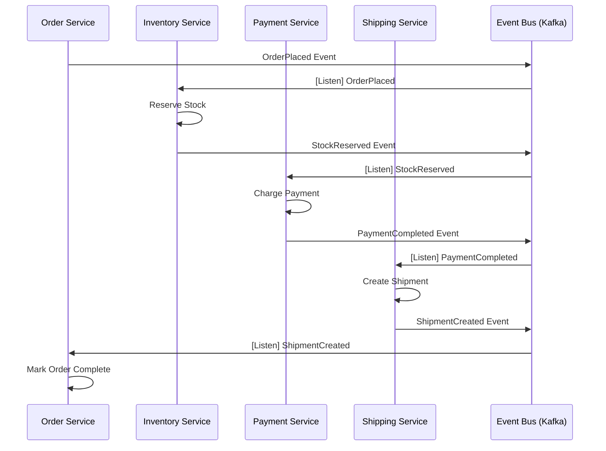
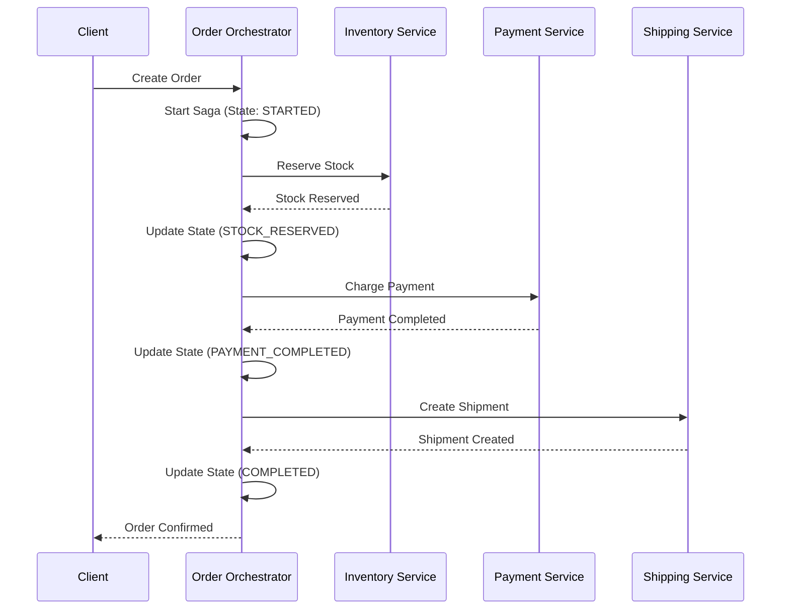
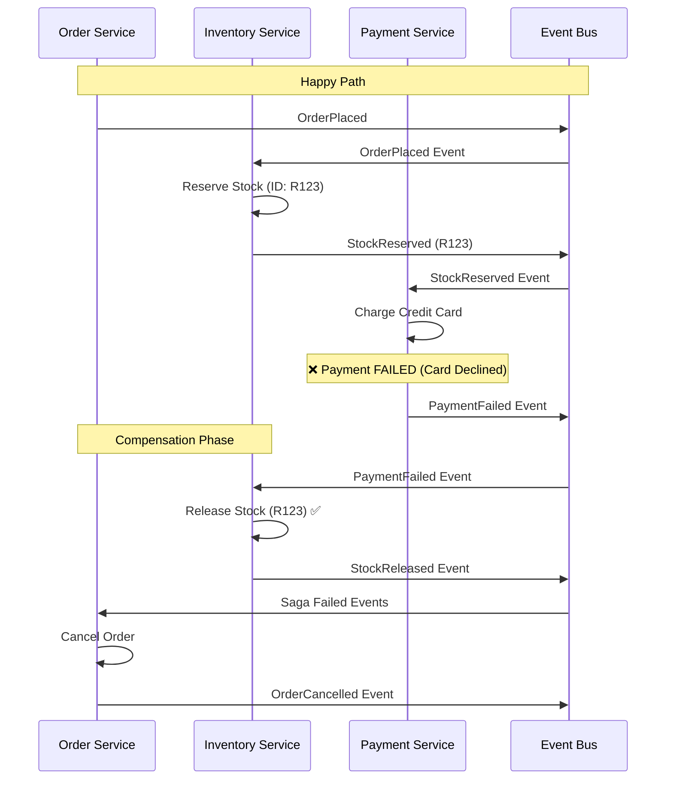

# Saga Pattern - Distributed Transactions

**Deep Dive** | Managing transactions across microservices

---

## 📋 Overview

The Saga pattern is a sequence of local transactions where each transaction updates data within a single service. If a step fails, the saga executes compensating transactions to undo the impact of preceding steps.

**Problem Solved:**  
Traditional ACID transactions don't work across distributed services. Sagas provide eventual consistency through a series of coordinated actions.

---

## 🎯 Choreography vs. Orchestration

### Choreography Pattern

**Definition:** Services coordinate by exchanging events. Each service listens for events and decides what to do.



**Advantages:**
- ✅ **Loose Coupling**: Services don't know about each other
- ✅ **No Single Point of Failure**: No central coordinator
- ✅ **Scalability**: Easy to add new participants
- ✅ **Independent Deployment**: Services evolve independently

**Disadvantages:**
- ❌ **Hard to Track**: No single place shows saga state
- ❌ **Circular Dependencies**: Event loops possible
- ❌ **Debugging Complexity**: Distributed state machine
- ❌ **Testing**: Requires simulating all services

**When to Use:**
- Simple workflows (3-5 services)
- High autonomy requirements
- Event-driven architecture already in place

---

### Orchestration Pattern

**Definition:** A central orchestrator tells each participant what to do. The orchestrator maintains the saga state.



**Advantages:**
- ✅ **Centralized State**: Easy to query saga status
- ✅ **Easier Debugging**: One place to see what's happening
- ✅ **Better Testing**: Test the orchestrator's state machine
- ✅ **Timeouts**: Orchestrator can enforce deadlines

**Disadvantages:**
- ❌ **Coupling**: Services know about orchestrator
- ❌ **Single Point of Failure**: Orchestrator must be highly available
- ❌ **Bottleneck**: All coordination goes through one component

**When to Use:**
- Complex workflows (5+ services, conditional logic)
- Compliance requirements (audit trail needed)
- Strict SLAs with timeouts

---

## 💔 Compensating Transactions

When a saga step fails, **compensating transactions** undo the effects of previous steps.

### Compensating Transaction Example



### Compensation Rules

| Original Action | Compensating Action | Idempotent? |
|----------------|---------------------|-------------|
| Reserve Stock | Release Stock | ✅ Yes |
| Charge Payment | Refund Payment | ✅ Yes |
| Create Shipment | Cancel Shipment | ⚠️ Depends |
| Send Email | Send Cancellation Email | ✅ Yes |
| Allocate Warehouse | Deallocate Warehouse | ✅ Yes |

**Key Principle:** Compensating transactions must be **idempotent** (safe to retry).

---

## 🔧 Implementation: Choreography Example

### Event Schema (Avro)

```json
{
  "namespace": "com.example.order",
  "type": "record",
  "name": "OrderPlaced",
  "fields": [
    {"name": "order_id", "type": "string"},
    {"name": "customer_id", "type": "string"},
    {"name": "items", "type": {"type": "array", "items": "OrderItem"}},
    {"name": "total_amount", "type": "double"},
    {"name": "timestamp", "type": "long", "logicalType": "timestamp-millis"},
    {"name": "correlation_id", "type": "string"}
  ]
}
```

### Order Service (Publisher)

```python
from kafka import KafkaProducer
import json
import uuid

class OrderSagaChoreography:
    def __init__(self):
        self.producer = KafkaProducer(
            bootstrap_servers=['kafka:9092'],
            value_serializer=lambda v: json.dumps(v).encode('utf-8')
        )
    
    def place_order(self, order_data):
        correlation_id = str(uuid.uuid4())
        
        event = {
            'event_type': 'OrderPlaced',
            'order_id': order_data['order_id'],
            'correlation_id': correlation_id,
            'timestamp': int(time.time() * 1000),
            **order_data
        }
        
        # Publish to Kafka
        self.producer.send('order-events', value=event)
        
        # Store saga state for eventual reconciliation
        self.save_saga_state(correlation_id, 'STARTED', event)
        
        return correlation_id
```

### Inventory Service (Listener & Publisher)

```python
from kafka import KafkaConsumer, KafkaProducer
import json

class InventorySagaParticipant:
    def __init__(self):
        self.consumer = KafkaConsumer(
            'order-events',
            bootstrap_servers=['kafka:9092'],
            group_id='inventory-service',
            value_deserializer=lambda m: json.loads(m.decode('utf-8'))
        )
        self.producer = KafkaProducer(
            bootstrap_servers=['kafka:9092'],
            value_serializer=lambda v: json.dumps(v).encode('utf-8')
        )
    
    def listen(self):
        for message in self.consumer:
            event = message.value
            
            if event['event_type'] == 'OrderPlaced':
                self.handle_order_placed(event)
            elif event['event_type'] == 'PaymentFailed':
                self.handle_payment_failed(event)
    
    def handle_order_placed(self, event):
        try:
            # Reserve stock
            reservation_id = self.reserve_stock(event['items'])
            
            # Publish success event
            self.producer.send('order-events', value={
                'event_type': 'StockReserved',
                'order_id': event['order_id'],
                'correlation_id': event['correlation_id'],
                'reservation_id': reservation_id,
                'timestamp': int(time.time() * 1000)
            })
        except InsufficientStockError:
            # Publish failure event
            self.producer.send('order-events', value={
                'event_type': 'StockReservationFailed',
                'order_id': event['order_id'],
                'correlation_id': event['correlation_id'],
                'reason': 'Insufficient stock',
                'timestamp': int(time.time() * 1000)
            })
    
    def handle_payment_failed(self, event):
        """Compensating transaction"""
        # Release previously reserved stock
        self.release_stock(event['order_id'])
        
        self.producer.send('order-events', value={
            'event_type': 'StockReleased',
            'order_id': event['order_id'],
            'correlation_id': event['correlation_id'],
            'timestamp': int(time.time() * 1000)
        })
```

---

## 🔧 Implementation: Orchestration Example

### Using Temporal Workflow

```go
package sagas

import (
    "fmt"
    "time"
    "go.temporal.io/sdk/workflow"
)

type OrderSagaInput struct {
    OrderID    string
    CustomerID string
    Items      []OrderItem
    Amount     float64
}

type SagaState struct {
    StockReserved    bool
    PaymentProcessed bool
    ShipmentCreated  bool
    ReservationID    string
    PaymentID        string
}

func OrderSagaWorkflow(ctx workflow.Context, input OrderSagaInput) error {
    logger := workflow.GetLogger(ctx)
    state := &SagaState{}
    
    // Configure activity options
    ao := workflow.ActivityOptions{
        StartToCloseTimeout: 5 * time.Second,
        RetryPolicy: &temporal.RetryPolicy{
            InitialInterval: 1 * time.Second,
            MaximumAttempts: 3,
        },
    }
    ctx = workflow.WithActivityOptions(ctx, ao)
    
    // Step 1: Reserve Stock
    var reservationID string
    err := workflow.ExecuteActivity(ctx, ReserveStockActivity, input.Items).Get(ctx, &reservationID)
    if err != nil {
        logger.Error("Failed to reserve stock", "error", err)
        return fmt.Errorf("stock reservation failed: %w", err)
    }
    state.StockReserved = true
    state.ReservationID = reservationID
    logger.Info("Stock reserved", "reservationID", reservationID)
    
    // Defer compensation if later steps fail
    defer func() {
        if !state.PaymentProcessed {
            // Compensate: Release stock
            compensationCtx, _ := workflow.NewDisconnectedContext(ctx)
            workflow.ExecuteActivity(compensationCtx, ReleaseStockActivity, reservationID).Get(compensationCtx, nil)
            logger.Warn("Stock released (compensation)", "reservationID", reservationID)
        }
    }()
    
    // Step 2: Process Payment
    var paymentID string
    err = workflow.ExecuteActivity(ctx, ChargePaymentActivity, input.CustomerID, input.Amount).Get(ctx, &paymentID)
    if err != nil {
        logger.Error("Payment failed", "error", err)
        return fmt.Errorf("payment failed: %w", err)
    }
    state.PaymentProcessed = true
    state.PaymentID = paymentID
    logger.Info("Payment processed", "paymentID", paymentID)
    
    // Defer compensation for payment
    defer func() {
        if !state.ShipmentCreated {
            // Compensate: Refund payment
            compensationCtx, _ := workflow.NewDisconnectedContext(ctx)
            workflow.ExecuteActivity(compensationCtx, RefundPaymentActivity, paymentID).Get(compensationCtx, nil)
            logger.Warn("Payment refunded (compensation)", "paymentID", paymentID)
        }
    }()
    
    // Step 3: Create Shipment
    var shipmentID string
    err = workflow.ExecuteActivity(ctx, CreateShipmentActivity, input).Get(ctx, &shipmentID)
    if err != nil {
        logger.Error("Shipment creation failed", "error", err)
        return fmt.Errorf("shipment creation failed: %w", err)
    }
    state.ShipmentCreated = true
    logger.Info("Shipment created", "shipmentID", shipmentID)
    
    // Success!
    logger.Info("Order saga completed successfully", "orderID", input.OrderID)
    return nil
}
```

---

## ⚖️ Decision Matrix

| Factor | Choreography | Orchestration |
|--------|--------------|---------------|
| **Workflow Complexity** | Simple (2-4 steps) | Complex (5+ steps, branches) |
| **Control Flow** | Distributed | Centralized |
| **State Visibility** | Hard (across events) | Easy (single source) |
| **Loose Coupling** | ✅ High | ⚠️ Medium |
| **Debugging** | ❌ Hard | ✅ Easy |
| **Single Point of Failure** | ✅ No | ❌ Yes (orchestrator) |
| **Timeout Handling** | ❌ Hard | ✅ Easy |
| **Audit Trail** | ❌ Distributed | ✅ Centralized |
| **Event-Driven Fit** | ✅ Natural | ⚠️ Requires adaptation |

---

## 🧪 Testing Strategies

### Testing Choreography

```python
import pytest
from unittest.mock import Mock, patch

def test_saga_happy_path(kafka_mock):
    # Arrange
    order_service = OrderSagaChoreography()
    inventory_service = InventorySagaParticipant()
    
    # Act
    correlation_id = order_service.place_order({'order_id': '123', 'items': [...]})
    
    # Simulate events
    kafka_mock.publish('OrderPlaced', correlation_id)
    kafka_mock.publish('StockReserved', correlation_id)
    kafka_mock.publish('PaymentCompleted', correlation_id)
    
    # Assert
    assert order_service.get_saga_state(correlation_id) == 'COMPLETED'

def test_saga_payment_failure_compensation(kafka_mock):
    # Arrange
    inventory_service = InventorySagaParticipant()
    
    # Act
    kafka_mock.publish('PaymentFailed', correlation_id='abc-123')
    
    # Assert
    assert inventory_service.stock_released('R123') == True
```

### Testing Orchestration

```go
func TestOrderSagaWorkflow_Success(t *testing.T) {
    testSuite := &testsuite.WorkflowTestSuite{}
    env := testSuite.NewTestWorkflowEnvironment()
    
    // Mock activities
    env.OnActivity(ReserveStockActivity, mock.Anything, mock.Anything).Return("R123", nil)
    env.OnActivity(ChargePaymentActivity, mock.Anything, mock.Anything, mock.Anything).Return("P456", nil)
    env.OnActivity(CreateShipmentActivity, mock.Anything, mock.Anything).Return("S789", nil)
    
    // Execute
    env.ExecuteWorkflow(OrderSagaWorkflow, OrderSagaInput{OrderID: "O123"})
    
    // Assert
    require.True(t, env.IsWorkflowCompleted())
    require.NoError(t, env.GetWorkflowError())
}

func TestOrderSagaWorkflow_PaymentFailure_Compensation(t *testing.T) {
    env := testSuite.NewTestWorkflowEnvironment()
    
    // Stock reservation succeeds
    env.OnActivity(ReserveStockActivity, mock.Anything, mock.Anything).Return("R123", nil)
    
    // Payment fails
    env.OnActivity(ChargePaymentActivity, mock.Anything, mock.Anything, mock.Anything).Return("", errors.New("insufficient funds"))
    
    // Compensation should be called
    env.OnActivity(ReleaseStockActivity, mock.Anything, "R123").Return(nil)
    
    env.ExecuteWorkflow(OrderSagaWorkflow, OrderSagaInput{OrderID: "O123"})
    
    // Assert compensation was called
    env.AssertCalled(t, "ReleaseStockActivity", mock.Anything, "R123")
}
```

---

## 📚 Additional Resources

- **[Saga Pattern](../../../../../../../05-labs/play-ground/youtube-lessons/05-shell-scripting/course-2/loops/all-example)** - Full choreography implementation
- **[Orchestration Example](../../../../../../../04-projects-showcase/00-governance-checklists/container-orchestration-checklist.md)** - Full orchestration implementation
- **[Compensation Strategies](../../../../../../../01-beginner/03-phase-3/03-finops/reference/cost-optimization-strategies-ref.md)** - Deep dive into rollback patterns

---

**Last Updated:** 2026-01-19  
**Complexity:** Advanced  
**Maintainer:** DevOps Curriculum Team
