# Microservices Architecture

> **Advanced Cloud Architecture Module** | Part 11 - Cloud Architecture  

> Master distributed systems design, resilience patterns, and production-grade microservices

---
## 📋 Overview
This module provides a comprehensive, advanced-level guide to microservices architecture patterns, communication strategies, data management techniques, and resiliency patterns used in modern cloud-native applications. You'll learn how to design, implement, and operate production-grade distributed systems.

**Prerequisites:**
- Strong understanding of distributed systems concepts
- Experience with containerization (Docker, Kubernetes)
- Familiarity with RESTful APIs and message queues
- Basic knowledge of cloud platforms (AWS, Azure, GCP)

**Learning Path:**
```
Monolith → Service Decomposition → Communication Patterns → 
Data Management → Resiliency → Observability → Production
```

---

## 🎯 Learning Objectives
By the end of this module, you will be able to:

✅ **Design**: Decompose monoliths using Domain-Driven Design and Bounded Contexts  
✅ **Implement**: Build resilient microservices with circuit breakers and retry mechanisms  
✅ **Architect**: Choose appropriate communication patterns (sync vs async)  
✅ **Manage**: Handle distributed transactions using Saga patterns  
✅ **Operate**: Deploy service meshes and API gateways for production traffic  
✅ **Debug**: Implement distributed tracing across asynchronous boundaries  

---

## 🏗️ Architecture Overview

> **⚠️ Missing Image**: *Microservices Architecture* ('./assets/microservices_vs_monolith_comparison.png')

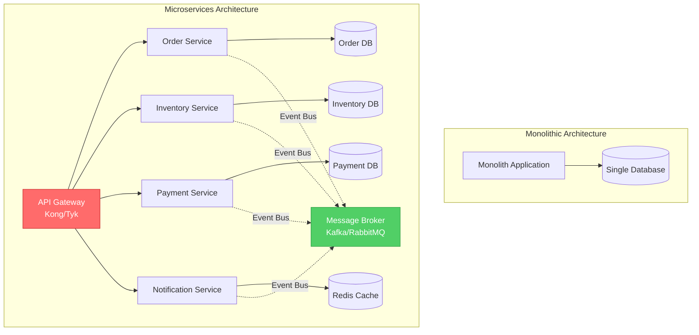

---

## 📚 Table of Contents

1. [Patterns & Principles](#patterns--principles)
   - [From Monolith to Microservices](#from-monolith-to-microservices)
   - [Domain-Driven Design (DDD)](#domain-driven-design-ddd)
   - [Bounded Contexts](#bounded-contexts)
   - [Strangler Fig Pattern](#strangler-fig-pattern)

2. [Communication Patterns](#communication-patterns)
   - [Synchronous Communication](#synchronous-communication)
   - [Asynchronous Communication](#asynchronous-communication)
   - [Event-Driven Architecture](#event-driven-architecture)

3. [Data Management & Consistency](#data-management--consistency)
   - [Database Per Service](#database-per-service)
   - [Saga Pattern](#saga-pattern)
   - [Event Sourcing & CQRS](#event-sourcing--cqrs)
   - [CAP Theorem & Data Consistency](#cap-theorem--data-consistency) ⭐ NEW

4. [Resiliency Patterns](#resiliency-patterns)
   - [Circuit Breaker Pattern](#circuit-breaker-pattern)
   - [Bulkhead Pattern](#bulkhead-pattern)
   - [Retry with Exponential Backoff](#retry-with-exponential-backoff)

5. [Service Mesh & API Gateway](#service-mesh--api-gateway)
   - [API Gateway Pattern](#api-gateway-pattern)
   - [Sidecar Pattern with Istio](#sidecar-pattern-with-istio)
   - [Service Discovery Patterns](#service-discovery-patterns) ⭐ NEW
   - [BFF (Backend for Frontend)](#bff-backend-for-frontend) ⭐ NEW

6. [Observability](#observability) ⭐ NEW
   - [Distributed Tracing](#distributed-tracing)
   - [Log Aggregation](#log-aggregation)
   - [Metrics & Monitoring](#metrics--monitoring)

7. [Deployment Strategies](#deployment-strategies) ⭐ NEW
   - [Blue/Green Deployment](#bluegreen-deployment)
   - [Canary Deployment](#canary-deployment)
   - [Rolling Updates](#rolling-updates)

8. [Implementation Examples](#implementation-examples)
   - [Resilient Client (Go)](#resilient-client-go)
   - [Resilient Client (Python)](#resilient-client-python)
   - [Kubernetes Manifests](#kubernetes-manifests)
   - [Health Check Patterns](#health-check-patterns) ⭐ NEW

9. [The Cost of Microservices](#the-cost-of-microservices) ⭐ NEW
   - [Death Star Architecture](#death-star-architecture)
   - [Distributed Monolith Anti-Pattern](#distributed-monolith-anti-pattern)
   - [When NOT to Use Microservices](#when-not-to-use-microservices)

10. [Interview Preparation](#interview-preparation)
11. [Real-World Case Studies](#real-world-case-studies)

---
## 🎓 Specialized Deep Dives
For advanced technical deep-dives, see these specialized directories:
- **[Saga Distributed Transactions](./patterns/saga-distributed-transactions/)** - Choreography vs Orchestration
- **[gRPC vs Event-Driven](./communication/grpc-vs-event-driven/)** - Protocol comparison (Protobuf/Avro/JSON)
- **[Service Mesh & Retries](./resiliency/service-mesh-and-retries/)** - Circuit breakers, Istio config
- **[OAuth2 & JWT Propagation](./security/oauth2-and-jwt-propagation/)** - Identity across services

---
## 🎨 Patterns & Principles

### From Monolith to Microservices

#### Why Migrate?
**Monolithic Challenges:**
- **Scalability Limits**: Cannot scale components independently
- **Technology Lock-in**: Entire app uses same tech stack
- **Deployment Risk**: Small change requires full redeployment
- **Team Bottlenecks**: Multiple teams work on same codebase

**Microservices Benefits:**
- **Independent Scaling**: Scale only what needs it
- **Technology Diversity**: Choose best tool per service
- **Faster Deployment**: Deploy services independently
- **Team Autonomy**: Each team owns their services
#### Migration Strategy Matrix

| Aspect | Monolith | Transitional | Microservices |
|--------|----------|--------------|---------------|
| **Deployment** | Single artifact | Hybrid deployment | Independent services |
| **Database** | Shared DB | Shared + separate DBs | Database per service |
| **Communication** | In-process calls | REST + Events | Events + gRPC |
| **Scaling** | Vertical | Mixed | Horizontal |
| **Team Structure** | Single team | Domain teams forming | Full autonomous teams |

---
### Domain-Driven Design (DDD)

**Core Concepts:**

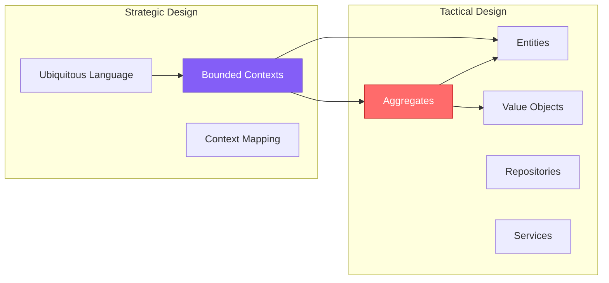

#### 1. **Ubiquitous Language**
A shared vocabulary between developers and domain experts that appears in code, documentation, and conversation.

**Example (E-commerce):**
```
✅ Use: "Order", "LineItem", "Product", "Checkout"
❌ Avoid: "Record", "Data", "Thing", "Process"
```
#### 2. **Bounded Contexts**
Explicit boundaries within which a domain model applies. Different contexts can have different models for the same concept.

**Example:**
```
Sales Context:     Customer = {name, creditLimit, orders}
Support Context:   Customer = {name, ticketHistory, satisfaction}
Shipping Context:  Customer = {name, address, deliveryPreferences}
```

#### 3. **Aggregates**
Cluster of domain objects treated as a single unit for data changes. Each aggregate has a root entity.

**Example (Order Aggregate):**
```go
type Order struct {
    ID          string
    CustomerID  string
    Items       []LineItem  // Cannot be modified directly
    TotalAmount decimal.Decimal
    Status      OrderStatus
}

// Only Order (aggregate root) can modify items
func (o *Order) AddItem(product Product, quantity int) error {
    if o.Status != Draft {
        return errors.New("cannot modify confirmed order")
    }
    o.Items = append(o.Items, LineItem{...})
    o.recalculateTotal()
    return nil
}
```

---

### Bounded Contexts

**Context Map Example:**

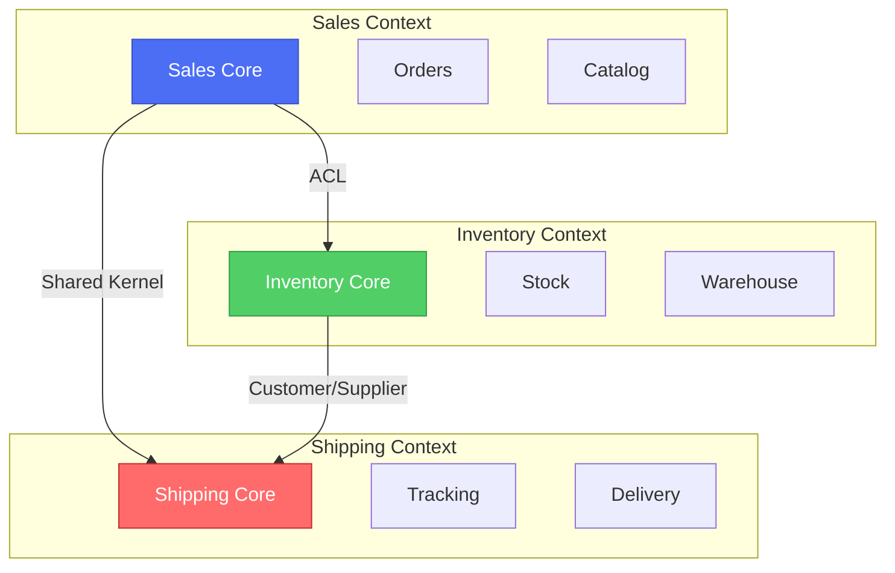

**Relationship Patterns:**

| Pattern | Description | Example |
|---------|-------------|---------|
| **Shared Kernel** | Two contexts share a small common model | Order ID format shared between Sales & Shipping |
| **Customer/Supplier** | Upstream context provides API for downstream | Inventory (supplier) → Shipping (customer) |
| **Anti-Corruption Layer (ACL)** | Translation layer protecting domain model | Sales translates legacy format from old Inventory system |
| **Conformist** | Downstream adopts upstream model completely | Mobile app conforms to backend API |

---

### Strangler Fig Pattern

The **Strangler Fig Pattern** enables gradual migration from monolith to microservices by incrementally replacing functionality.

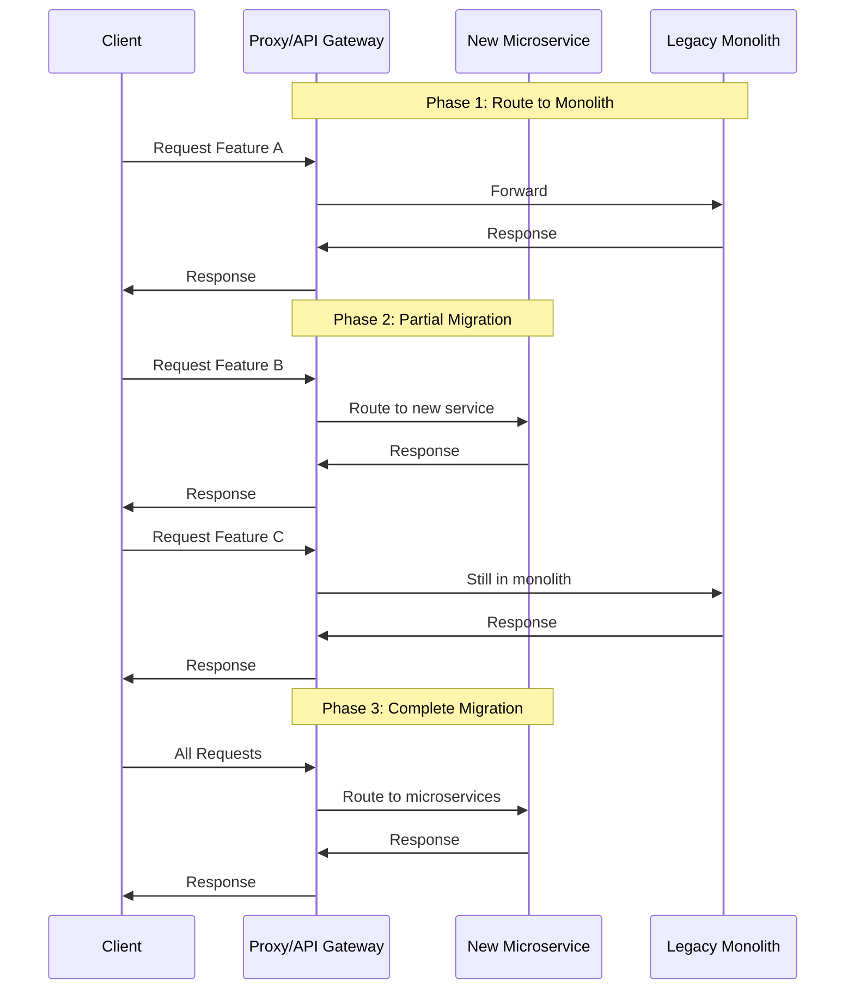

**Implementation Steps:**

1. **Identify Seams**: Find natural boundaries in monolith (e.g., user management, payments)
2. **Create Routing Layer**: Add API Gateway or proxy (Kong, Envoy, NGINX)
3. **Build New Service**: Implement functionality in new microservice
4. **Dual Write** (if needed): Write to both old and new systems temporarily
5. **Route Traffic**: Gradually shift traffic from monolith to new service
6. **Monitor & Validate**: Ensure new service meets SLAs
7. **Decommission**: Remove old functionality from monolith

**Example Routing Configuration (Kong):**
```yaml
services:
  - name: user-service-v2
    url: http://user-microservice:8080
    routes:
      - paths:
          - /api/v2/users
          
  - name: legacy-monolith
    url: http://monolith:3000
    routes:
      - paths:
          - /api/v1/users
```

---

## 📡 Communication Patterns

> **⚠️ Missing Image**: *Event-Driven Architecture* ('./assets/event_driven_architecture_flow.svg')

### Synchronous Communication

**When to Use:**
- ✅ Real-time user interactions (user clicks "Pay Now")
- ✅ Request/response semantics required
- ✅ Low latency critical

**When to Avoid:**
- ❌ Long-running operations
- ❌ Chain of dependent services (cascading failures)
- ❌ High volume, fire-and-forget operations

#### REST (HTTP/JSON)

**Pros:**
- Universal support, human-readable
- Mature tooling (Swagger/OpenAPI)
- Stateless, cacheable

**Cons:**
- Text-based overhead
- Schema evolution challenges
- HTTP/1.1 connection limits

**Example:**
```python
# Python REST Client with Retry
import requests
from requests.adapters import HTTPAdapter
from urllib3.util.retry import Retry

def create_session_with_retries():
    session = requests.Session()
    retries = Retry(
        total=3,
        backoff_factor=0.3,
        status_forcelist=[500, 502, 503, 504]
    )
    session.mount('http://', HTTPAdapter(max_retries=retries))
    return session

client = create_session_with_retries()
response = client.post(
    'http://inventory-service/api/reserve',
    json={'product_id': '123', 'quantity': 2},
    timeout=5
)
```

#### gRPC (HTTP/2 + Protocol Buffers)

**Pros:**
- Binary protocol (smaller, faster)
- Strong typing with `.proto` files
- Bi-directional streaming
- HTTP/2 multiplexing

**Cons:**
- Requires code generation
- Less human-readable
- Limited browser support

**Example (.proto):**
```protobuf
syntax = "proto3";

service InventoryService {
  rpc ReserveStock(ReserveRequest) returns (ReserveResponse);
  rpc ReleaseStock(ReleaseRequest) returns (ReleaseResponse);
}

message ReserveRequest {
  string product_id = 1;
  int32 quantity = 2;
  string order_id = 3;
}

message ReserveResponse {
  bool success = 1;
  string reservation_id = 2;
  string error_message = 3;
}
```

---

### Asynchronous Communication

**When to Use:**
- ✅ Decoupling services (publisher doesn't need to know subscribers)
- ✅ Event notifications (order placed, payment received)
- ✅ High throughput scenarios
- ✅ Eventual consistency acceptable

#### RabbitMQ (AMQP)

**Best For:** Traditional message queuing with complex routing

**Key Concepts:**
- **Exchange Types**: Direct, Topic, Fanout, Headers
- **Queues**: Durable message storage
- **Bindings**: Routing rules

**Example (Topic Exchange):**
```python
import pika

connection = pika.BlockingConnection(pika.ConnectionParameters('localhost'))
channel = connection.channel()

channel.exchange_declare(exchange='orders', exchange_type='topic')

# Publisher
channel.basic_publish(
    exchange='orders',
    routing_key='order.created.us-east',
    body='{"order_id": "123", "amount": 99.99}'
)

# Consumer (listens to all order.created.* events)
channel.queue_declare(queue='warehouse_queue')
channel.queue_bind(
    exchange='orders',
    queue='warehouse_queue',
    routing_key='order.created.*'
)
```

#### Apache Kafka

**Best For:** High-throughput event streaming, event sourcing

**Key Concepts:**
- **Topics**: Categories of events
- **Partitions**: Parallel processing, order guarantee within partition
- **Consumer Groups**: Scalable consumption

**Example:**
```python
from kafka import KafkaProducer, KafkaConsumer
import json

# Producer
producer = KafkaProducer(
    bootstrap_servers=['localhost:9092'],
    value_serializer=lambda v: json.dumps(v).encode('utf-8')
)

producer.send('order-events', {
    'event_type': 'OrderPlaced',
    'order_id': '123',
    'timestamp': '2026-01-19T14:23:15Z'
})

# Consumer
consumer = KafkaConsumer(
    'order-events',
    bootstrap_servers=['localhost:9092'],
    group_id='inventory-service',
    value_deserializer=lambda m: json.loads(m.decode('utf-8'))
)

for message in consumer:
    event = message.value
    print(f"Received: {event['event_type']}")
```

---

### Event-Driven Architecture

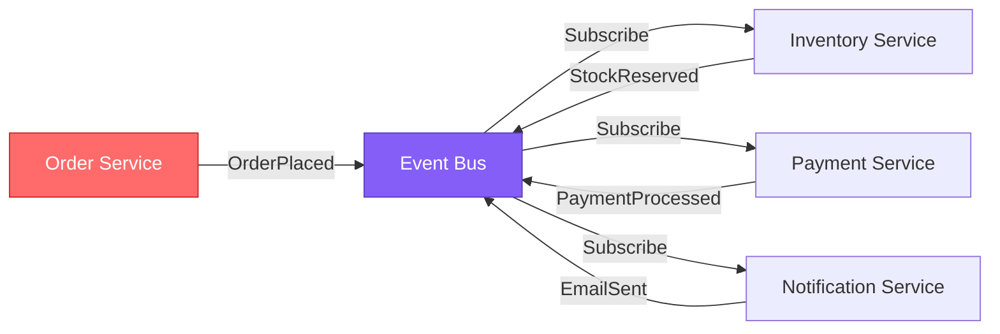

**Event Types:**

| Type | Description | Example |
|------|-------------|---------|
| **Event Notification** | Announce something happened | `UserRegistered`, `OrderShipped` |
| **Event-Carried State Transfer** | Event contains full state | `OrderPlaced` with full order details |
| **Event Sourcing** | Events as source of truth | Store `AccountDebited`, `AccountCredited` |

---

## 💾 Data Management

> **⚠️ Missing Image**: *Database Per Service* ('./assets/database_per_service_pattern.jpg')

### Database Per Service

**Principle:** Each microservice owns its data. No direct database access between services.

**Benefits:**
- ✅ Service independence
- ✅ Technology diversity (SQL, NoSQL, Graph DB)
- ✅ Schema evolution per service
- ✅ Easier scaling

**Challenges:**
- ❌ No ACID transactions across services
- ❌ Data duplication
- ❌ Complex queries spanning services

**Example Architecture:**
```
Order Service    → PostgreSQL (ACID for orders)
Catalog Service  → MongoDB (flexible product schemas)
Analytics        → Elasticsearch (full-text search)
Cache Layer      → Redis (fast lookups)
```

---

### Saga Pattern

The **Saga Pattern** manages distributed transactions through a sequence of local transactions coordinated by events or orchestration.

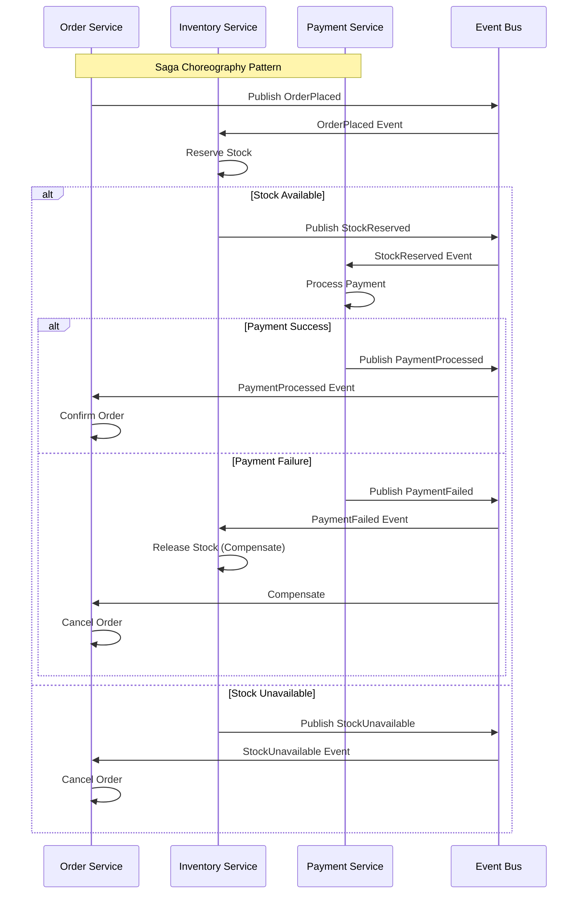

#### Choreography vs Orchestration

**Choreography:**
- Services react to events independently
- No central coordinator
- **Pros**: Loose coupling, no single point of failure
- **Cons**: Hard to track saga state, circular dependencies possible

**Orchestration:**
- Central orchestrator directs the saga
- **Pros**: Clear state machine, easier debugging
- **Cons**: Orchestrator is single point of failure, coupling to orchestrator

**Orchestration Example (Temporal Workflow):**
```go
func OrderSagaWorkflow(ctx workflow.Context, order Order) error {
    var stockReserved bool
    var paymentProcessed bool
    
    // Step 1: Reserve Stock
    err := workflow.ExecuteActivity(ctx, ReserveStock, order).Get(ctx, &stockReserved)
    if err != nil || !stockReserved {
        return fmt.Errorf("stock reservation failed: %w", err)
    }
    
    // Compensation if later steps fail
    defer func() {
        if !paymentProcessed {
            workflow.ExecuteActivity(ctx, ReleaseStock, order)
        }
    }()
    
    // Step 2: Process Payment
    err = workflow.ExecuteActivity(ctx, ProcessPayment, order).Get(ctx, &paymentProcessed)
    if err != nil {
        return fmt.Errorf("payment failed: %w", err)
    }
    
    // Step 3: Confirm Order
    workflow.ExecuteActivity(ctx, ConfirmOrder, order)
    return nil
}
```

---

### Event Sourcing & CQRS

**Event Sourcing:** Store all changes as a sequence of immutable events.

**CQRS (Command Query Responsibility Segregation):** Separate read and write models.

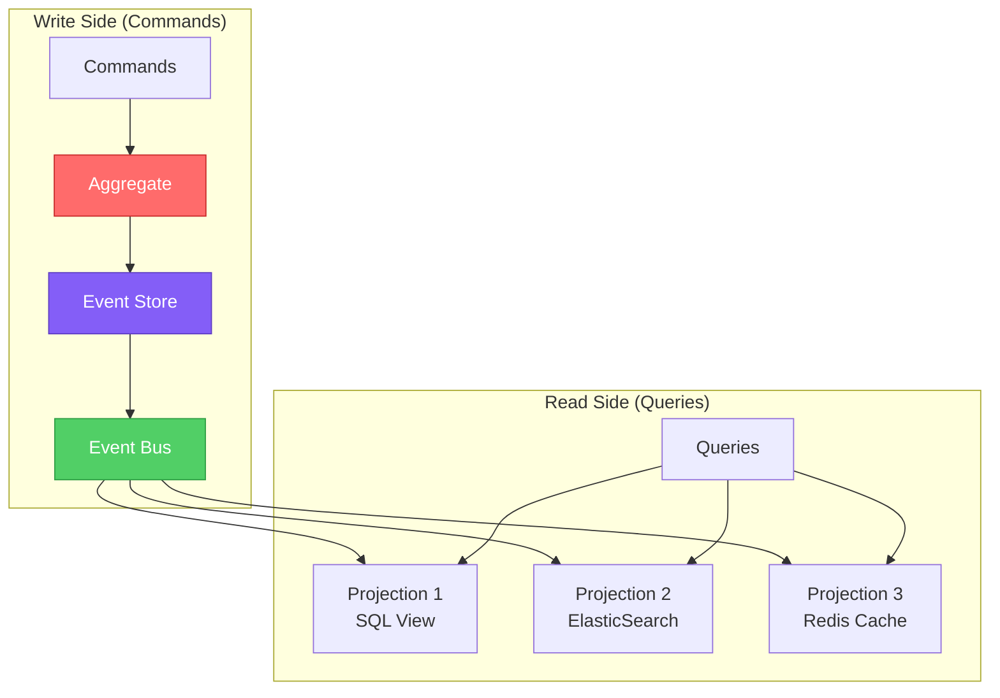

**Example (Account Events):**
```go
type Event interface {
    EventType() string
    AggregateID() string
    Timestamp() time.Time
}

type AccountCreated struct {
    AccountID string
    Owner     string
    CreatedAt time.Time
}

type MoneyDeposited struct {
    AccountID string
    Amount    decimal.Decimal
    Timestamp time.Time
}

// Rebuild current state from events
func (a *Account) ApplyEvents(events []Event) {
    for _, event := range events {
        switch e := event.(type) {
        case AccountCreated:
            a.ID = e.AccountID
            a.Owner = e.Owner
        case MoneyDeposited:
            a.Balance = a.Balance.Add(e.Amount)
        case MoneyWithdrawn:
            a.Balance = a.Balance.Sub(e.Amount)
        }
    }
}
```

---

### CAP Theorem & Data Consistency

**The CAP Theorem** states that a distributed system can only guarantee **two** of the following three properties:

- **C**onsistency: All nodes see the same data at the same time
- **A**vailability: Every request receives a response (success/failure)
- **P**artition Tolerance: System continues despite network partitions

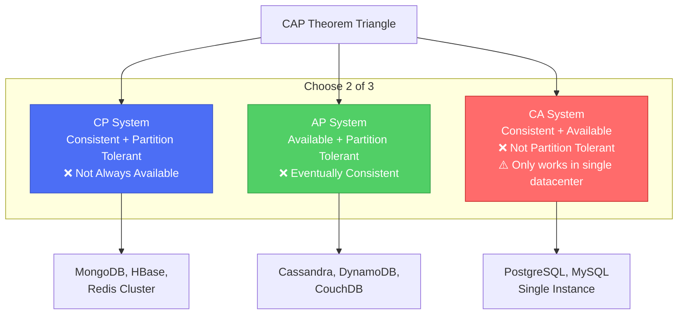

#### Practical Application in Microservices

**In reality, network partitions happen**, so you choose between **CP** (Consistency) or **AP** (Availability).

**Decision Framework:**

| Service Type | Priority | Database Choice | Example |
|--------------|----------|-----------------|---------|
| **Financial Transactions** | Consistency |CP (PostgreSQL + Distributed Locks) | Payment processing |
| **Product Catalog** | Availability | AP (DynamoDB) | E-commerce listings |
| **User Sessions** | Availability | AP (Redis Cluster) | Login sessions |
| **Inventory** | Mixed | CP for writes, AP for reads | Stock management |
| **Analytics** | Availability | AP (Cassandra) | Click tracking |

**SQL vs. NoSQL for Microservices:**

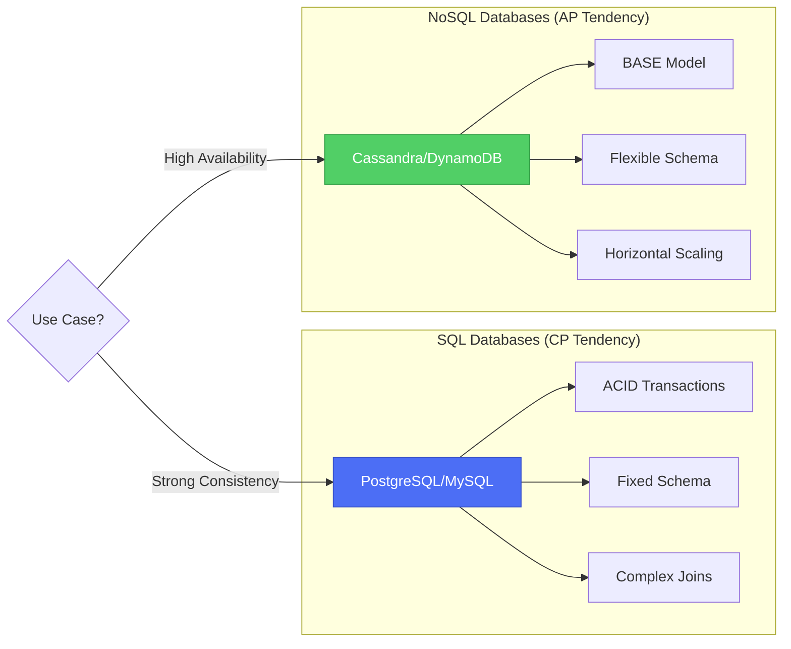

**BASE Model (Alternative to ACID):**

- **B**asically **A**vailable: System appears to work most of the time
- **S**oft state: State may change over time (even without input)
- **E**ventual consistency: System will become consistent eventually

**Choosing the Right Database Per Service:**

```go
// Example: Order Service Database Selection

// Option 1: PostgreSQL (CP) - For critical order data
type OrderRepository struct {
    db *sql.DB
}

func (r *OrderRepository) CreateOrder(ctx context.Context, order *Order) error {
    tx, err := r.db.BeginTx(ctx, &sql.TxOptions{Isolation: sql.LevelSerializable})
    if err != nil {
        return err
    }
    defer tx.Rollback()
    
    // Strong consistency guaranteed
    _, err = tx.ExecContext(ctx, "INSERT INTO orders ...")
    if err != nil {
        return err
    }
    
    return tx.Commit()
}

// Option 2: DynamoDB (AP) - For order search/history
type OrderSearchRepository struct {
    client *dynamodb.Client
}

func (r *OrderSearchRepository) IndexOrder(order *Order) error {
    // Eventual consistency - okay for search
    _, err := r.client.PutItem(context.Background(), &dynamodb.PutItemInput{
        TableName: aws.String("order-search"),
        Item: map[string]types.AttributeValue{
            "order_id": &types.AttributeValueMemberS{Value: order.ID},
            "customer_id": &types.AttributeValueMemberS{Value: order.CustomerID},
            // Optimized for read queries
        },
    })
    return err
}
```

---

## 🛡️ Resiliency Patterns

### Circuit Breaker Pattern

Prevent cascading failures by stopping requests to failing services.

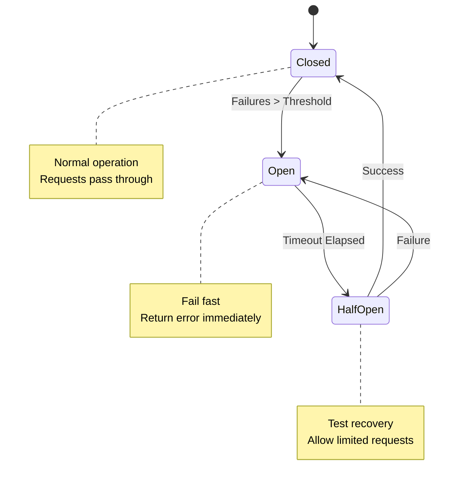

**States:**
- **Closed**: Normal operation, track failures
- **Open**: Too many failures, reject requests immediately
- **Half-Open**: After timeout, allow test requests

**Cascading Failure Prevention:**

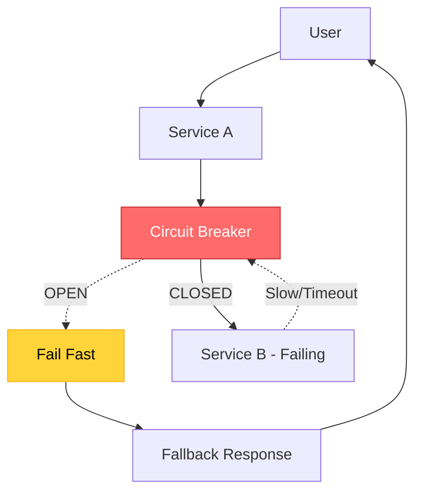

**Without Circuit Breaker:**
```
Service A → Service B (failing) → Timeout (30s)
100 concurrent requests × 30s = Resource exhaustion
```

**With Circuit Breaker:**
```
Service A → Circuit Breaker (OPEN) → Fail fast (1ms)
Prevents resource exhaustion, returns fallback
```

---

### Bulkhead Pattern

Isolate resources to prevent total system failure.

**Concept:** Like compartments in a ship's hull, isolate parts of the system.

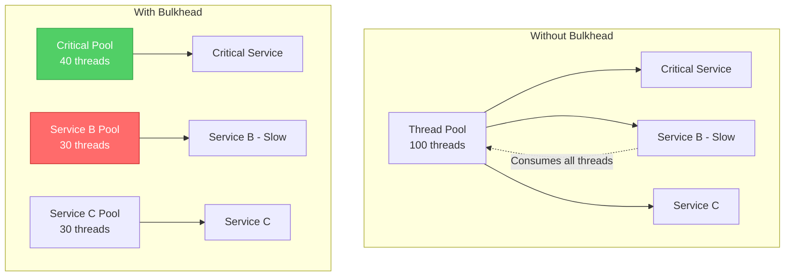

**Implementation (Go):**
```go
// Semaphore-based bulkhead
type Bulkhead struct {
    sem chan struct{}
}

func NewBulkhead(maxConcurrent int) *Bulkhead {
    return &Bulkhead{
        sem: make(chan struct{}, maxConcurrent),
    }
}

func (b *Bulkhead) Execute(fn func() error) error {
    select {
    case b.sem <- struct{}{}:
        defer func() { <-b.sem }()
        return fn()
    default:
        return errors.New("bulkhead full, rejecting request")
    }
}

// Usage
criticalBulkhead := NewBulkhead(50)
nonCriticalBulkhead := NewBulkhead(20)

criticalBulkhead.Execute(func() error {
    return callCriticalService()
})
```

---

### Retry with Exponential Backoff

**Strategy:** Retry failed requests with increasing delays.

**Formula:**
```
delay = min(maxDelay, baseDelay * (2 ^ attempt) + jitter)
```

**Example:**
```
Attempt 1: 100ms
Attempt 2: 200ms
Attempt 3: 400ms
Attempt 4: 800ms
Max: 5000ms
```

**Implementation (Python):**
```python
import random
import time
from functools import wraps

def retry_with_backoff(
    max_retries=5,
    base_delay=0.1,
    max_delay=5.0,
    exponential_base=2,
    jitter=True
):
    def decorator(func):
        @wraps(func)
        def wrapper(*args, **kwargs):
            for attempt in range(max_retries):
                try:
                    return func(*args, **kwargs)
                except Exception as e:
                    if attempt == max_retries - 1:
                        raise
                    
                    delay = min(
                        max_delay,
                        base_delay * (exponential_base ** attempt)
                    )
                    
                    if jitter:
                        delay = delay * (0.5 + random.random())
                    
                    print(f"Attempt {attempt+1} failed: {e}. Retrying in {delay:.2f}s")
                    time.sleep(delay)
        return wrapper
    return decorator

@retry_with_backoff(max_retries=3)
def call_external_api():
    response = requests.get('http://external-service/api/data')
    response.raise_for_status()
    return response.json()
```

---

## 🌐 Service Mesh & API Gateway

### API Gateway Pattern

**Responsibilities:**
- Request routing
- Authentication & authorization
- Rate limiting
- Request/response transformation
- Caching
- Monitoring & logging

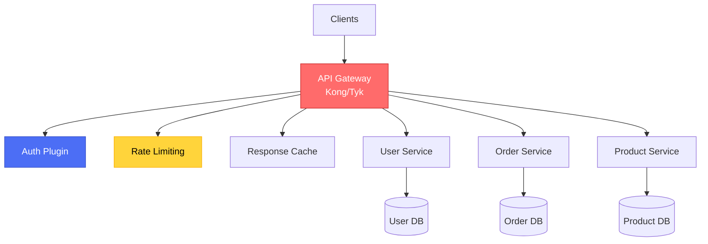

**Kong Configuration Example:**
```yaml
services:
  - name: user-service
    url: http://user-svc:8080
    plugins:
      - name: rate-limiting
        config:
          minute: 100
      - name: jwt
        config:
          key_claim_name: iss
    routes:
      - paths:
          - /api/users
        methods:
          - GET
          - POST
```

---

### Sidecar Pattern with Istio

**Service Mesh:** Infrastructure layer handling service-to-service communication.

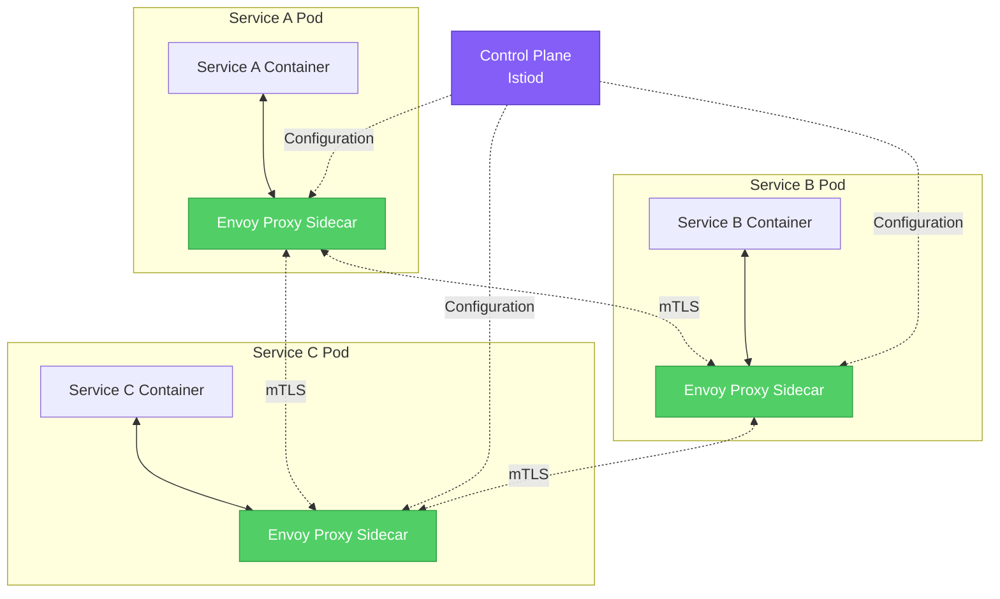

**Features:**
- **Traffic Management**: A/B testing, canary deployments
- **Security**: Mutual TLS, authorization policies
- **Observability**: Distributed tracing, metrics
- **Resiliency**: Circuit breakers, retries, timeouts

**Istio VirtualService Example:**
```yaml
apiVersion: networking.istio.io/v1beta1
kind: VirtualService
metadata:
  name: order-service
spec:
  hosts:
    - order-service
  http:
    - match:
        - headers:
            canary:
              exact: "true"
      route:
        - destination:
            host: order-service
            subset: v2
          weight: 100
    - route:
        - destination:
            host: order-service
            subset: v1
          weight: 90
        - destination:
            host: order-service
            subset: v2
          weight: 10
```

---

### Service Discovery Patterns

**Problem:** In microservices, services need to find and communicate with each other dynamically. Hard-coded IP addresses don't work in cloud environments where instances scale up/down.

**Solution:** Service discovery mechanisms that maintain a registry of available service instances.

#### Client-Side Discovery (Netflix Eureka Pattern)

**How it works:**
1. Service instances register themselves with a service registry on startup
2. Clients query the registry to get available instances
3. Client performs load balancing and selects an instance
4. Client makes direct request to chosen instance

```mermaid
sequenceDi agram
    participant S as Service Instance
    participant R as Service Registry<br/>(Eureka)
    participant C as Client
    
    S->>R: 1. Register (heartbeat every 30s)
    C->>R: 2. Query available instances
    R-->>C: 3. List of instances
    C->>C: 4. Load balance (client-side)
    C->>S: 5. Direct request
```

**Example (Spring Cloud Eureka):**

**Service Registration:**
```java
// application.yml
eureka:
  client:
    serviceUrl:
      defaultZone: http://eureka-server:8761/eureka/
  instance:
    preferIpAddress: true
    leaseRenewalIntervalInSeconds: 30

// Service code
@SpringBootApplication
@EnableEurekaClient
public class OrderServiceApplication {
    public static void main(String[] args) {
        SpringApplication.run(OrderServiceApplication.class, args);
    }
}
```

**Service Discovery (Client):**
```java
@Autowired
private DiscoveryClient discoveryClient;

public List<ServiceInstance> getOrderServiceInstances() {
    return discoveryClient.getInstances("order-service");
}

// With load balancing
@LoadBalanced
@Bean
public RestTemplate restTemplate() {
    return new RestTemplate();
}

// Usage (automatic load balancing)
String response = restTemplate.getForObject(
    "http://order-service/api/orders/123",
    String.class
);
```

**Pros:**
- ✅ Client controls load balancing algorithm
- ✅ No single point of failure for routing
- ✅ Better performance (no extra hop)

**Cons:**
- ❌ Client logic more complex
- ❌ Must implement health checks
- ❌ Different languages need different clients

---

#### Server-Side Discovery (Kubernetes DNS Pattern)

**How it works:**
1. Load balancer/router queries service registry
2. Registry returns healthy instances
3. Load balancer forwards request
4. Client is unaware of discovery mechanism

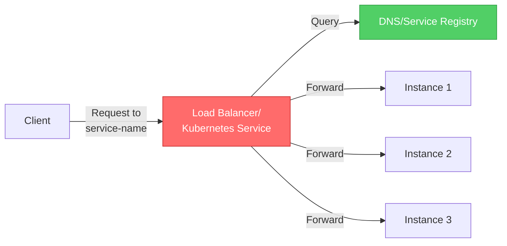

**Example (Kubernetes + CoreDNS):**

**Service Definition:**
```yaml
apiVersion: v1
kind: Service
metadata:
  name: order-service
spec:
  selector:
    app: order-service
  ports:
    - protocol: TCP
      port: 80
      targetPort: 8080
  type: ClusterIP  # Internal load balancer
---
apiVersion: apps/v1
kind: Deployment
metadata:
  name: order-service
spec:
  replicas: 3
  selector:
    matchLabels:
      app: order-service
  template:
    metadata:
      labels:
        app: order-service
    spec:
      containers:
      - name: order-service
        image: order-service:1.0
        ports:
        - containerPort: 8080
        livenessProbe:
          httpGet:
            path: /health
            port: 8080
          initialDelaySeconds: 30
          periodSeconds: 10
        readinessProbe:
          httpGet:
            path: /ready
            port: 8080
          initialDelaySeconds: 5
          periodSeconds: 5
```

**Client Usage (any language):**
```python
# Simple HTTP call - DNS resolution handled by K8s
import requests

response = requests.get("http://order-service/api/orders/123")

# Fully Qualified Domain Name (FQDN) in K8s:
# http://order-service.default.svc.cluster.local
```

**Kubernetes DNS Resolution:**
```bash
# Within cluster, services resolve by name:
order-service               → Resolves to ClusterIP
order-service.default       → Explicitly specify namespace
order-service.default.svc.cluster.local  → FQDN

# External DNS (for external access):
ExternalName service type
```

**Pros:**
- ✅ Simpler client code
- ✅ Language-agnostic
- ✅ Infrastructure handles health checks
- ✅ Centralized logging/monitoring

**Cons:**
- ❌ Extra network hop (slight latency)
- ❌ Load balancer is potential bottleneck
- ❌ Less control over load balancing

---

#### Decision Matrix

| Factor | Client-Side Discovery | Server-Side Discovery |
|--------|----------------------|----------------------|
| **Client Complexity** | High (embedded logic) | Low (simple HTTP call) |
| **Performance** | ✅ Faster (direct) | ⚠️ Extra hop |
| **Language Support** | ❌ Need client libs | ✅ Any language |
| **Load Balancing Control** | ✅ Full control | ⚠️ Limited options |
| **Failure Isolation** | ⚠️ Client retries | ✅ LB handles |
| **Observability** | ❌ Distributed metrics | ✅ Centralized |
| **Best For** | Java/Spring ecosystem | Kubernetes, polyglot |

#### Hybrid Approach (Service Mesh)

Modern service meshes like **Istio** combine both approaches:

- Server-side discovery (Kubernetes Service)
- Client-side load balancing (Envoy sidecar)
- Centralized configuration (Istio control plane)

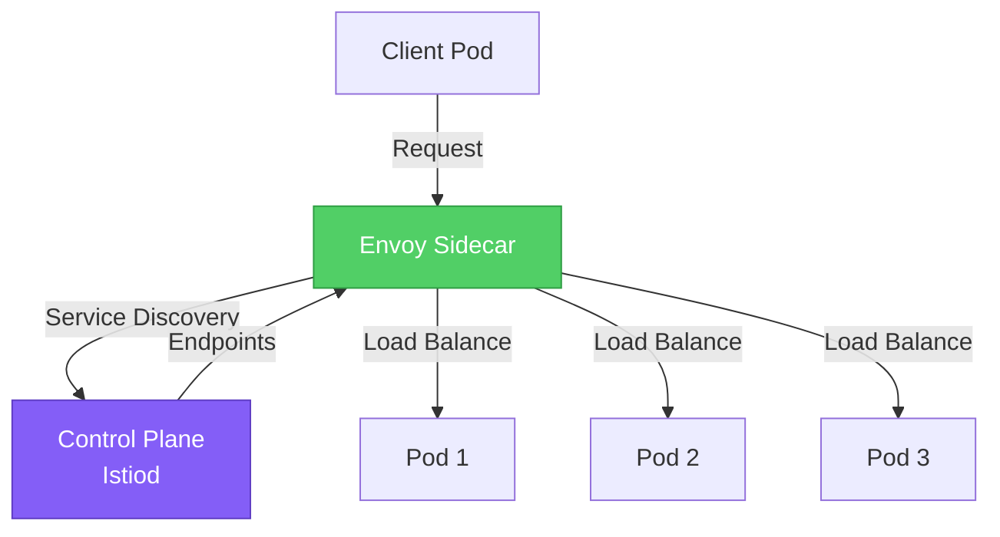

**Best of Both Worlds:**
- ✅ Simple client code (server-side)
- ✅ Advanced load balancing (client-side)
- ✅ Centralized policy management

**Implementation:** See [`Resiliency/Service-Mesh-and-Retries/`](./resiliency/service-mesh-and-retries/) for detailed Istio configuration.

---

## 💻 Implementation Examples

### Resilient Client (Go)

See: [`boilerplates/resilient-client-go/`](./boilerplates/resilient-client-go/)

**Features:**
- Circuit breaker (using `sony/gobreaker`)
- Exponential backoff retries
- Timeout handling
- Context propagation

**Quick Start:**
```go
client := resilient.NewClient(resilient.Config{
    MaxRetries:    3,
    Timeout:       5 * time.Second,
    CircuitBreaker: true,
})

response, err := client.Call(ctx, "http://inventory-svc/reserve", payload)
```

---

### Resilient Client (Python)

See: [`boilerplates/resilient-client-python/`](./boilerplates/resilient-client-python/)

**Features:**
- Circuit breaker (using `pybreaker`)
- Retry with exponential backoff (using `tenacity`)
- Request pooling
- Structured logging

**Quick Start:**
```python
from resilient_client import ResilientClient

client = ResilientClient(
    base_url='http://inventory-svc',
    max_retries=3,
    timeout=5.0
)

response = client.post('/reserve', json={'product_id': '123'})
```

---

### Kubernetes Manifests

See: [`boilerplates/k8s-manifests/`](./boilerplates/k8s-manifests/)

**Includes:**
- **Envoy Sidecar Proxy** configuration
- **Dapr** (Distributed Application Runtime) setup
- **Service Mesh** integration examples

---

## 🎤 Interview Preparation

### Senior Architect Questions

#### 1. **How do you handle distributed tracing across asynchronous boundaries?**

**Answer:**

Distributed tracing in async systems requires **context propagation** across message boundaries.

**Approach:**
- Use **W3C Trace Context** or **OpenTelemetry** for standardized trace IDs
- Embed trace context in message headers/metadata
- Ensure all services extract and propagate context

**Example (OpenTelemetry + Kafka):**
```python
from opentelemetry import trace
from opentelemetry.propagate import inject
from kafka import KafkaProducer

tracer = trace.get_tracer(__name__)

with tracer.start_as_current_span("publish_order_event") as span:
    headers = {}
    inject(headers)  # Inject trace context
    
    producer.send(
        'order-events',
        value={'order_id': '123'},
        headers=[(k, v.encode()) for k, v in headers.items()]
    )
```

**Consumer:**
```python
from opentelemetry.propagate import extract

for message in consumer:
    context = extract(dict(message.headers))
    with tracer.start_as_current_span("process_order", context=context):
        process_order(message.value)
```

**Key Challenges:**
- Custom instrumentation for message brokers
- Sampling strategy (too much = overhead, too little = missing critical paths)
- Clock skew between services

---

#### 2. **When would you choose orchestration over choreography for a Saga, and vice versa?**

**Answer:**

| Factor | Choreography | Orchestration |
|--------|--------------|---------------|
| **Complexity** | Simple workflows (2-4 services) | Complex workflows (5+ services, conditionals) |
| **Coupling** | Low (services independent) | Higher (services know orchestrator) |
| **Visibility** | Hard to track overall state | Central state machine, easy to monitor |
| **Testing** | Harder (distributed logic) | Easier (test orchestrator) |
| **Failure Handling** | Each service handles compensation | Orchestrator manages compensation |

**Use Choreography When:**
- Simple, linear workflows
- High autonomy required
- Event-driven architecture already in place

**Use Orchestration When:**
- Complex business logic with branches
- Need centralized monitoring/auditing
- Timeouts and deadlines critical

---

#### 3. **How do you prevent cascading failures in a microservices architecture?**

**Answer:**

**Multi-Layer Defense:**

1. **Circuit Breakers**: Stop calling failing services
2. **Timeouts**: Don't wait forever (fail fast)
3. **Bulkheads**: Isolate thread pools/resources
4. **Rate Limiting**: Protect from overload
5. **Backpressure**: Slow down producers when consumers can't keep up
6. **Fallbacks**: Return cached/default data when services fail

**Example Scenario:**
```
Payment Service fails → 
  Circuit Breaker opens → 
    Order Service uses cached fraud check → 
      Falls back to "manual review" workflow
```

**Architecture Patterns:**
- Use **API Gateway** for global rate limiting
- Implement **retry budgets** (e.g., max 10% retries across system)
- Deploy **Health Checks** (liveness & readiness probes)
- Use **Chaos Engineering** (test failure scenarios)

---

#### 4. **Explain the trade-offs between Database-Per-Service and Shared Database patterns.**

**Answer:**

| Aspect | Database Per Service | Shared Database |
|--------|---------------------|-----------------|
| **Service Independence** | ✅ Full independence | ❌ Schema changes affect all |
| **Transactions** | ❌ No ACID across services | ✅ ACID transactions |
| **Scalability** | ✅ Scale independently | ❌ Bottleneck |
| **Data Consistency** | ❌ Eventual consistency | ✅ Strong consistency |
| **Query Complexity** | ❌ Join across services hard | ✅ SQL joins work |
| **Technology Diversity** | ✅ Choose best DB per service | ❌ Locked to one DB |

**Migration Path:**
```
Monolith (Shared DB) → 
  Views per service (logical separation) → 
    Separate schemas (same DB instance) → 
      Separate database instances
```

---

#### 5. **How do you implement versioning in a microservices API ecosystem?**

**Answer:**

**Strategies:**

1. **URL Versioning**
   ```
   /api/v1/users
   /api/v2/users
   ```
   - ✅ Simple, explicit
   - ❌ Clutters URL space

2. **Header Versioning**
   ```
   GET /api/users
   Accept: application/vnd.company.v2+json
   ```
   - ✅ Clean URLs
   - ❌ Less visible, harder to test

3. **Content Negotiation**
   ```
   GET /api/users
   Accept: application/json; version=2
   ```

**Best Practices:**
- **Backward Compatibility**: Support N-1 version for 6-12 months
- **Deprecation Headers**: `Sunset: Sat, 31 Dec 2026 23:59:59 GMT`
- **Consumer-Driven Contracts**: Use Pact or Spring Cloud Contract
- **Schema Evolution**: Use Protobuf/Avro for graceful field additions

**Example (Go):**
```go
func (h *Handler) GetUser(w http.ResponseWriter, r *http.Request) {
    version := r.Header.Get("API-Version")
    switch version {
    case "2", "":  // Default to v2
        h.getUserV2(w, r)
    case "1":
        h.getUserV1(w, r)
    default:
        http.Error(w, "Unsupported API version", http.StatusBadRequest)
    }
}
```

---

## 📖 Real-World Case Studies

### Case Study 1: Amazon's Microservices Evolution

**Background:**
In the early 2000s, Amazon ran a monolithic application that became a bottleneck for innovation.

**Migration Journey:**

1. **2001-2002**: Decomposed monolith into services
   - Created "two-pizza teams" (teams small enough to feed with two pizzas)
   - Each team owned a service and its database

2. **Service-Oriented Architecture (SOA)**
   - Strict API contracts between services
   - No direct database access

3. **Scaling Challenges**
   - **Problem**: Service dependencies caused cascading failures during Prime Day 2013
   - **Solution**: Implemented circuit breakers and aggressive timeouts

4. **Current State** (2020s):
   - Thousands of microservices
   - Services deployed independently every 11.6 seconds (on average)
   - 99.99% availability target

**Key Lessons:**
- ✅ **Conway's Law**: System design mirrors org structure
- ✅ **Automate Everything**: Deployment, testing, monitoring
- ✅ **Ownership**: Teams own service from dev to production
- ⚠️ **Complexity**: Need strong tooling (service discovery, tracing)

---

### Case Study 2: Netflix Chaos Engineering

**The Outage That Changed Everything:**

**2011: AWS Outage**
- Netflix streaming went down for hours
- Cause: Cascading failures across tightly coupled services
- Impact: Loss of customer trust, revenue

**Response: Chaos Engineering**

1. **Chaos Monkey** (2012)
   - Randomly terminates instances in production
   - Forces engineers to build resilient services

2. **Simian Army**
   - **Latency Monkey**: Introduces artificial delays
   - **Chaos Kong**: Simulates entire AWS region failure
   - **Chaos Gorilla**: Takes down entire availability zone

3. **Architecture Changes**
   - Implemented Hystrix (circuit breaker library)
   - Adopted asynchronous communication (avoid blocking calls)
   - Built fallback mechanisms (e.g., cached recommendations)

**Results:**
- 99.99% streaming availability
- Zero-downtime deployments (4000+ per day)
- Able to survive AWS region failures

**Key Lessons:**
- ✅ **Test in Production**: Staging never matches prod complexity
- ✅ **Fail Fast**: Timeouts are better than hangs
- ✅ **Design for Failure**: Assume everything will fail
- ✅ **Observability**: Can't fix what you can't see

---

### Case Study 3: Uber's Microservices Explosion

**The Problem:**

**2015**: Uber had ~1000 microservices
**2020**: Uber had ~4000 microservices

**Challenges:**
- Developer onboarding took weeks (which service do I need?)
- Dependency hell (service A → B → C → D → E)
- Inconsistent patterns (each team built differently)

**Solutions:**

1. **Domain-Oriented Microservices Architecture (DOMA)**
   - Grouped services into domains (Rider, Driver, Marketplace)
   - Created "domain gateways" (API gateway per domain)

2. **Platform Standardization**
   - Standardized RPC framework (uRPC - custom gRPC)
   - Unified observability (Jaeger for tracing)
   - Shared libraries for auth, logging, metrics

3. **Service Mesh (Envoy)**
   - Deployed sidecars for traffic management
   - Centralized policy enforcement

**Results:**
- Reduced mean time to onboard from 2 weeks to 2 days
- Clear ownership boundaries
- Standardized tooling improved debugging

**Key Lessons:**
- ⚠️ **More Services ≠ Better**: Only split when needed
- ✅ **Platform Team**: Invest in internal tooling/platforms
- ✅ **Governance**: Enforce standards (but allow exceptions)

---

## 📁 Directory Structure

```
02-Microservices-Architecture/
├── README.md                          (This file)
├── assets/
│   ├── microservices_vs_monolith_comparison.png
│   ├── event_driven_architecture_flow.svg
│   └── database_per_service_pattern.jpg
├── boilerplates/
│   ├── resilient-client-go/
│   │   ├── README.md
│   │   ├── main.go
│   │   ├── circuit_breaker.go
│   │   └── retry.go
│   ├── resilient-client-python/
│   │   ├── README.md
│   │   ├── resilient_client.py
│   │   ├── circuit_breaker.py
│   │   └── requirements.txt
│   └── k8s-manifests/
│       ├── envoy-sidecar.yaml
│       ├── dapr-configuration.yaml
│       └── istio-virtualservice.yaml
└── CHALLENGES.md
```

---

## 🚀 Next Steps

1. **Implement**: Build a sample microservices app with the resilient client boilerplates
2. **Deploy**: Set up a local Kubernetes cluster with Istio
3. **Test**: Run chaos experiments (kill pods, introduce latency)
4. **Monitor**: Set up distributed tracing with Jaeger or Zipkin
5. **Review**: Study the case studies and answer interview questions

---

## 🔗 Related Topics

- **[Part 11: Cloud Architecture](../)** - Parent directory
- **Service Discovery** - Consul, Eureka
- **API Gateway Comparison** - Kong vs Tyk vs AWS API Gateway
- **Observability** - Metrics (Prometheus), Tracing (Jaeger), Logging (ELK)

---

## 📚 Additional Resources

**Books:**
- *Building Microservices* by Sam Newman
- *Microservices Patterns* by Chris Richardson
- *Release It!* by Michael Nygard

**Online:**
- [Microservices.io](https://microservices.io) - Patterns catalog
- [Martin Fowler's Blog](https://martinfowler.com/microservices/) - Architecture articles
- [AWS Microservices](https://aws.amazon.com/microservices/) - Cloud implementation guides

---

**Last Updated:** 2026-01-19  
**Version:** 1.0  
**Maintainer:** Advanced DevOps Curriculum Team
